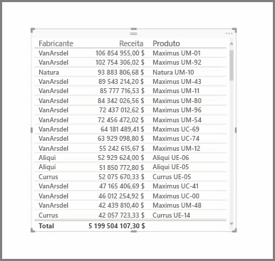

Para além de uma abundância de gráficos, o Power BI Desktop também suporta mais visualizações de tabela. Na realidade, quando captar um campo categórico ou campo de texto e arrastá-lo para o ecrã de relatórios, recebe uma tabela de resultados por predefinição. Pode percorrer para cima e para baixo na tabela e inicialmente será ordenado por ordem alfabética.

Se tiver informações numéricas numa tabela, como a receita, uma soma total será apresentada na parte inferior. Pode ordenar manualmente por coluna ao clicar no respetivo cabeçalho para alternar a ordem ascendente ou descendente. Se a coluna não for suficientemente grande para apresentar todos os respetivos conteúdos, clique e arraste o cabeçalho para o lado para expandi-la.

A ordem dos campos no registo *Valores* no painel **Visualizações** determina a ordem em que aparecem na tabela.

A **matriz** é semelhante a uma tabela, mas tem cabeçalhos da categoria diferentes nas colunas e linhas. Tal como acontece com as tabelas, as informações numéricas serão automaticamente totalizadas, juntamente com a parte inferior e o lado direito da matriz.

Existem muitas opções cosméticas disponíveis para matrizes, como colunas de dimensionamento automático, alternância de totais de linhas ou colunas, definição de cores e muito mais. Ao criar uma matriz, certifique-se de que os dados categóricos (os dados não numéricos) estão à esquerda da matriz e os ficheiros numéricos no lado direito, para garantir que a barra de deslocamento horizontal aparece e certifique-se de que esse comportamento de deslocamento funciona corretamente.

