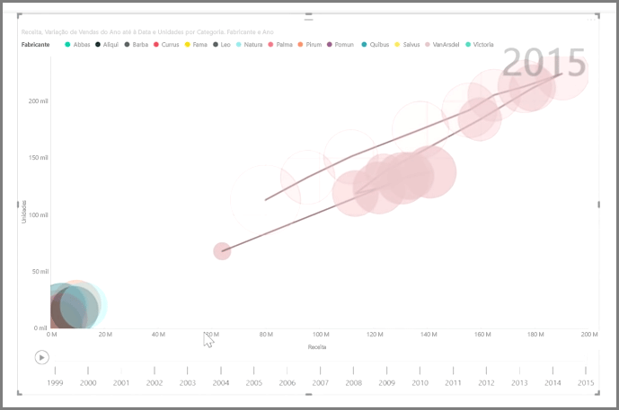

Se quiser comparar duas medidas diferentes, como, por exemplo, vendas unitárias versus receita, uma visualização comum a utilizar é um gráfico de dispersão.

Para criar um gráfico em branco, selecione **Gráfico de dispersão** no painel **Visualizações**. Arraste e largue os dois campos que pretende comparar do painel **Campos** para os registos de opções *Eixo X* e *Eixo Y*. Neste momento, é provável que o gráfico de dispersão tenha apenas um pequena bolha no centro do elemento visual - tem de adicionar uma medida ao registo de *Detalhes* para indicar como pretende segmentar os seus dados. Por exemplo, se estiver a comparar vendas de artigos e receita, talvez queira dividir os dados por categoria, ou fabricante ou mês de venda.

Se adicionar mais um campo ao registo de *Legenda*, as bolhas são codificadas por cores de acordo com o valor do campo. Também pode adicionar um campo ao registo de *Tamanho* para alterar o tamanho da bolha de acordo com esse valor.

Os gráficos de dispersão também têm muitas opões de formatação, como, por exemplo, ativar um destaque para cada bolha colorida e alternar etiquetas individuais. Também pode alterar as cores dos dados para outros tipos de gráfico.

Pode criar uma animação das alterações do seu gráfico de bolhas ao longo do tempo, adicionando um campo com base no tempo ao registo de *Eixo de Reprodução*. Clique numa bolha durante uma animação para ver um traçado do respetivo caminho.

>[!NOTE]
>Não se esqueça que se vir apenas uma bolha no seu gráfico de dispersão, é porque o Power BI está a agregar os dados, que é o comportamento predefinido. Adicione uma categoria ao registo de *Detalhes*, no painel **Visualizações**, para obter mais bolhas.
> 
> 

