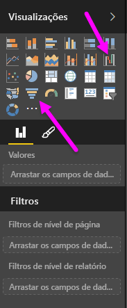

Os gráficos de cascata e de funil são duas das visualizações standard mais interessantes (e talvez invulgares) que estão incluídas no Power BI. Para criar um gráfico em branco de qualquer tipo, selecione o respetivo ícone do painel **Visualizações**.

Os **Gráficos de cascata** servem tipicamente para mostrar as alterações num determinado valor ao longo do tempo.

Gráficos de cascata têm duas opções de registo: *Categoria* e *eixo Y*. Arraste um campo baseado no tempo, como o *ano* para o registo *Categoria* e o valor que pretende controlar para o registo do *Eixo Y*. Os períodos de tempo em que ocorreu um aumento no valor são apresentados a verde por predefinição, enquanto os valores com um decréscimo no valor são apresentados a vermelho.

Os **Gráficos de funil** servem tipicamente para mostrar as alterações ao longo de um determinado processo, como um pipeline de vendas ou esforços de retenção do site.

Ambos os gráficos de **Cascata** e de **Funil** podem ser segmentados e visualmente personalizados.

