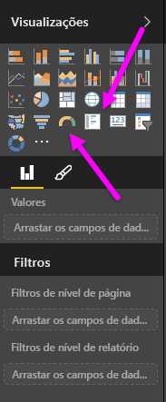
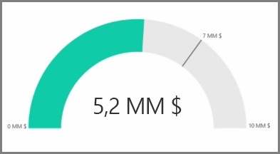
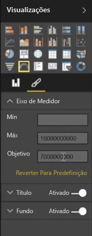
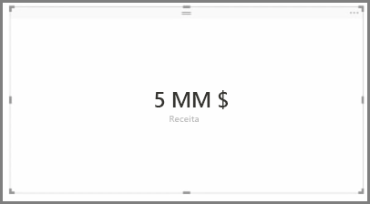
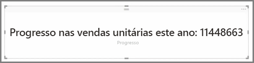

Geralmente, as visualizações servem para comparar dois ou mais valores diferentes. No entanto, por vezes, ao criar relatórios poderá querer controlar apenas um Indicador de Desempenho de Chave único (KPI) ou métrica ao longo do tempo. A melhor forma de o fazer no Power BI Desktop é com um visual de cartão de **Medidor** ou de  **número único**. Para criar um gráfico em branco de qualquer tipo, selecione o respetivo ícone do painel **Visualizações**.

Os medidores são particularmente úteis quando está a criar dashboards e pretende mostrar o progresso de um destino específico. Para criar um medidor, selecione o respetivo ícone do painel **Visualizações** e arraste o campo que pretende controlar para o registo *Valor*.

Os medidores aparecem por predefinição em 50%, ou duplicam o *Valor*, e existem duas formas para ajustar esta definição. Para definir dinamicamente os valores, arraste os campos para os registos de Valor *Mínimo*, *Máximo* e *Destino*. Em alternativa, utilize as opções de formatação visual manualmente para personalizar o intervalo do medidor.

As visualizações do cartão mostram simplesmente uma representação numérica de um campo. Por predefinição, os visuais do cartão utilizam unidades para manter o número pequeno, por exemplo ao apresentar "$5bn" em vez de "$5,000,000,000". Utilize as opções de formatação visual para alterar a unidade que está a ser utilizada ou desativá-la completamente.

Uma aplicação interessante de cartões é eles exibirem uma medida personalizada que o utilizador concatenou com o texto. Para utilizar o exemplo anterior com uma medida personalizada, o seu cartão pode incluir funções da DAX avançadas e apresentar algo como, "Receita total deste ano: $5bn" ou "Progresso das unidades de venda deste ano:" e, em seguida, adicionar o número que representa o progresso.

