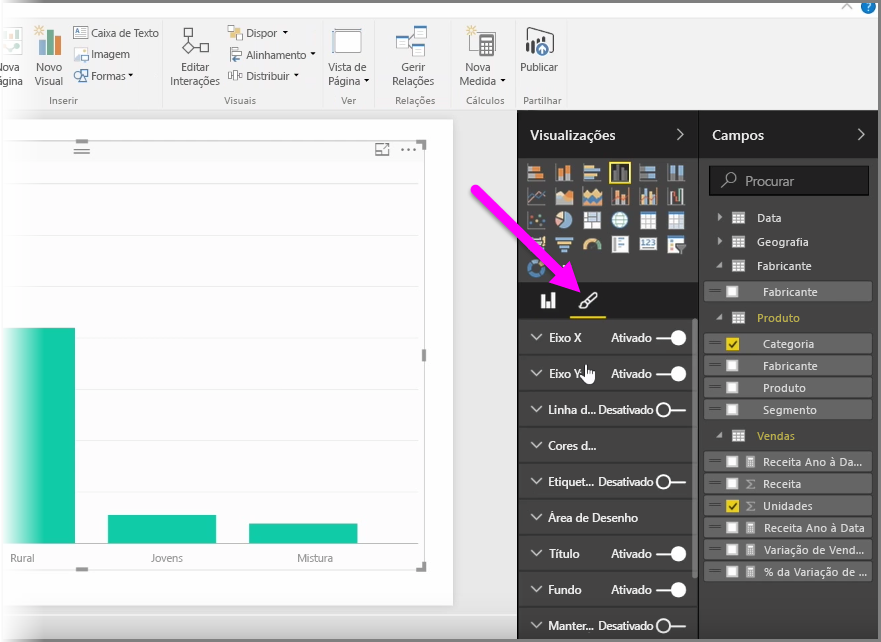
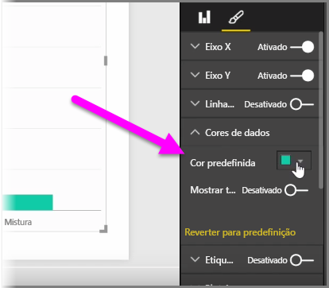
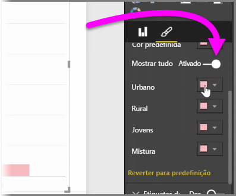
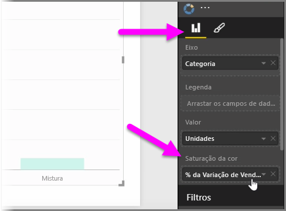
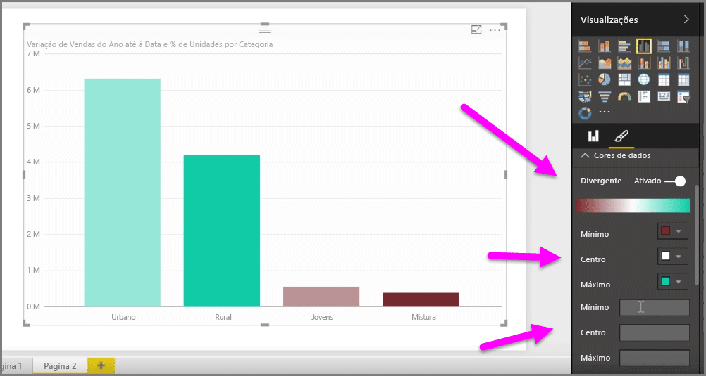
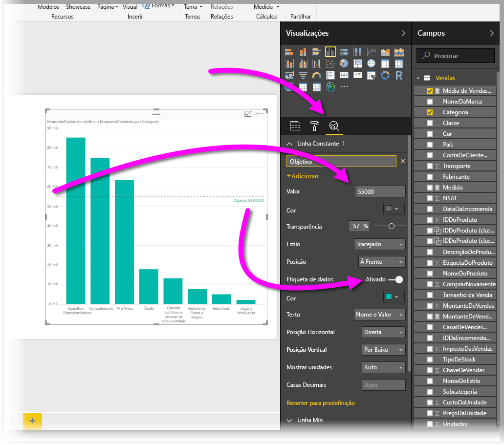
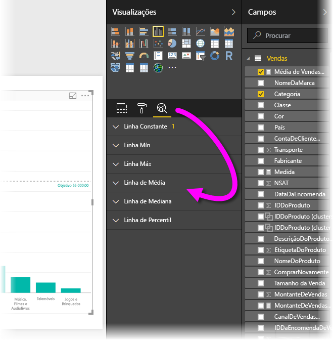

Muitas vezes, poderá querer modificar as cores utilizadas em gráficos ou elementos visuais. O Power BI dá-lhe um grande controlo sobre a forma como as cores são apresentadas. Para começar, selecione um elemento visual e, em seguida, no painel **Visualizações**, clique no ícone de **pincel**.

Existem muitas opções para alterar as cores ou a formatação do elemento visual. Pode alterar a cor de todas as barras de um elemento visual, selecionando o seletor de cores junto a **Cor Predefinida** e, em seguida, selecionando a sua cor de eleição.

Também pode alterar a cor de cada barra (ou outro elemento, dependendo do tipo de elemento visual que selecionou), ativando o controlo de deslize **Mostrar tudo**. Quando o fizer, é apresentado um seletor de cores para cada elemento.

Também pode alterar a cor com base num valor ou medida. Para tal, arraste um campo para a área **Saturação da cor** no painel Visualizações (tenha em atenção que esta área está disponível na secção de **campo** e não na secção de **pincel**).

Além disso, pode alterar a escala e as cores utilizadas ao preencher as cores dos elementos de dados. Também pode selecionar uma escala divergente, ativando o controlo de deslize Divergente, que permite uma escala de cores entre três cores. Ainda pode definir os valores *Mínimo*, *Centro* e *Máximo* apresentados no seu gráfico.

Também pode utilizar esses valores para criar regras, por exemplo, para apresentar os valores superiores a zero numa determinada cor e os valores inferiores noutra cor.

Outra ferramenta útil para utilizar cores é a definição de uma *linha constante*, por vezes também referida como *linha de referência*. Pode definir o valor da linha constante, definir a respetiva cor e até definir a linha de referência para incluir uma etiqueta. Para criar uma linha constante (e outras linhas interessantes), selecione o **painel de Análise** (parece uma lupa) e, em seguida, expanda a secção **Linha de Referência**.

Pode criar muitas outras linhas para um elemento visual, que também estão localizadas no **painel de Análise**, tais como as linhas Mín, Máx, Média, Mediana e Percentil.

Por último, pode criar um limite em torno de uma visualização individual e, tal como nos outros controlos, também pode especificar a cor desse limite.

