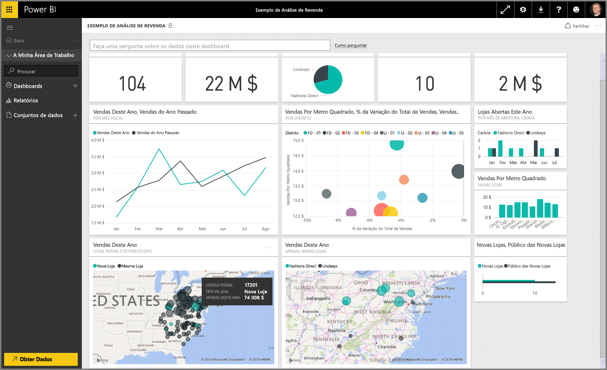
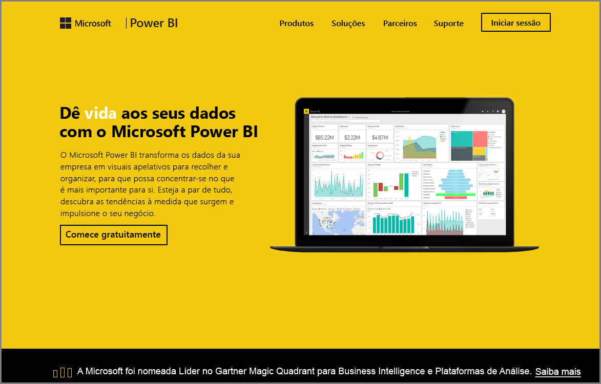

Bem-vindo à secção **Explorar Dados** do curso **Aprendizagem Orientada** do Power BI. Agora que sabe mais sobre o Power BI Desktop e como obter e visualizar dados, está pronto para explorar os dados no serviço do Power BI.

Existem diversos tipos de ações para aprender nesta secção e a interatividade e partilha interessante do Power BI realmente destacam-se aqui. Por isso, prepare-se para uma secção envolvente e interessante.

## Introdução ao serviço do Power BI
*Veja o que o serviço do Power BI pode fazer para a sua organização*

O serviço do Power BI é a extensão natural do **Power BI Desktop**, e as respetivas funcionalidades incluem carregar relatórios, criar dashboards e colocar questões sobre os seus dados com linguagem natural. Pode utilizar o serviço para definir as horas de atualização de dados, partilhar dados com a sua organização e criar pacotes de serviço personalizado.

Nos tópicos seguintes, vamos explorar o serviço Power BI e mostrar-lhe como pode transformar os dados de business intelligence em informações de dados e num ambiente de colaboração em decisões.

