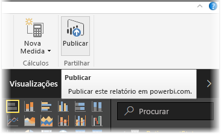
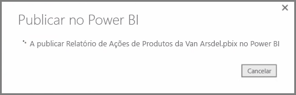
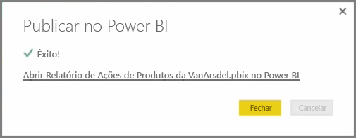
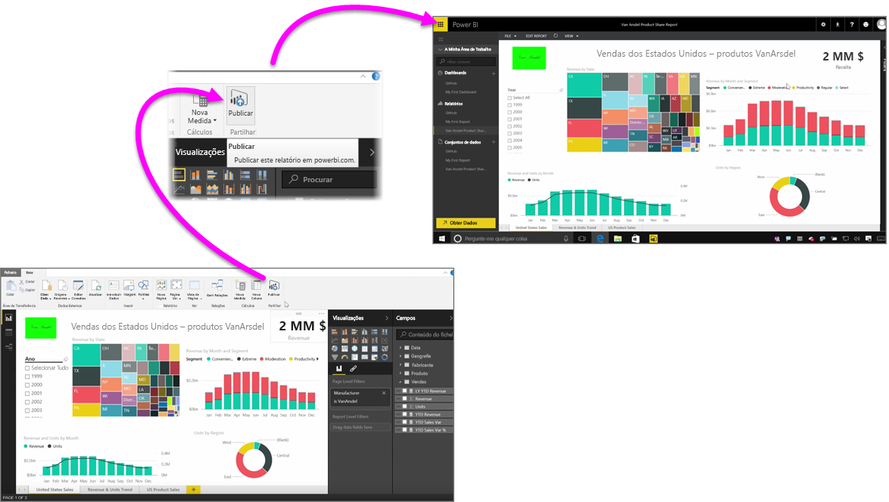

Publicar os seus relatórios do serviço do Power BI é rápido e fácil.

Depois de concluir a criação de relatório no **Power BI Desktop**, basta selecionar o botão **Publicar** no separador **Home page** no Power BI Desktop e o processo começa.

O relatório e os dados, incluindo visualizações, consultas e medidas personalizadas são agrupados e carregados para o serviço do Power BI.

> [!NOTE]
> É comum para fazer referência a relatórios do Power BI Desktop como ficheiros **.pbix**, que é a extensão que lhes é dada no Windows.
> 

Assim que o carregamento está concluído, uma caixa de diálogo indica que o processo de publicação foi realizado com êxito e é apresentada uma ligação nessa caixa de diálogo para o levarem diretamente para o relatório no serviço do Power BI, num browser.

E já está - é fácil publicar relatórios do Power BI Desktop para o serviço do Power BI.

