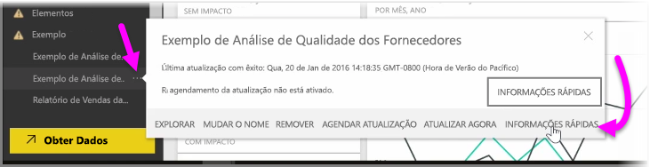
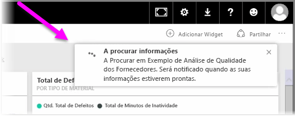
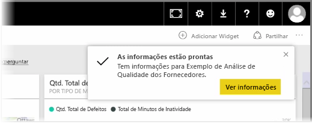
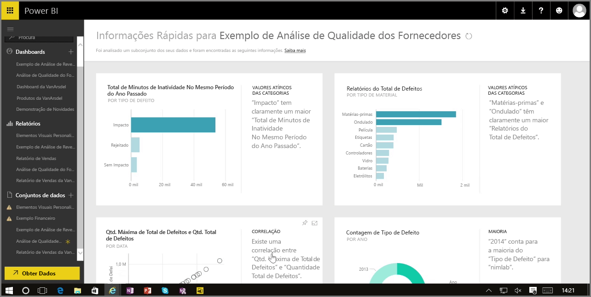

Quando estiver a trabalhar com um dashboard, relatório ou conjunto de dados no serviço Power BI, pode configurar o Power BI para procurar informações rápidas nos dados. No Power BI, na secção **Conjuntos de dados** no painel esquerdo, selecione as *reticências* (os três pontos) junto ao conjunto de dados no qual está interessado. É apresentado um menu de opções e, na extremidade direita, verá uma opção chamada **Informações Rápidas**.

Quando seleciona Informações Rápidas, o Power BI executa alguma aprendizagem automática e procura os dados, analisando-os para encontrar informações rápidas. Verá uma notificação no lado superior direito do serviço, que indica que o Power BI está a trabalhar para localizar informações.

Passados cerca de quinze segundos, a notificação muda para o informar de que o Power BI encontrou algumas informações.

Quando seleciona o botão **Ver Informações** na notificação, é apresentada uma página de elementos visuais que mostram as informações que o Power BI encontrou, semelhante à que pode ser na imagem seguinte. São apresentadas muitas informações e pode deslocar a página para baixo para ver e considerar.

Tal como acontece com qualquer outro elemento visual, pode interagir com os elementos visuais na página Informações Rápidas, e também pode afixar qualquer um deles a um dashboard que possa ter, ou filtrar ainda mais um ou mais dos mesmos (ou todos os que quiser), para procurar informações adicionais que possa ter curiosidade em descobrir.

Com as **Informações Rápidas**, pode deixar que o Power BI faça o trabalho, para detetar valores atípicos e tendências nos seus dados, e, posteriormente, utilizar esses resultados nos seus dashboards ou refinar e filtrá-los ainda mais para obter as informações que são mais importantes para si.

