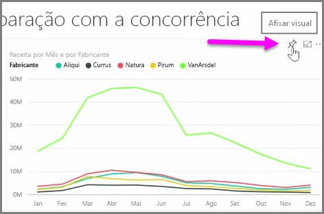
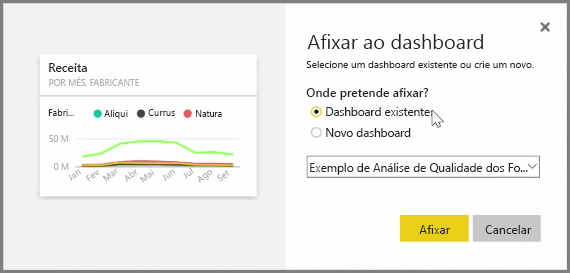
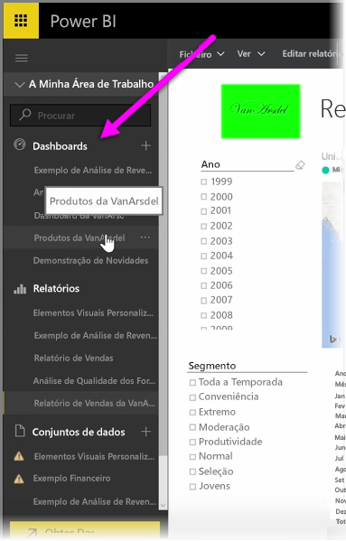
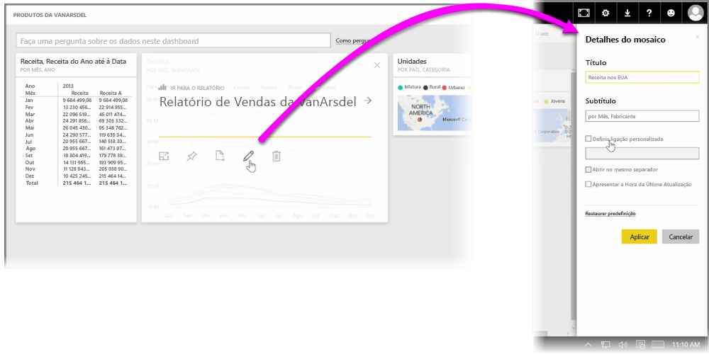

No Power BI, **Dashboards** são coleções de uma página de visualizações criadas a partir do serviço Power BI. Os dashboards são criados ao **afixar** visualizações de relatórios que criou e publicou com o Power BI Desktop ou visualizações que criou no próprio serviço Power BI. **Afixar** um elemento visual a um dashboard é muito semelhante a afixar uma fotografia a um quadro de cortiça na parede - prende o elemento visual num determinado lugar, para que outras pessoas o possam ver. Para afixar um elemento visual, abra o respetivo relatório no serviço Power BI. Paire o rato sobre o elemento visual que pretende afixar e selecione o ícone de **pin**.

É apresentada uma caixa de diálogo, onde seleciona um dashboard de destino para o elemento visual no menu pendente ou pode criar um novo dashboard. Também obtém uma pré-visualização do aspeto que o elemento visual afixado irá ter no dashboard. Pode afixar visualizações de vários relatórios e páginas a um único dashboard, permitindo-lhe combinar diferentes conjuntos de dados e origens numa única página de informações.

Em **Dashboards**, pode adicionar qualquer tipo de visualização, incluindo gráficos, mapas, imagens e formas, "afixando-os". Depois de um elemento visual ser afixado a um dashboard, é chamado **mosaico**.

Os seus dashboards, incluindo dashboards novos, são apresentados na secção Dashboards no lado esquerdo do serviço Power BI. Selecione um dashboard na lista para vê-lo.

Pode alterar o esquema dos elementos visuais num dashboard da forma que quiser. Para redimensionar um mosaico, arraste as respetivas alças para dentro ou para fora. Para mover um mosaico, basta clicar e arrastá-lo para uma localização diferente no dashboard. Paire o rato sobre um mosaico e clique no ícone de **lápis** para abrir os **Detalhes do Mosaico**, onde pode alterar o **Título** ou **Subtítulo**.

Clique num mosaico do dashboard para ver o relatório a partir do qual foi gerado. Esta ação permite-lhe ver rapidamente os dados subjacentes sob um elemento visual. Também pode alterar essa ligação através do campo **Definir ligação personalizada** em **Detalhes do Mosaico**.

Pode afixar mosaicos de um dashboard a outro, por exemplo, se tiver uma coleção de dashboards e pretender criar um dashboard de resumo. O processo é o mesmo: paire o rato sobre o mosaico e selecione o **ícone de pin**. Os dashboards são fáceis de criar e de alterar. Além disso, pode personalizá-los para que o seu dashboard de uma página mostre exatamente o que devia.

