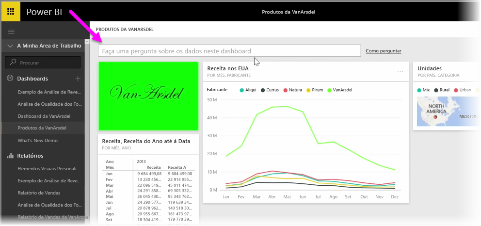
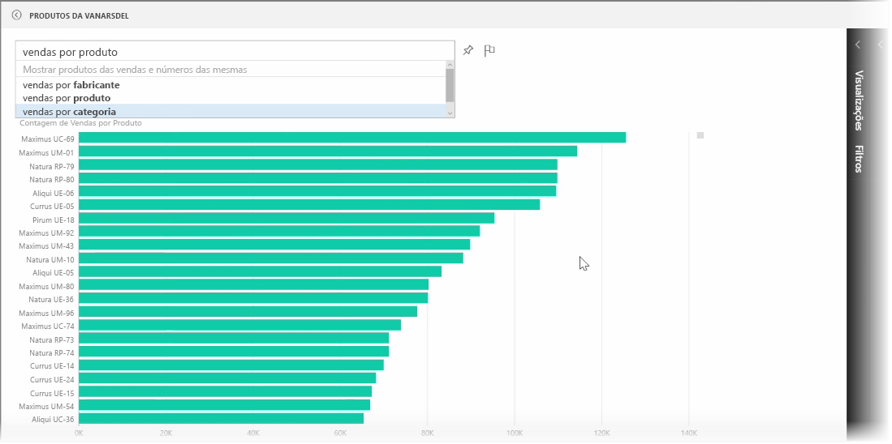
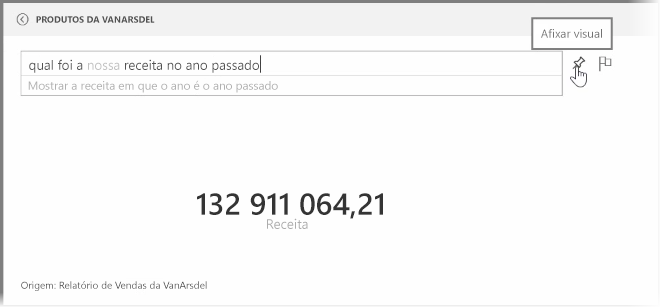
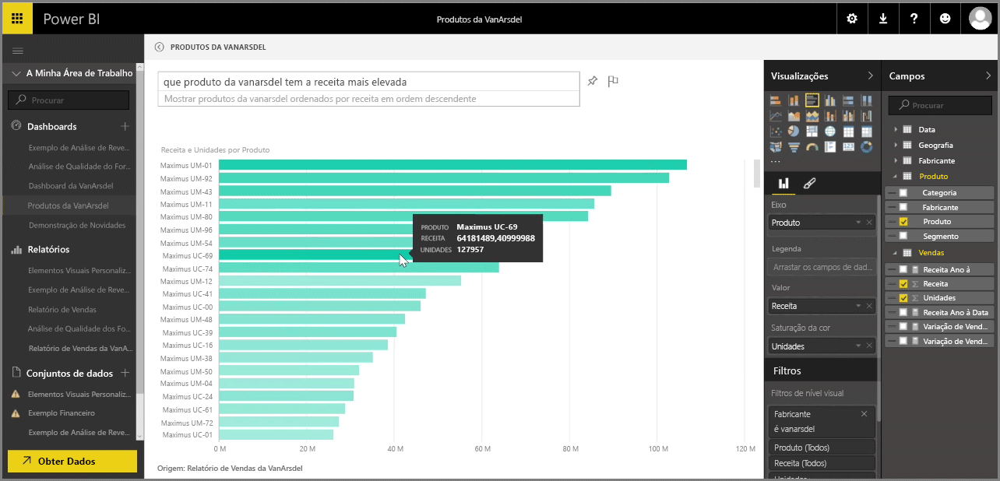

O Power BI é fornecido com um avançado motor de reconhecimento de linguagem, que lhe permite fazer perguntas sobre os seus dados com expressões e perguntas coloquiais. Por isso, para além de criar relatórios e visualizações com o Power BI, também pode criar quadros e gráficos ao fazer apenas algumas perguntas simples.

Para fazer uma pergunta sobre os seus dados, abra um dashboard no Power BI e, na parte superior do ecrã, verá uma caixa de entrada, onde pode fazer perguntas sobre os dados apresentados. Por vezes, esta funcionalidade é designada por *Perguntas e Respostas* ou, mais frequentemente, é apenas designada por **Q&A**.

Ao clicar na caixa, o Power BI apresenta alguns termos sugeridos com base nos seus dados, tais como "Receita YTD". Pode clicar num termo sugerido para ver o resultado que, muitas vezes, é apresentado como um cartão ou tabela simples. Quando seleciona uma das expressões sugeridas, o Power BI cria automaticamente um elemento visual com base na sua seleção, em tempo real.

Também pode fazer perguntas com linguagem natural, como, por exemplo, "Qual foi a nossa receita no ano passado?" ou "Que produto tinha as vendas mais elevadas em março de 2014?". O Power BI apresenta a respetiva interpretação da sua pergunta e escolhe o melhor tipo de elemento visual para representar a resposta. E, tal como acontece com qualquer outro elemento visual no Power BI, pode **afixá-lo** ao dashboard da sua eleição, selecionando o ícone de **pin**.

A qualquer momento, pode editar o elemento visual criado pela sua pergunta ou expressão de linguagem natural. Basta utilizar os painéis **Visualizações** e **Campos** no lado direito do ecrã. Tal como acontece com qualquer outro elemento visual no Power BI, pode alterar o esquema, ajustar os filtros e alterar as entradas de campo.

Para guardar a visualização num dashboard depois de ter criado o elemento visual perfeito, basta selecionar o ícone de **pin** junto à caixa de entrada da pergunta.

