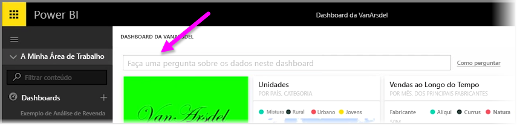
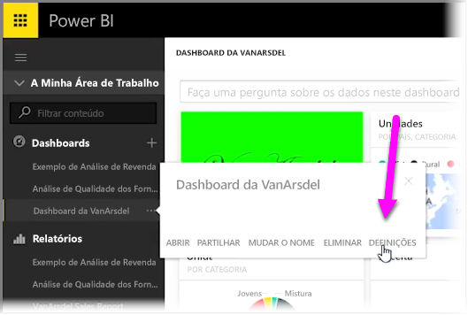
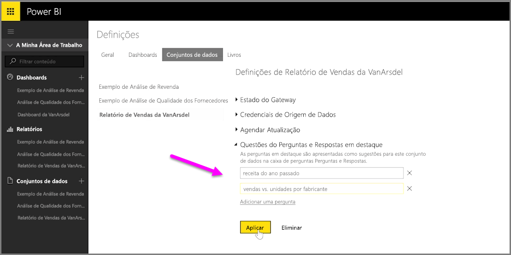

Com o Power BI, pode adicionar as suas próprias perguntas sugeridas para outros utilizadores que utilizam a caixa de consulta de linguagem natural para um dashboard, frequentemente referido como a caixa de **perguntas e respostas**. Estas perguntas sugeridas são o que os utilizadores irão ver quando clicarem na caixa de entrada na parte superior de um dashboard.

Para adicionar as suas próprias perguntas, selecione as reticências (os três pontos ...) junto ao nome do dashboard que pretende utilizar e selecione **Definições** no menu.

 Esta ação abre a página **Definições** para o dashboard e os conjuntos de dados ou livros subjacentes. Pode desativar a caixa de entrada de procura de perguntas e respostas completamente da secção **Dashboards** da página **Definições**, mas pretendemos adicionar perguntas, por isso selecionamos a secção **Conjuntos de dados**.

Na secção **Conjuntos de dados**, todos os conjuntos de dados associados ao Dashboard são apresentados. Selecione o conjunto de dados associado ao seu dashboard da lista, selecione **Perguntas e respostas destacadas** e, em seguida, selecione a ligação **Adicionar uma pergunta**. Introduza a sua pergunta ou entre na caixa de entrada e selecione **Aplicar**.

Agora, sempre que um utilizador clicar na caixa de entrada de pesquisa no dashboard selecionado, verá as suas entradas sugeridas na parte superior da lista de linha de comandos e, ao selecionar essa questão, será reencaminhado diretamente para a resposta das perguntas e respostas. Esta é uma forma útil de colocar os utilizadores do dashboard a pensarem no tipo de dados disponíveis e como podem utilizá-los da melhor forma.

