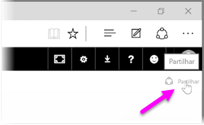
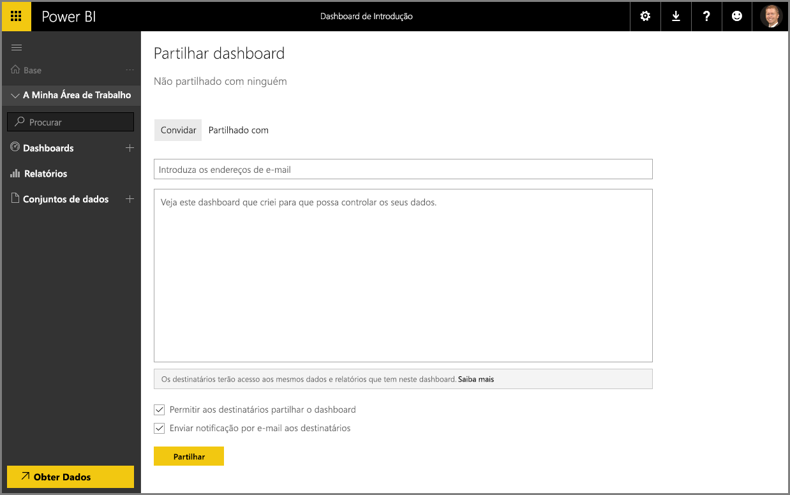

Já vimos como o Power BI ajuda a localizar dados, a reuni-los num modelo de dados e a criar relatórios e visualizações sobre a utilização desses dados. Também já vimos como pode publicar esses relatórios no serviço Power BI e criar dashboards que o ajudam a monitorizar as suas informações ao longo do tempo. Todas estas funcionalidades são ainda mais poderosas quando partilha as suas informações com outras pessoas na sua organização. Felizmente, é muito fácil partilhar dashboards.

Para partilhar um dashboard, abra-o no serviço Power BI e selecione a ligação **Partilhar** no canto superior direito.

A página **Partilhar Dashboard** é apresentada, na qual pode selecionar a secção **Convidar** e, em seguida, preencher a caixa de entrada **Endereço de e-mail** com o endereço das pessoas às quais pretende conceder acesso ao seu dashboard. O Power BI verifica os endereços de e-mail à medida que os escreve nas contas no seu domínio e no domínio do Office 365, e faz a conclusão automática sempre que possível. Também pode copiar e colar os endereços de e-mail nesta caixa ou utilizar uma lista de distribuição, grupo de segurança ou grupo do Office 365 para chegar a várias pessoas de uma só vez.

Se tiver selecionado a caixa de verificação (perto do fim) para *enviar notificação por e-mail aos destinatários*, os destinatários irão receber uma mensagem de e-mail a informá-los de que partilhou um dashboard com os mesmos, incluindo uma hiperligação com o dashboard. Pode adicionar uma nota à mensagem de e-mail que irão receber ou enviar a nota que o Power BI criou automaticamente (está na caixa imediatamente abaixo do local onde introduziu os respetivos endereços de e-mail).

>[!NOTE]
>Os destinatários que não tenham uma conta existente do Power BI serão encaminhados ao longo do processo de inscrição antes de visualizarem o dashboard.
> 
> 

Todas as pessoas com quem partilha um dashboard podem vê-lo e interagir com o mesmo, exatamente como o utilizador. No entanto, apenas têm acesso *só de leitura* aos relatórios subjacentes e *não têm acesso* aos conjuntos de dados subjacentes.

Também pode selecionar o separador **Partilhado Com** na página Partilhar Dashboard para ver as pessoas com quem partilhou anteriormente este dashboard.

