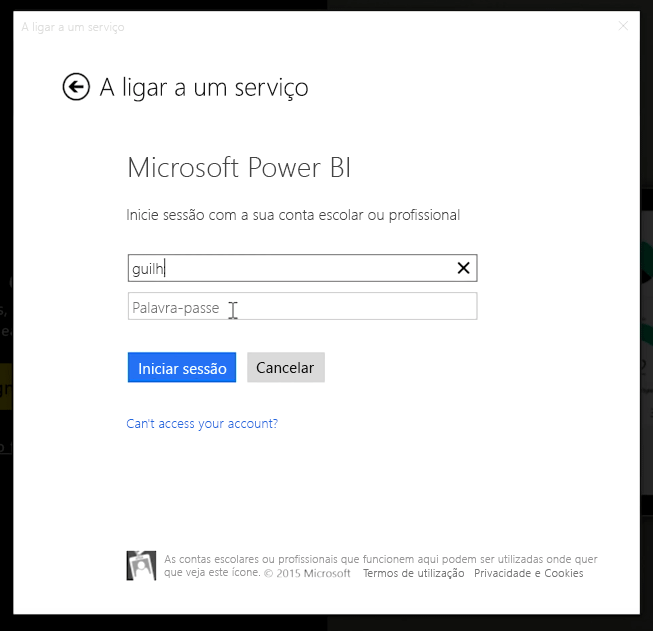
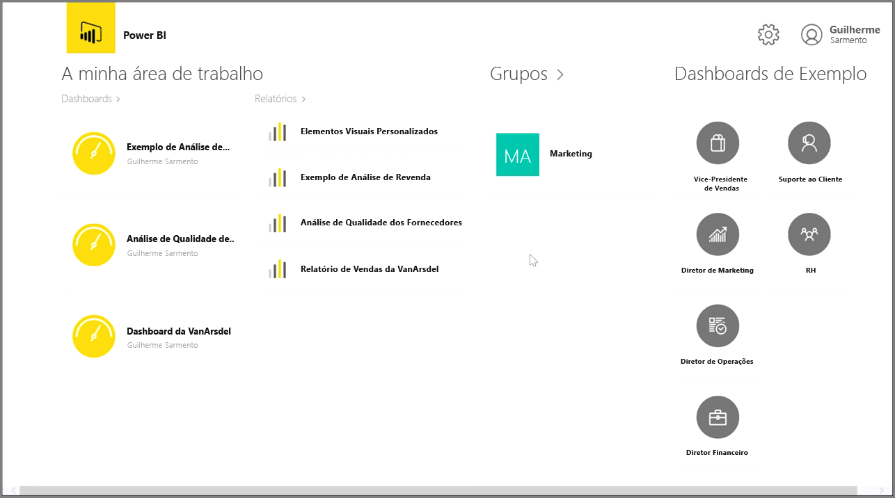
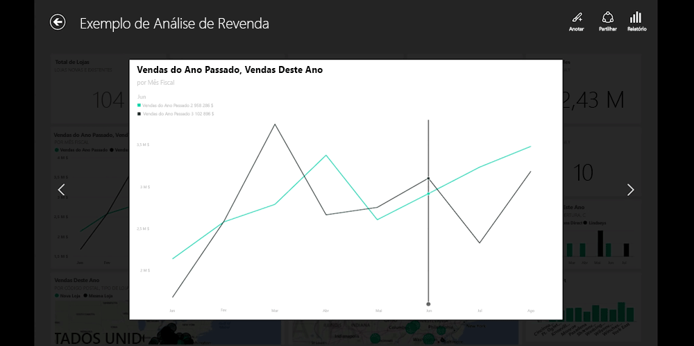
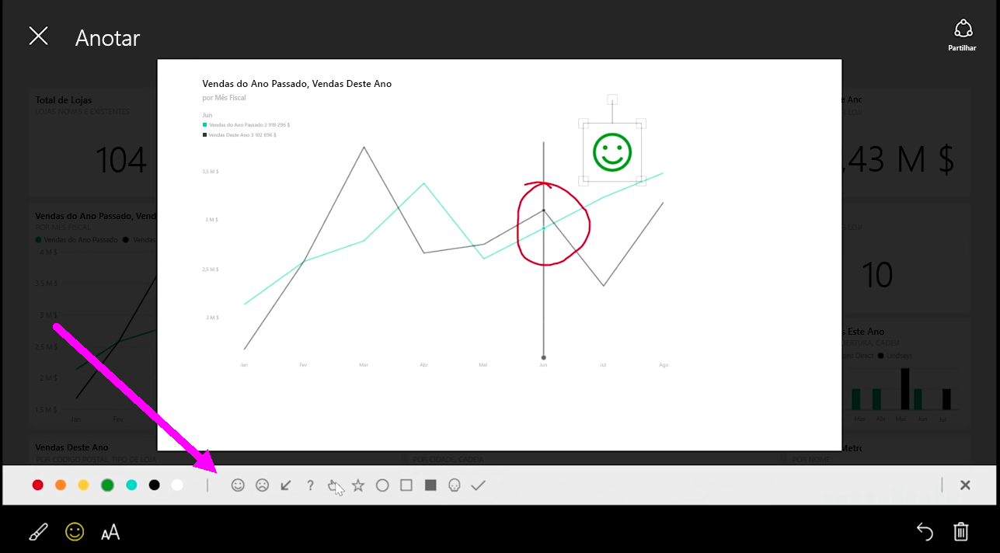

Se quiser monitorizar os seus dados enquanto se desloca, pode utilizar uma das aplicações móveis do Power BI para dispositivos iOS, Android e Windows.

Quando utilizar a aplicação Power BI, inicie sessão primeiro na sua conta com as suas informações de conta do serviço Power BI. Num dispositivo móvel Windows (neste caso, um tablet), o início de sessão é semelhante ao seguinte.

O primeiro ecrã que irá ver apresenta todos os conteúdos aos quais tem acesso, incluindo relatórios, dashboards e grupos. Também existem dashboards de exemplo que pode utilizar para se inspirar ou apenas para ver as capacidades do Power BI. A aplicação foi concebida para ser intuitiva ao toque: toque num dashboard ou relatório para o ver em modo de ecrã inteiro e desloque-se pelo menos utilizando o seu dedo.

Pode abrir qualquer um dos dashboards, tocando nos mesmos. Num dashboard, pode tocar num mosaico do dashboard para se focar nele numa vista ampliada.

Também pode anotar todas as informações que detetar, tocando no botão **Anotar** no canto superior direito. Esta ação permite-lhe recorrer a um mosaico em destaque para realçar áreas de interesse específicas. As ferramentas de anotação encontram-se ao longo da parte inferior do ecrã.

Para partilhar o seu mosaico anotado, toque na ligação **Partilhar** no canto superior direito.

Toque na ligação **Relatório** no canto superior direito para ver o relatório subjacente de um mosaico. Esta ação apresenta exatamente as mesmas visualizações que veria num browser ou no Power BI Desktop e inclui também a capacidade de interagir com o relatório ao tocar nas barras, desagregar ou ao utilizar a segmentação de dados.

