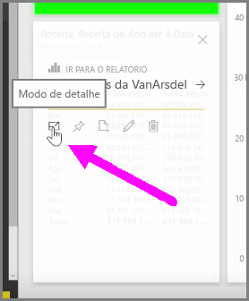
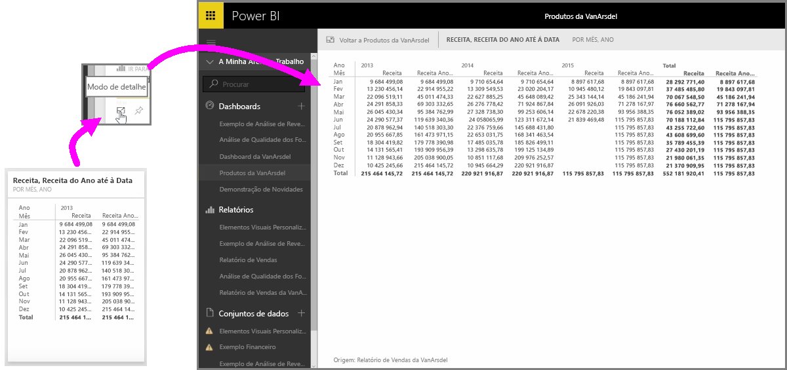

Quando estiver a olhar para dashboards ou relatórios do Power BI no serviço, por vezes, pode ser útil concentrar-se num gráfico ou visualização individual. Pode fazê-lo de duas formas diferentes.

Quando estiver num dashboard, paire o rato sobre um mosaico para ver algumas opções de ícones diferentes no canto superior direito. Quando seleciona as reticências (os três pontos), verá uma coleção de ícones que representam as ações que pode executar no mosaico.

O ícone mais à esquerda está identificado como **Modo de detalhe**. Selecione esse ícone para expandir o mosaico de forma a abranger todo o espaço do dashboard.

O **Modo de detalhe** permite-lhe ver muito mais detalhes nos seus elementos visuais e legendas. Por exemplo, quando redimensiona um mosaico no Power BI, algumas das colunas podem não ser apresentadas devido ao espaço disponível no mosaico.

No **Modo de detalhe**, pode ver todos os dados. Também pode afixar o elemento visual a partir diretamente do modo de detalhe a um dashboard diferente, selecionando o ícone de **Pin**. Para sair do **Modo de detalhe**, selecione o ícone **Voltar a...** no canto superior esquerdo do **Modo de detalhe**.

O processo é semelhante quando visualiza um relatório. Paire o rato sobre um elemento visual para ver os três ícones no canto superior direito e selecione o ícone **Modo de detalhe**. A seleção deste ícone expande a sua visualização para abranger a tela de relatórios completa. O elemento visual continua interativo neste modo, embora perca temporariamente qualquer efeito de filtro cruzado entre as visualizações.

Paire o rato sobre um mosaico ou relatório expandido e selecione o ícone de seta para a esquerda **Voltar a...** no canto superior esquerdo para voltar à vista anterior.

