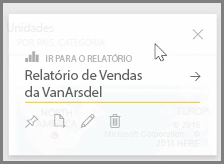
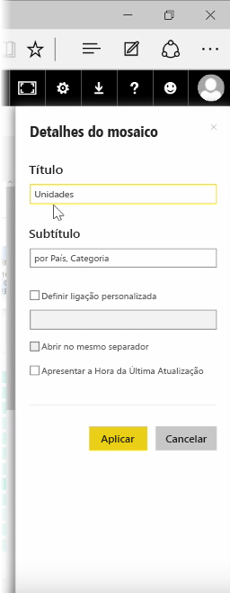
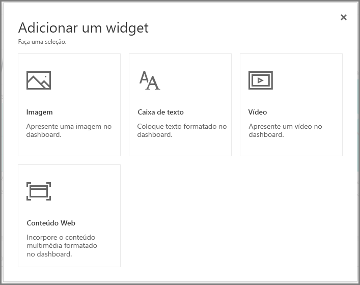
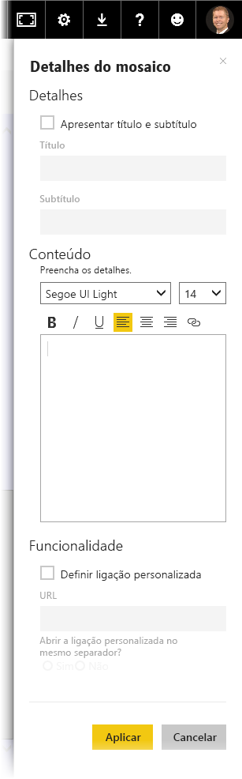

Depois de criar um dashboard, pode editar os respetivos **Mosaicos* no serviço Power BI para fazer algumas alterações de formatação.

Para fazer alterações a um mosaico, paire o rato sobre o mosaico e selecione as reticências (três pontos) para mostrar uma coleção de ícones que lhe permitem fazer alterações ao mosaico.

Selecione o ícone de **caneta** para abrir o painel **Detalhes do Mosaico**. Aqui, pode alterar o **Título** e o **Subtítulo** do mosaico, incluir a hora e data da última atualização, bem como outros detalhes, como criar uma ligação personalizada.

Por predefinição, quando clica num mosaico do dashboard, é direcionado para o relatório a partir do qual foi gerado. Para alterar este comportamento, utilize o campo **Definir ligação personalizada** no painel **Detalhes do Mosaico**. Uma utilização popular desta funcionalidade é direcionar os utilizadores para a home page da organização quando clicam numa imagem de logótipo.

## Adicionar widgets ao dashboard
Também pode adicionar widgets ao dashboard. Um **widget** é um mosaico do dashboard especial que, em vez de conter uma visualização, contém outros itens, como uma imagem, um vídeo online, uma caixa de texto ou conteúdo Web avançado.

Quando seleciona a ligação Adicionar Widget no canto superior direito de um Dashboard, a caixa de diálogo **Adicionar um widget** é apresentada.

Quando adiciona uma caixa de texto, por exemplo, aparece um painel **Detalhes do mosaico** no lado direito, onde pode editar detalhes semelhantes aos que estão disponíveis quando edita os detalhes de um mosaico. No entanto, no caso dos widgets, existe também uma secção para definir ou modificar o conteúdo do widget, tal como um editor de texto formatado para uma caixa de texto.

Com os widgets e a capacidade de editar os detalhes do mosaico, pode personalizar o dashboard e dar-lhe o aspeto que pretende que tenha.

