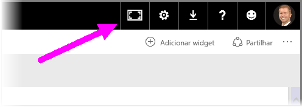
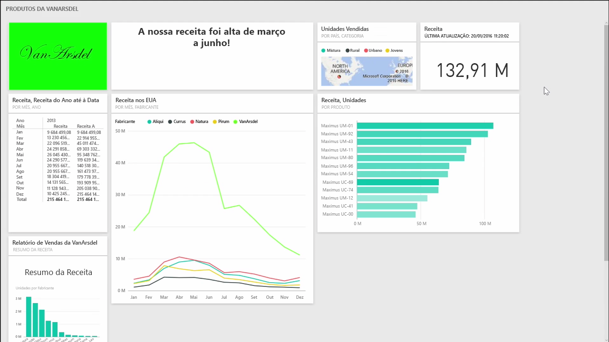
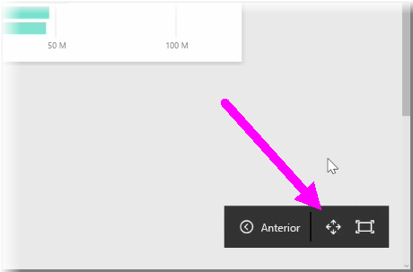
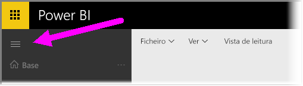

Pode achar que, ocasionalmente, quando cria os seus dashboards, tem mais conteúdo do que o que pode caber na sua tela. Existem algumas soluções que o ajudam a gerir a forma como o espaço do dashboard é apresentado, para que tenha uma visão completa do conteúdo do dashboard.

O método mais simples para apresentar o dashboard completo num ecrã é selecionar o botão **Modo de Ecrã Completo** no canto superior direito do dashboard.

Selecionar o botão **Modo de Ecrã Completo** coloca o seu browser no modo de ecrã completo, retirando todos os elementos do chrome em torno do dashboard e, deste modo, aumentando a quantidade de espaço que pode ser visualizado.

No **Modo de Ecrã Completo**, pode selecionar a opção **Ajustar ao Ecrã** para reduzir todos os mosaicos, de forma a ajustarem-se num único ecrã, sem a necessidade de barras de deslocamento. Isto é normalmente denominado *Modo TV* e é útil para fazer apresentações com dashboards ou apresentar um dashboard em monitores de corredor.

Outra forma de gerir o espaço do dashboard é fechar o painel de navegação no lado esquerdo da página, ao selecionar o ícone de hambúrguer. Para expandir o painel de navegação, clique no ícone novamente.

Pode certificar-se de que um dashboard terá sempre uma barra de navegação fechada, ao acrescentar o seguinte no fim do URL:

> ?collapseNavigation=true
> 
> 

Os utilizadores que seguem essa ligação irão abrir o dashboard com uma barra de navegação fechada.

