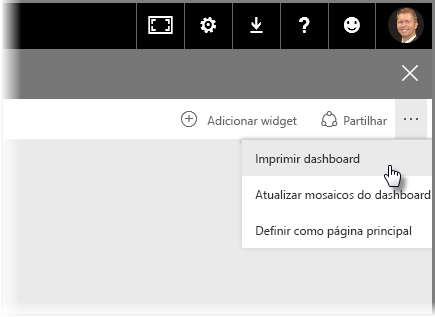
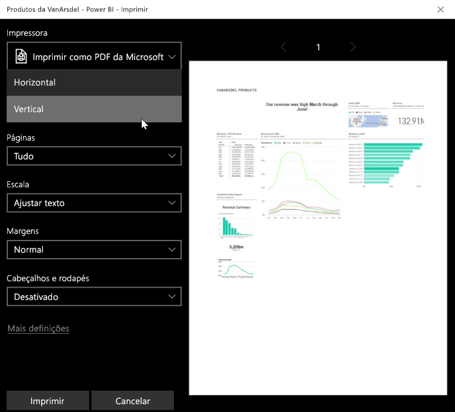
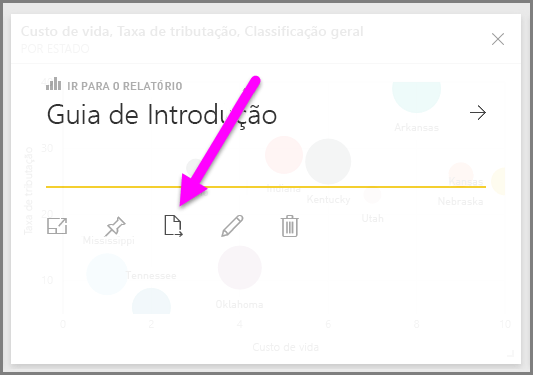
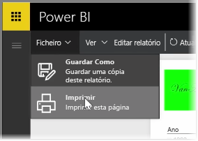

Por vezes, poderá trazer um relatório impresso ou um dashboard para uma reunião ou poderá partilhá-lo com outras pessoas. Com o Power BI, durante alguns dias pode realizar impressões dos seus visuais.

No serviço do Power BI, selecione as reticências (três pontos) no canto superior direito do serviço e selecione **Imprimir dashboard**.

A caixa de diálogo **Imprimir** é apresentada, onde pode selecionar a impressora para a qual pretende enviar o dashboard, bem como as opções habituais de impressão, como a orientação *vertical* ou *horizontal*.

## Exportar dados de um visual
Também pode exportar os dados a partir de qualquer visual no serviço do Power BI. Basta selecionar as reticências em qualquer elemento visual e, em seguida, selecionar o botão **Exportar dados** (botão do meio). Quando o fizer, é criado um ficheiro .CSV e transferido para o seu computador local e é apresentada uma mensagem no seu browser (como em qualquer outra transferência iniciada pelo browser), permitindo-lhe saber que a transferência está concluída.

Também pode imprimir ou exportar diretamente a partir de um relatório. Ao visualizar um relatório no serviço do Power BI, selecione **Ficheiro > Imprimir** para abrir a caixa de diálogo de impressão.

E, assim como com um dashboard, também pode exportar dados a partir de um elemento visual num relatório, ao selecionar o botão de exportação num visual.

