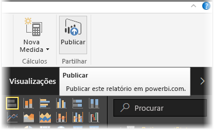
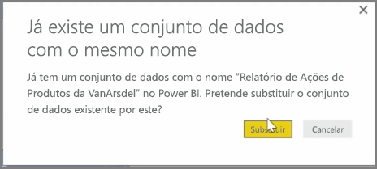
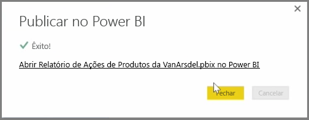

Pode atualizar relatórios e conjuntos de dados que já tiver publicado do Power BI Desktop para o serviço do Power BI. Para tal, selecione **Publicar** no separador **Home page** no friso.

Quando publica um relatório que já existe no serviço do Power BI, é-lhe pedido para confirmar que pretende substituir o conjunto de dados anterior e os relatórios pela versão editada que escolheu para atualizar.

Quando seleciona **Substituir**, os conjuntos de dados e relatórios no serviço do Power BI são substituídos pelos conjuntos de dados e relatórios na versão mais recente do ficheiro do Power BI Desktop.

E como qualquer outro evento de **Publicação** do Power BI Desktop, verá uma caixa de diálogo que indica que o evento de publicação foi realizado com êxito e obtém uma ligação para o relatório no serviço do Power BI.

Esta é uma forma de atualizar manualmente os seus dados. Também pode atualizar automaticamente conjuntos de dados e relatórios; esse processo encontra-se noutro tópico de aprendizagem.

