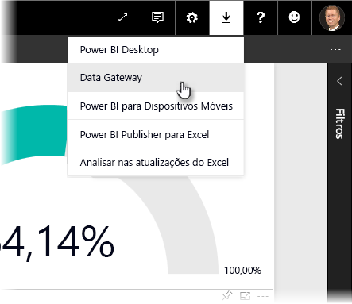
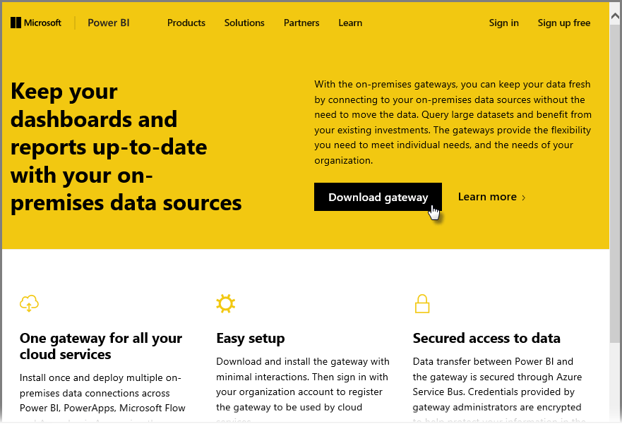
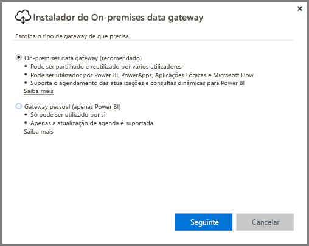
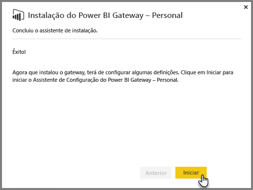
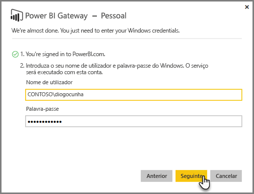
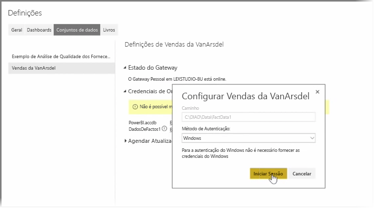
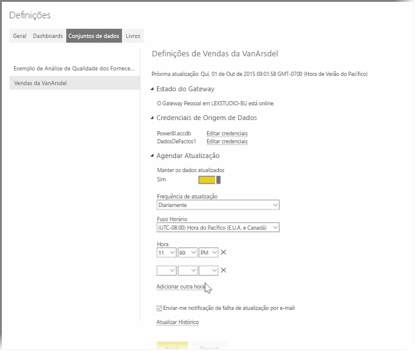

Nos tópicos anteriores, vimos como utilizar o Power BI para ligar a origens de dados e como atualizar manualmente os conjuntos de dados no serviço Power BI. No entanto, não vai querer atualizar manualmente tudo sempre que os seus dados mudam e, por isso, pode utilizar o Power BI para configurar uma atualização agendada que irá ligar às suas origens de dados e publicá-las automaticamente no Serviço Power BI. Este método também lhe permite ligar o serviço a qualquer origem de dados no local, incluindo ficheiros do Excel, bases de dados do Access, bases de dados SQL e muito mais.

O sistema que lhe permite ligar as suas origens de dados no local ao serviço Power BI chama-se **gateway de dados**. É uma pequena aplicação que é executada no seu computador e utiliza um agendamento previamente configurado para ligar aos seus dados, recolher todas as atualizações e emiti-las no serviço Power BI. O **gateway pessoal** é uma versão do **gateway de dados** que pode ser utilizada sem qualquer configuração do administrador.

>[!NOTE]
>O computador que está a executar o gateway pessoal do Power BI *tem* de estar ligado à alimentação e à Internet para que o **gateway pessoal** funcione corretamente.
> 

Para configurar o seu **gateway pessoal**, primeiro tem de iniciar sessão no serviço Power BI. Selecione o ícone de **Transferência** no canto superior direito do ecrã e, em seguida, selecione **Gateways de Dados** no menu.

A partir daí, será direcionado para uma página Web onde pode selecionar **Power BI Gateway - Personal**, conforme mostra a figura abaixo.

Execute a aplicação quando a transferência terminar e conclua o assistente de instalação.

Em seguida, é-lhe pedido que inicie o assistente de configuração para configurar o gateway.

Primeiro, é-lhe pedido que inicie sessão na conta do serviço Power BI e, em seguida, que inicie sessão na conta do Windows do computador, uma vez que o serviço de gateway é executado na sua conta.

Volte ao serviço Power BI. Selecione o menu de reticências (três pontos) junto ao conjunto de dados que pretende atualizar e, em seguida, selecione **Agendar Atualização**. Esta ação abre a página **Definições de Atualização**. O Power BI deteta que instalou um **gateway pessoal** e permite-lhe saber o estado.

Selecione **Editar credenciais** junto a cada origem de dados aplicável e configure a autenticação.

Por fim, defina as opções em **Agendar Atualização** para ativar as atualizações automáticas e definir quando e com que frequência ocorrem.

E já está! Às horas agendadas, o Power BI irá para essas origens de dados, com as credenciais que indicou e a ligação para o computador no qual o seu **gateway pessoal** está em execução, e atualizará os relatórios e conjuntos de dados de acordo com o agendamento. Da próxima vez que aceder ao Power BI, esses dashboards, relatórios e conjuntos de dados irão refletir os dados a partir da atualização agendada mais recente.

## Próximas etapas
**Parabéns!** Concluiu a secção **Explorar Dados** do curso de **Aprendizagem Orientada** do Power BI. O serviço Power BI está repleto de formas interessantes para explorar dados, partilhar informações e interagir com elementos visuais. E está tudo acessível a partir de um browser, num serviço ao qual pode ligar onde quer que esteja.

Um parceiro poderoso e muito conhecido do Power BI é o **Excel**. O Power BI e o Excel foram concebidos para funcionarem bem em conjunto; os seus livros vão sentir-se em casa no Power BI e é muito fácil colocá-los lá.

O quão fácil? Na secção seguinte, **Power BI e Excel** vai aprender exatamente isso.

Vemo-nos na próxima secção!

