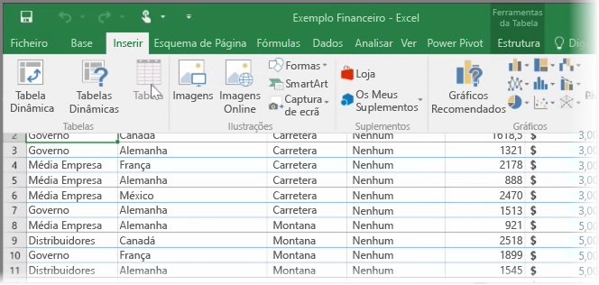
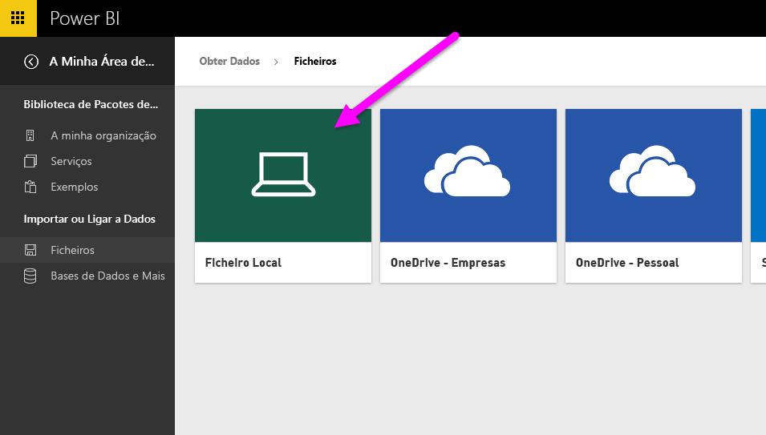
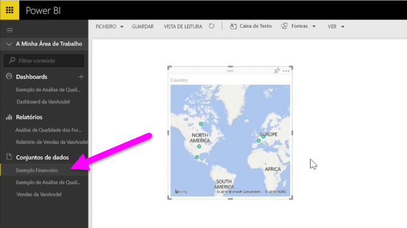

Neste tópico, vamos ver primeiro como pode importar um ficheiro de livro do Excel que contém uma **tabela** simples, de uma unidade local para o Power BI. Em seguida, vai aprender a começar a explorar os dados nessa tabela no Power BI através da criação de um relatório.

## Certificar-se de que os dados estão formatados como uma tabela
Para que o Power BI importe dados de um livro, esses dados têm de estar **formatados como uma tabela**. É fácil. No Excel, pode realçar um intervalo de células e, em seguida, no separador **Inserir** do friso do Excel, clique em **Tabela**.

Certifique-se de que cada coluna tem um nome adequado. Desta forma, será mais fácil localizar os dados que pretende quando criar os seus relatórios no Power BI.

## Importar a partir de uma unidade local
Onde quer que mantenha os seus ficheiros, o Power BI facilita a importação dos mesmos. No Power BI, pode utilizar **Obter Dados** > **Ficheiros** > **Ficheiro Local**, para localizar e selecionar o ficheiro do Excel que quiser.

Depois de o importar para o Power BI, pode começar a criar relatórios.

Como é óbvio, os ficheiros não têm de estar numa unidade local. Se guardar os ficheiros no OneDrive ou no Site de Equipa do SharePoint, é ainda melhor. Iremos analisar este aspeto mais pormenorizadamente num tópico mais à frente.

## Começar a criar relatórios
Depois de os dados do seu livro terem sido importados, é criado um conjunto de dados no Power BI. É apresentado em **Conjuntos de dados**. Agora, pode começar a explorar os seus dados através da criação de relatórios e dashboards. Basta clicar no ícone **Abrir menu** junto ao conjunto de dados e, em seguida, clicar em **Explorar**. É apresentado um novo ecrã de relatório em branco. À direita, em **Campos**, verá as suas tabelas e colunas. Basta selecionar os campos para os quais pretende criar uma nova visualização no ecrã.

Pode alterar o tipo de visualização e aplicar **filtros** e outras propriedades em **Visualizações**.

