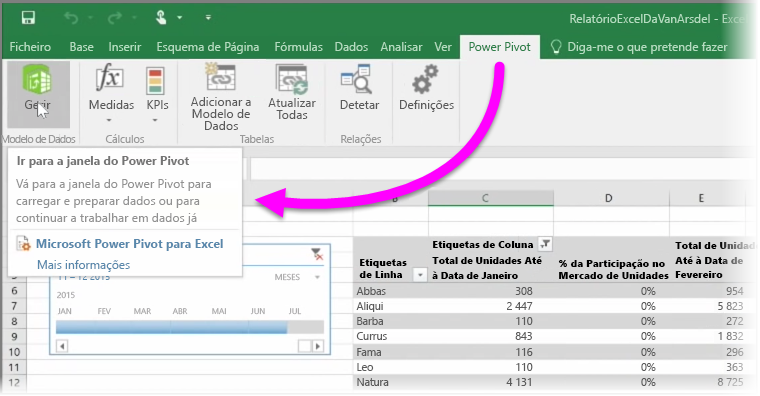

Se utilizar qualquer uma das funcionalidades do BI avançadas do Excel, como o **Power Query** (denominado **Obter e Transformar** no Excel 2016) para consultar e carregar dados, o **Power Pivot** para criar modelos de dados poderosos e o **Power View** para criar relatórios dinâmicos, também os pode importar para o Power BI.

Se utilizar o **Power Pivot** para criar modelos de dados avançados, como os que têm várias tabelas relacionadas, medidas, colunas calculadas e hierarquias, o Power BI também irá importar todos eles.

Se o seu livro tiver **folhas do Power View**, não há problema. O Power BI irá recriará-las como novos **relatórios** no Power BI. Pode começar a afixar visualizações nos dashboards de imediato.

E aqui está uma das grandes funcionalidades do Power BI: se utilizar o Power Query ou o Power Pivot para ligar, consultar e carregar dados a partir de uma origem de dados externa, depois de ter importado o livro para o Power BI, pode configurar a **atualização agendada**. Ao utilizar a atualização agendada, o Power BI irá utilizar as informações de ligação do livro para ligar diretamente à origem de dados, e consultar e carregar os dados que foram alterados. Qualquer visualizações nos relatórios também serão automaticamente atualizadas.

