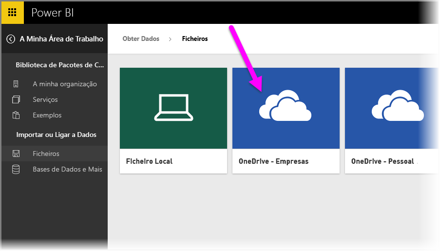
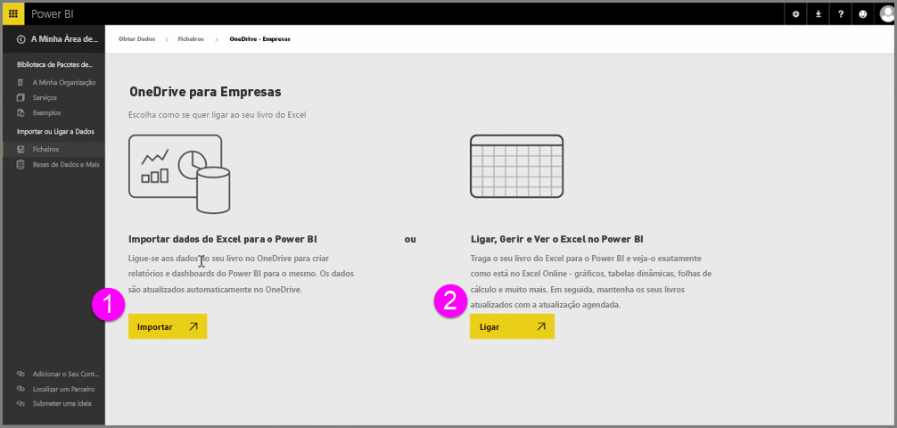
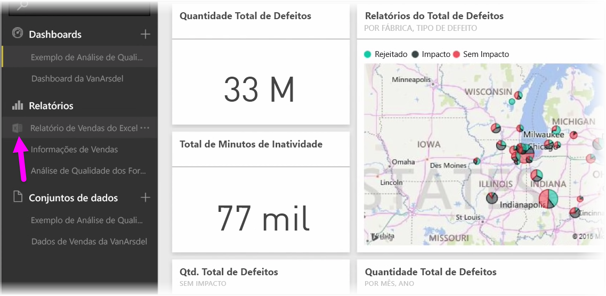
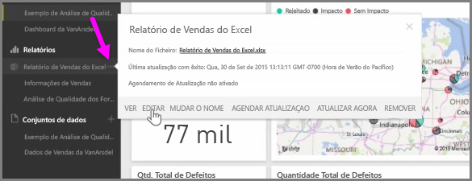

Obtenha uma integração perfeita entre o Power BI e o Excel ao guardar os seus livros do Excel no OneDrive.

Uma vez que o OneDrive se encontra na cloud, tal como o Power BI, é estabelecida uma ligação em direto entre o Power BI e o OneDrive. Se fizer alterações ao seu livro no OneDrive, essas alterações são *automaticamente sincronizadas* com o Power BI. A suas visualizações em relatórios e dashboards mantêm-se atualizadas. Se o seu livro ligar a origens de dados externas, como uma base de dados ou um feed do OData, pode utilizar a funcionalidade **Agendar Atualização** do Power BI para procurar atualizações. Precisa de fazer perguntas sobre dados do seu livro? Sem problemas. Pode utilizar as funcionalidades de **Perguntas e Respostas** do Power BI para fazê-lo.

Existem duas formas de ligar aos seus ficheiros do Excel no OneDrive para Empresas:

1. Importar dados do Excel para o Power BI
2. Ligar, gerir e ver o Excel no Power BI

### Importar dados do Excel para o Power BI
Quando opta por importar dados do Excel para o Power BI, os dados de tabela do livro são carregados para um novo conjunto de dados no Power BI. Se tiver folhas do **Power View** no livro, essas folhas são importadas e também são criados automaticamente novos relatórios no Power BI.

O Power BI mantém a ligação entre eles e o ficheiro de livro no OneDrive para Empresas. Se fizer alterações ao seu livro, quando guardar, essas alterações serão *automaticamente sincronizadas** com o Power BI, normalmente, no prazo de uma hora. Se o livro ligar a origens de dados externas, pode configurar a atualização agendada para que o conjunto de dados no Power BI se mantenha atualizado. Uma vez que as visualizações nos relatórios e no dashboard no Power BI irão utilizar os dados do conjunto de dados, à medida que explora, as suas consultas são extremamente rápidas.

### Conectar, gerir e ver o Excel no Power BI
Quando opta por ligar ao livro do Excel, terá uma experiência totalmente integrada de utilização do seu livro no Excel e no Power BI. Quando liga desta forma, o relatório do livro tem um pequeno ícone do Excel junto ao mesmo.

No relatório, verá o seu livro do Excel no Power BI, tal como veria no **Excel Online**. Pode explorar e editar as suas folhas de cálculo no Excel Online, selecionando Editar no menu de reticências. Quando fizer alterações, quaisquer visualizações que tiver afixado aos dashboards são atualizadas automaticamente.

Nenhum conjunto de dados será criado no Power BI. Todos os dados permanecem no livro no OneDrive. Uma das muitas vantagens desta abordagem é o facto de poder configurar a **atualização agendada** se o seu livro ligar a origens de dados externas. Pode selecionar elementos, como PivotTables e gráficos, e **afixar** os mesmos aos dashboards no Power BI. Se fizer alterações, estas refletem-se automaticamente no Power BI. Além disso, pode utilizar as fantásticas funcionalidades de **Perguntas e Respostas** do Power BI para fazer perguntas sobre os dados no seu livro.  

