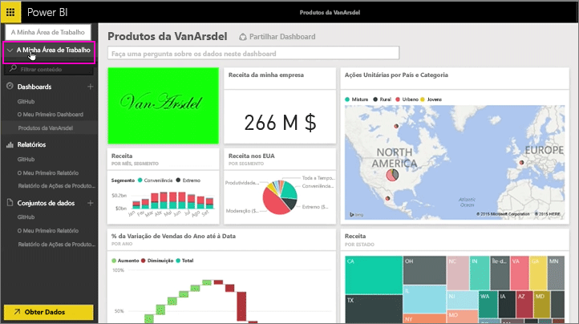
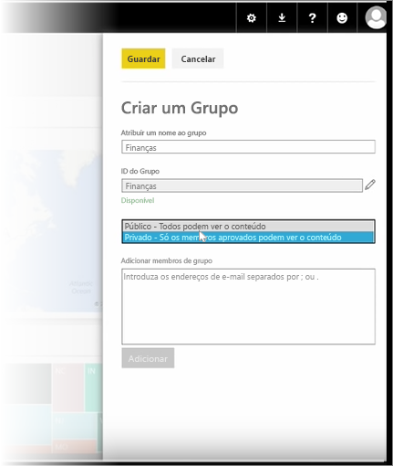
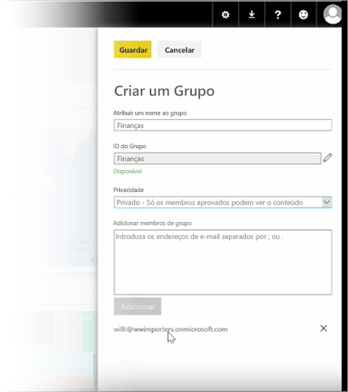

Nesta aula, vamos começar por criar um *grupo*. Um **grupo** define um conjunto de utilizadores que têm acesso a dados, relatórios e dashboards específicos.

Os grupos no Power BI baseiam-se em grupos do Office 365, por isso se tem utilizado grupos do Office 365 para gerir o e-mail, o calendário e os documentos do seu grupo, verá que o Power BI oferece as mesmas funcionalidades e muito mais. Quando cria um grupo no Power BI, na verdade, está a criar um grupo do Office 365.

Este módulo utiliza o cenário de configuração de um novo grupo de finanças. Vamos mostrar como configurar o grupo, partilhar dashboards, relatórios e conjuntos de dados com o grupo, e adicionar membros que terão acesso aos itens no grupo.

Começo aqui na Minha Área de Trabalho. Estes são os dashboards, relatórios e conjuntos de dados que criei ou que alguém partilhou comigo.

Se expandir a Minha Área de Trabalho, pode selecionar **Criar um grupo**.

Aqui posso atribuir um nome. Estamos a utilizar o cenário ou um grupo do departamento financeiro, pelo que chamaremos de Finanças. O Power BI certifica-se de que o nome não existe no domínio.

Pode definir o nível de privacidade ao decidir se qualquer pessoa na minha organização pode ver o conteúdo do grupo ou apenas os seus membros.

Escrevo os endereços de e-mail, os grupos de segurança e as listas de distribuição aqui. Seleciono **Adicionar** para torná-los membros do grupo e guardo o mesmo.

Avancemos para a próxima aula!

