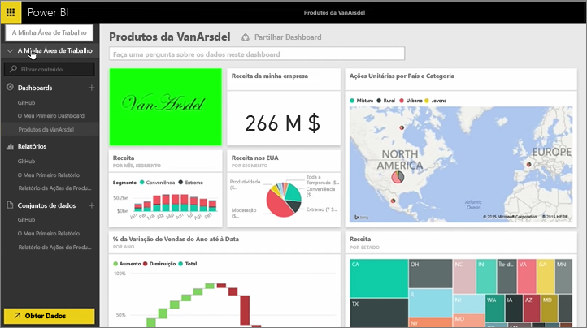
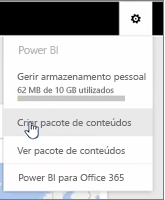
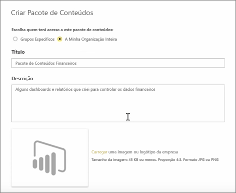
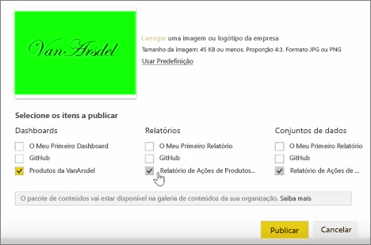
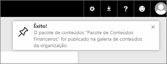

Nesta lição, vamos criar um *pacote de conteúdos* com artefactos existentes que já temos no Power BI e partilhá-los com colegas.

Em **A Minha Área de Trabalho**, existe um dashboard, o relatório por baixo e o conjunto de dados. Quero partilhá-los como um pacote com as pessoas da minha organização, para que possam reutilizá-los.

Quando seleciono o ícone de **Definições** (a engrenagem na parte superior direita do serviço), posso ver a quantidade de armazenamento que utilizei e posso criar um pacote de conteúdos.

Na caixa de diálogo que aparece, posso escolher se pretendo distribui-lo para pessoas específicas ou grupos e também posso dar um título ao pacote de conteúdos. Também é boa ideia fornecer uma descrição detalhada na caixa **Descrição**, para que as pessoas que estejam à procura de um pacote de conteúdos saibam o que contém ou o que fornece.

Na parte inferior da caixa de diálogo, tenho a oportunidade de carregar uma imagem para o pacote de conteúdos e, em seguida, o passo mais importante: selecionar o dashboard que pretendo incluir no pacote de conteúdos e, quando o fizer, o Power BI seleciona automaticamente o relatório e o conjunto de dados que são utilizados no dashboard. Não é possível anular a seleção do relatório ou conjunto de dados, porque o dashboard que pretendo incluir no pacote de conteúdos necessita deles.

Também podia selecionar outros dashboards, relatórios e conjuntos de dados, mas não o vou fazer agora.

Quando publicar, o pacote de conteúdos é adicionado à galeria de conteúdos da organização.

Avancemos para a próxima aula!

