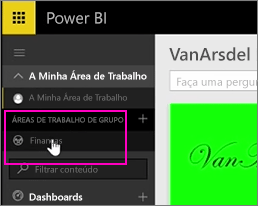
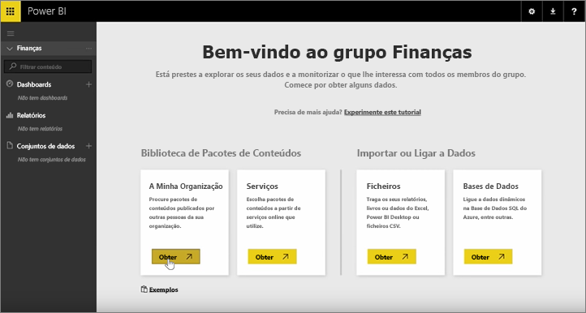
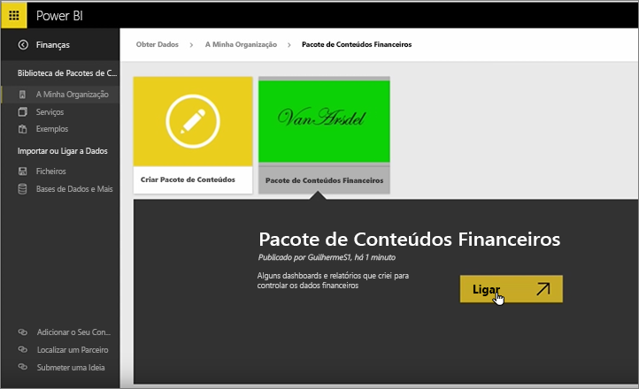
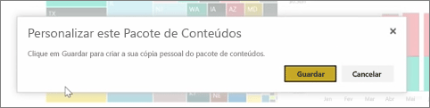
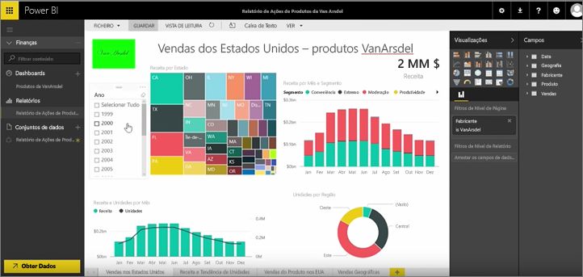

Nas aulas anteriores, já criámos um pacote de conteúdos e um grupo. Nesta aula, vamos criar uma instância do pacote de conteúdos para todos os utilizadores no grupo.

Começo na Minha Área de Trabalho...

... e volto para o grupo de Finanças que criei na aula anterior.

O grupo ainda não tem quaisquer dashboards, relatórios ou conjuntos de dados. Vou utilizar o pacote de conteúdos que criei. Procuro os pacotes de conteúdos da minha organização, em vez dos pacotes de serviços de terceiros.

Encontro o pacote de conteúdos que criei há um minuto. Vejo por que motivo é importante atribuir-lhe um bom título, descrição e imagem, para que as pessoas o possam encontrar. Ligo-me a ele.

O Power BI importa os dashboards, relatórios e conjuntos de dados que estão no pacote de conteúdos.

Quando seleciono o conjunto de dados, o Power BI pergunta se pretendo personalizar o pacote de conteúdos.

Estou a criar uma cópia do pacote de conteúdos onde posso fazer alterações e desligá-la da versão publicada do pacote de conteúdos. Se o autor do pacote de conteúdos fizer alterações na versão publicada, não obtenho essas atualizações automaticamente.

Mas posso editar o dashboard, o relatório e até o conjunto de dados, se pretender.

Desta forma, os pacotes de conteúdos são uma forma simples de reutilizar conteúdo criado por outras pessoas na sua organização.

Avancemos para a próxima aula!

