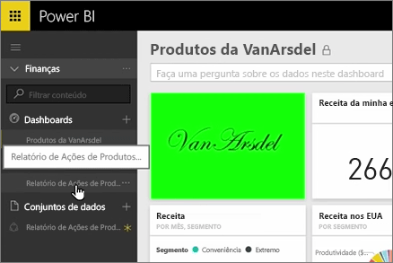

Nas aulas anteriores, já criámos um pacote de conteúdos e um grupo. Nesta aula, vamos criar uma instância do pacote de conteúdos para todos os utilizadores no grupo.

Começo na Minha Área de Trabalho...

... e volto para o grupo de Finanças que criei na aula anterior.

O grupo ainda não tem quaisquer dashboards, relatórios ou conjuntos de dados. Vou para utilizar a aplicação criada. Posso procurar aplicações da minha organização em vez de os de serviços de terceiros.

Posso encontrar a aplicação criada há um minuto. Vejo por que motivo é importante atribuir-lhe um bom título, descrição e imagem, para que as pessoas o possam encontrar. Ligo-me a ele.

O Power BI importa os dashboards, relatórios e conjuntos de dados na aplicação.

Quando seleciono o conjunto de dados, o Power BI pergunta se pretendo personalizar a aplicação.

Estou criando uma cópia da aplicação que posso fazer alterações para e desligá-la da versão publicada do aplicativo. Se o criador da aplicação fizer alterações na versão publicada, que não terei automaticamente essas atualizações.

Mas posso editar o dashboard, o relatório e até o conjunto de dados, se pretender.

Então, a aplicação são uma forma simples de reutilizar conteúdo criado por outras pessoas na sua organização.

Avancemos para a próxima aula!

