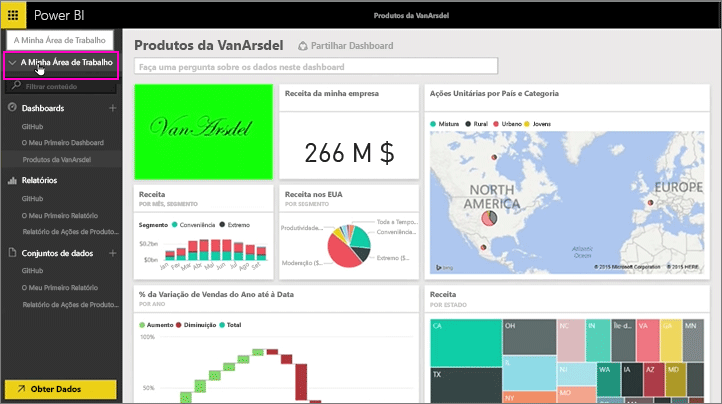
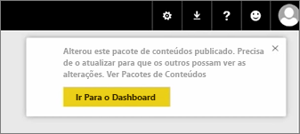
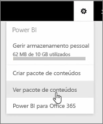
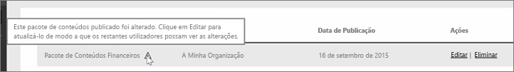
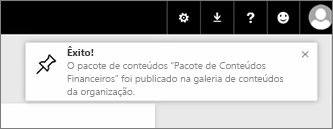

Nesta aula iremos editar o pacote de conteúdos original que criámos anteriormente e ver como isso atualiza as outras pessoas que se ligaram ao mesmo.

Estou novamente na Minha Área de Trabalho a editar o meu dashboard original.

Sempre que faço uma alteração ao dashboard, recebo este lembrete que indica que alterei algo que partilhei com outras pessoas num pacote de conteúdos, e a pedir para atualizar a versão partilhada.

Volto para o ícone de definições e seleciono **Ver pacote de conteúdos** para ver os pacotes de conteúdos que já publiquei.

Vejo o pacote de conteúdos que criei. Este ícone pequeno informa-me que alterei algo no pacote de conteúdos e que preciso de editar o pacote de conteúdos, para que outras pessoas possam ver as minhas alterações.

Quando seleciono **Editar**, estou de volta ao ecrã onde posso editar o título e a descrição, mas desta vez tem um botão de **Atualização**, pelo que seleciono o mesmo.

O Power BI assume essas alterações e publica o pacote de conteúdos atualizado na galeria do pacote de conteúdos.

Qualquer pessoa que esteja ligada ao meu pacote de conteúdos obtém uma mensagem a indicar que o pacote de conteúdos foi alterado e pergunta se pretendem aceitar as alterações ou manter a versão anterior.

Por isso, enquanto proprietário do pacote de conteúdos, pode gerir as versões que os seus colegas estão a utilizar.

