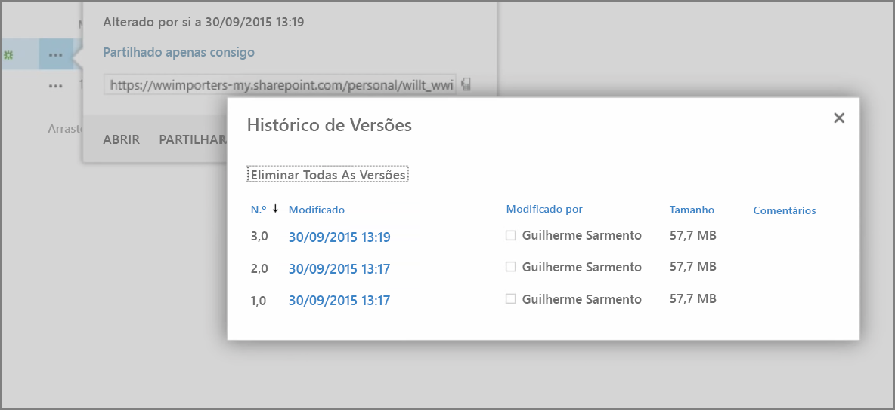
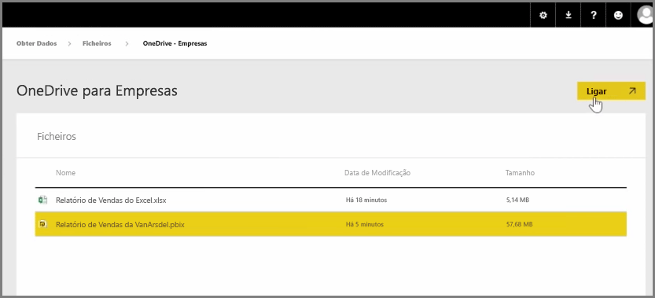
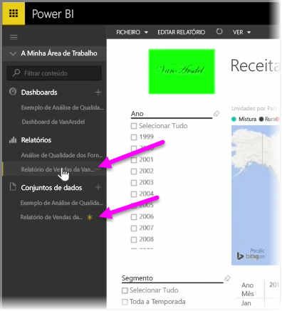

Num artigo anterior revemos a criação de grupos para ajudar a sua organização a gerir e a colaborar em conteúdo que está no Power BI. Também pode utilizar grupos do Power BI/Office 365 para colaborar e partilhar ao utilizar o **OneDrive para Empresas**.

Utilizar o OneDrive para Empresas como uma origem para conteúdo do Power BI dá-lhe acesso a várias ferramentas úteis, como o histórico de versões. Também pode partilhar os seus ficheiros com um grupo do Office 365 a partir do OneDrive para Empresas, para conceder acesso e permitir que várias pessoas trabalhem nos mesmos ficheiros do Power BI ou do Excel.

Para ligar a um ficheiro PBIX (Power BI Desktop) no OneDrive para Empresas, inicie sessão no serviço Power BI e selecione **Obter Dados**. Escolha **Ficheiros** em Importar ou Ligar a Dados e, em seguida, selecione **OneDrive - Empresas**. Destaque o ficheiro pretendido e selecione **Ligar**.

O conteúdo é apresentado na barra de navegação do lado esquerdo.

Agora, as alterações feitas no ficheiro do **OneDrive para Empresas** serão automaticamente refletidas no ambiente do Power BI e registadas no histórico de versões.

