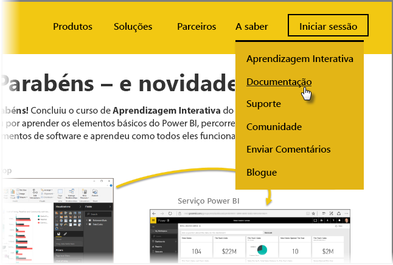

Você conseguiu! **Parabéns!** Concluiu o curso **Aprendizagem Orientada** do Power BI. Chegou ao fim do ciclo: começou por aprender os elementos básicos do Power BI, percorreu as respetivas funcionalidades e elementos de software e aprendeu como todos eles funcionam em conjunto.

Esta é a última secção (e o tópico final, a menos que queira aprender o DAX) do curso, pelo que, se percorreu todas estas secções por ordem, está de parabéns. Bom trabalho! Está agora bastante familiarizado com todos estes **conceitos importantes**:

* O que [é o Power BI](0-0-what-is-power-bi.md)
* Os [blocos modulares](0-0b-building-blocks-power-bi.md) do Power BI
* [Obter](1-2-connect-to-data-sources-in-power-bi-desktop.md) e [moldar](2-1-intro-modeling-data.md) dados
* [Visualizações](3-1-intro-visualizations.md)
* [Explorar dados](4-0-intro-power-bi-service.md) no serviço Power BI
* Utilizar o [Excel e o Power BI](5-1-intro-excel-data.md) em conjunto
* E [publicar e partilhar](6-0-intro-content-packs-groups.md) o seu trabalho

São muitos conhecimentos e agora que já os tem todos na cabeça, está preparado para colocá-los em prática! Eis algumas **hiperligações para transferências** ou para **ligar o seu browser ao serviço Power BI**:

* Pode sempre [obter a versão mais recente do Power BI Desktop](https://powerbi.microsoft.com/desktop)
* Aceder ao [serviço Power BI](https://powerbi.microsoft.com/) é fácil
* As [aplicações móveis para o Power BI](https://powerbi.microsoft.com/mobile/) estão à distância de um toque

Também está disponíveis mais conteúdo de **ajuda e referência**. Basta aceder à parte superior desta página e selecionar **Aprender > Documentação** para ver o nosso vasto conjunto de conteúdo de referência do Power BI.

Esperamos que tenha gostado da sua viagem por esta experiência de **Aprendizagem Orientada do Power BI**. Desejamos-lhe as maiores felicidades e que os seus elementos visuais do Power BI sejam sempre envolventes e empolgantes.

## Mais uma secção para utilizadores de DAX
Ainda quer mais? Está interessado em utilizar o **DAX (Data Analysis Expressions)** para criar, filtrar ou utilizar tabelas e colunas personalizadas no Power BI? Há mais uma secção direcionada para pessoas que estejam inclinadas a fazer algum trabalho de codificação no Power BI, que se chama **Introdução ao DAX**. Se estiver interessado, dê uma vista de olhos - utiliza a mesma abordagem amigável que o resto da Aprendizagem Orientada.

