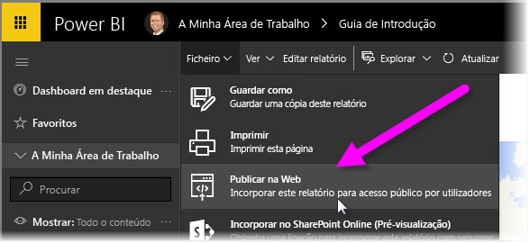
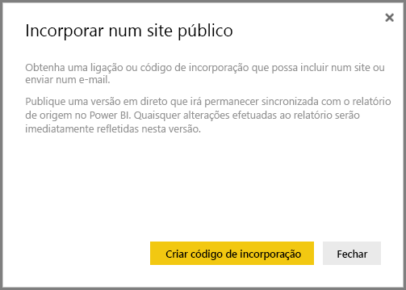
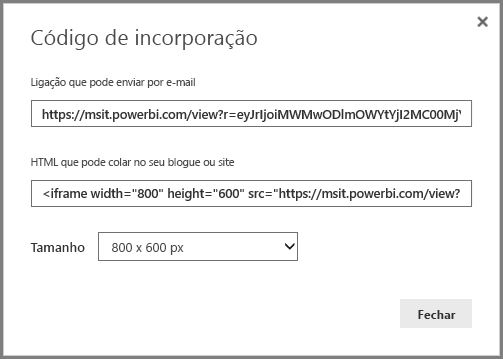
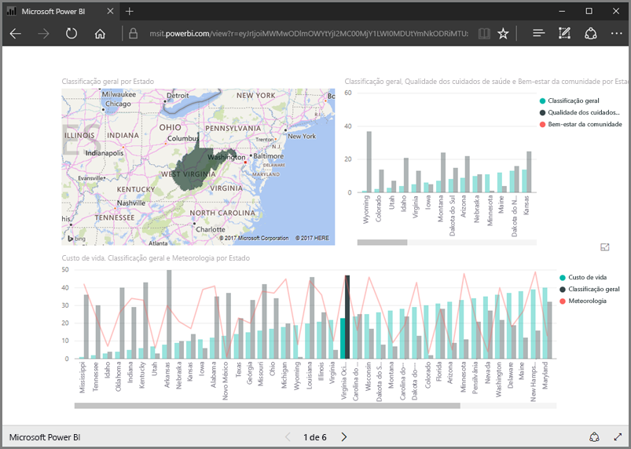
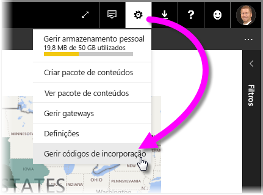
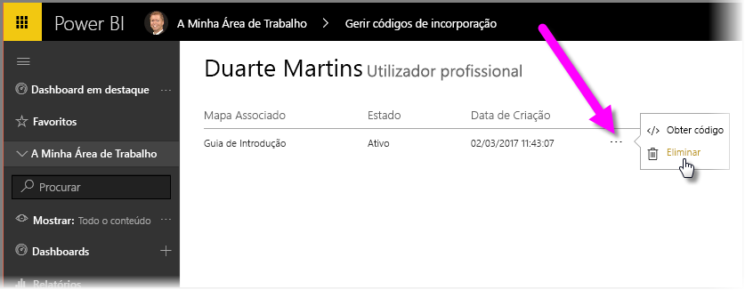

Nesta lição, vamos aprender a partilhar um relatório do Power BI numa página Web ou partilhá-lo através de e-mail, em apenas alguns passos simples. Esta funcionalidade do Power BI é muitas vezes designada por **Publicar na Web** e é fácil de utilizar e gerir.

No Power BI, selecione o relatório que pretende partilhar, para que seja apresentado na tela. Em seguida, no menu, selecione **Ficheiro > Publicar na Web**.

A partir daí, verá uma caixa de diálogo que explica que irá receber um *código de incorporação* que lhe permite incluir o relatório num site ou numa mensagem de e-mail.

Quando seleciona **Criar código de incorporação**, o Power BI apresenta outra caixa de diálogo, a informá-lo novamente de que está prestes a partilhar os seus dados com todos os utilizadores na Internet. Certifique-se de que não há problema!

O Power BI apresenta uma caixa de diálogo com duas hiperligações:

* Uma hiperligação que pode partilhar em mensagens de e-mail, que mostra o relatório como uma página Web
* Código HTML (uma hiperligação numa iframe), para que possa incorporar o relatório diretamente numa página Web

Para a hiperligação HTML, pode escolher de entre os tamanhos predefinidos para o relatório incorporado ou pode modificar o código da iframe e personalizar o seu tamanho.

Pode simplesmente colar a hiperligação de e-mail num browser e ver o relatório como uma página Web. Pode interagir com essa página Web, tal como se estivesse a visualizar o relatório no Power BI. As imagens seguintes mostram uma página **Publicar na Web**, quando a respetiva hiperligação foi copiada diretamente a partir dessa caixa de diálogo num browser:

Também pode incorporar essa hiperligação de iframe numa mensagem de blogue ou site, bem como no Sway.

Pretende eliminar um código de incorporação que criou? Sem problemas. No Power BI, selecione o ícone de **engrenagem** no canto superior direito e, em seguida, selecione **Gerir códigos de incorporação**.

A área de trabalho do Power BI mostra os códigos de incorporação que criou (na imagem abaixo, há apenas um). Ao clicar nas reticências, pode optar por receber o código para o código de incorporação ou por eliminar completamente o código de incorporação.

E é tudo o que precisa de saber para publicar um relatório do Power BI na Web e partilhá-lo com o mundo. É fácil!

