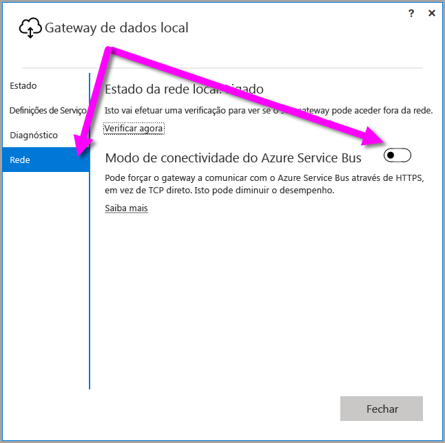

## <a name="sign-in-account"></a>Conta de início de sessão
Os utilizadores vão iniciar sessão com uma conta escolar ou profissional. Esta é a conta da sua organização. Caso se tenha inscrito numa oferta do Office 365 e não indicou o seu e-mail profissional real, pode ter um aspeto semelhante a nancy@contoso.onmicrosoft.com. A sua conta, num serviço cloud, é armazenada num inquilino no Azure Active Directory (AAD). Na maioria dos casos, o UPN da sua conta AAD corresponderá ao endereço de e-mail.

## <a name="windows-service-account"></a>Conta de Serviço Windows
O Gateway de dados no local está configurado para utilizar *NT SERVICE\PBIEgwService* para as credenciais de início de sessão do serviço Windows. Por predefinição, ele tem o direito de Iniciar sessão como um serviço. Isto sucede no contexto do computador no qual instala o gateway.

> [!NOTE]
> Se tiver selecionado o modo pessoal, irá configurar a conta de serviço Windows separadamente.
> 
> 

Esta não é a conta utilizada para se ligar a origens de dados no local.  Esta também não é a conta escolar ou profissional com a qual inicia sessão nos serviços da cloud.

Se ocorrerem problemas com o servidor proxy devido à autenticação, poderá alterar a conta do serviço Windows para uma conta de utilizador do domínio ou conta de serviço gerida. Saiba como alterar a conta em [configuração de proxy](../service-gateway-proxy.md#changing-the-gateway-service-account-to-a-domain-user).

## <a name="ports"></a>Portas
O gateway cria uma ligação de saída ao Azure Service Bus. Ele comunica com as portas de saída TCP 443 (padrão), 5671, 5672, 9350 a 9354.  O gateway não precisa de portas de entrada. [Saiba mais](https://azure.microsoft.com/documentation/articles/service-bus-fundamentals-hybrid-solutions/)

Recomenda-se que coloque os endereços IP na lista branca, para a sua região de dados, na firewall. Pode transferir a [lista de IPs do Microsoft Azure Datacenter](https://www.microsoft.com/download/details.aspx?id=41653). Esta lista é atualizada semanalmente. O gateway comunica com o Azure Service Bus utilizando o IP em conjunto com o nome de domínio completamente qualificado (FQDN). Se estiver a forçar o gateway para comunicar através de HTTPS, este utiliza estritamente apenas FQDN e não ocorre qualquer comunicação com os endereços IP.

> [!NOTE]
> Os Endereços IP listados na lista de IPs do Azure Datacenter estão em notação CIDR. Por exemplo, 10.0.0.0/24 não significa 10.0.0.0 a 10.0.0.24. Saiba mais sobre a [notação CIDR](http://whatismyipaddress.com/cidr).
> 
> 

Eis uma lista dos nomes de domínio completamente qualificados utilizados pelo gateway.

| Nomes de domínio | Portas de saída | Descrição |
| --- | --- | --- |
| *.download.microsoft.com |80 |HTTP utilizado para transferir o instalador. |
| *.powerbi.com |443 |HTTPS |
| *.analysis.windows.net |443 |HTTPS |
| *.login.windows.net |443 |HTTPS |
| *.servicebus.windows.net |5671-5672 |Advanced Message Queuing Protocol (AMQP) |
| *.servicebus.windows.net |443, 9350-9354 |Ouvintes no Reencaminhamento do Service Bus por TCP (precisa de 443 para aquisição do token de Controlo de Acesso) |
| *.frontend.clouddatahub.net |443 |HTTPS |
| *.core.windows.net |443 |HTTPS |
| login.microsoftonline.com |443 |HTTPS |
| *.msftncsi.com |443 |Utilizado para testar a conectividade à Internet se o serviço Power BI não conseguir aceder ao gateway. |
| *.microsoftonline-p.com |443 |Utilizado para autenticação, consoante a configuração. |

> [!NOTE]
> O tráfego para visualstudio.com ou visualstudioonline.com destina-se a informações de aplicações e não é necessário para o funcionamento do gateway.
> 
> 

## <a name="forcing-https-communication-with-azure-service-bus"></a>Forçar a comunicação HTTPS com o Azure Service Bus
Pode forçar o gateway a comunicar com o Azure Service Bus utilizando HTTPS, em vez de TCP direto. Isto poderá ter impacto no desempenho. Para o fazer, modifique o ficheiro *Microsoft.PowerBI.DataMovement.Pipeline.GatewayCore.dll.config* ao alterar o valor de `AutoDetect` para `Https`, conforme mostrado no fragmento de código logo a seguir a este parágrafo. Este ficheiro está localizado, por predefinição, em *C:\Programas\Gateway de dados no local*.

```
<setting name="ServiceBusSystemConnectivityModeString" serializeAs="String">
    <value>Https</value>
</setting>
```

O valor do parâmetro *ServiceBusSystemConnectivityModeString* é sensível a maiúsculas e minúsculas. Os valores válidos são *AutoDetect* e *Https*.

Em alternativa, pode forçar o gateway a adotar este comportamento ao utilizar a interface de utilizador do gateway, a começar pela atualização de [março de 2017](https://powerbi.microsoft.com/blog/power-bi-gateways-march-update/). Na interface de utilizador do gateway, selecione **Rede**e mude o **modo de conectividade Azure Service Bus** para **Ativado**.



Depois da alteração, quando selecionar **Aplicar** (um botão que surge apenas depois de efetuar alterações), o *serviço Windows de gateway* reinicia automaticamente, para que a alteração entre em vigor.

Futuramente, poderá reiniciar o *serviço Windows de gateway* da caixa de diálogo da interface de utilizador ao selecionar **Definições de Serviço** e, em seguida, selecionar *Reiniciar Agora*.


## <a name="support-for-tls-1112"></a>Suporte para TLS 1.1/1.2
Com a atualização de agosto de 2017 e posterior, o gateway de dados no local utiliza o TLS (Transport Layer Security) 1.1 ou 1.2 para comunicar com o **serviço Power BI** por predefinição. As versões anteriores do gateway de dados no local utilizam o TLS 1.0 por predefinição. A 15 de março de 2018, o suporte para o TLS 1.0 irá terminar, incluindo a capacidade do gateway de interagir com o **serviço Power BI** através do TLS 1.0, pelo que terá de atualizar as suas instalações de gateways de dados no local para a versão de agosto de 2017 ou mais recente, para garantir que os seus gateways continuam a funcionar.

É importante ter em atenção que o TLS 1.0 ainda é suportado pelo gateway de dados no local antes de 1 de novembro e é utilizado pelo gateway como um mecanismo de contingência. Para garantir que todo o tráfego de gateway utiliza o TLS 1.1 ou 1.2 (e para impedir a utilização de TLS 1.0 no seu gateway), tem de adicionar ou modificar as seguintes chaves de registo na máquina que executa o serviço de gateway:

        [HKEY_LOCAL_MACHINE\SOFTWARE\Microsoft\.NETFramework\v4.0.30319]"SchUseStrongCrypto"=dword:00000001
        [HKEY_LOCAL_MACHINE\SOFTWARE\Wow6432Node\Microsoft\.NETFramework\v4.0.30319]"SchUseStrongCrypto"=dword:00000001

> [!NOTE]
> Adicionar ou modificar estas chaves de registo aplica a alteração a todas as aplicações .NET. Para obter informações sobre as alterações de registo que afetam o TLS de outras aplicações, consulte [Definições de registo do TLS (Transport Layer Security)](https://docs.microsoft.com/windows-server/security/tls/tls-registry-settings).
> 
> 

## <a name="how-to-restart-the-gateway"></a>Como reiniciar o gateway
O gateway é executado como um serviço Windows. Pode iniciar e pará-lo como qualquer serviço Windows. Existem várias formas de o fazer. Veja como pode fazê-lo na linha de comandos.

1. No computador em que o gateway está em execução, inicie uma linha de comandos de administrador.
2. Use o seguinte comando para parar o serviço.
   
   net stop PBIEgwService
3. Use o seguinte comando para iniciar o serviço.
   
   net start PBIEgwService

