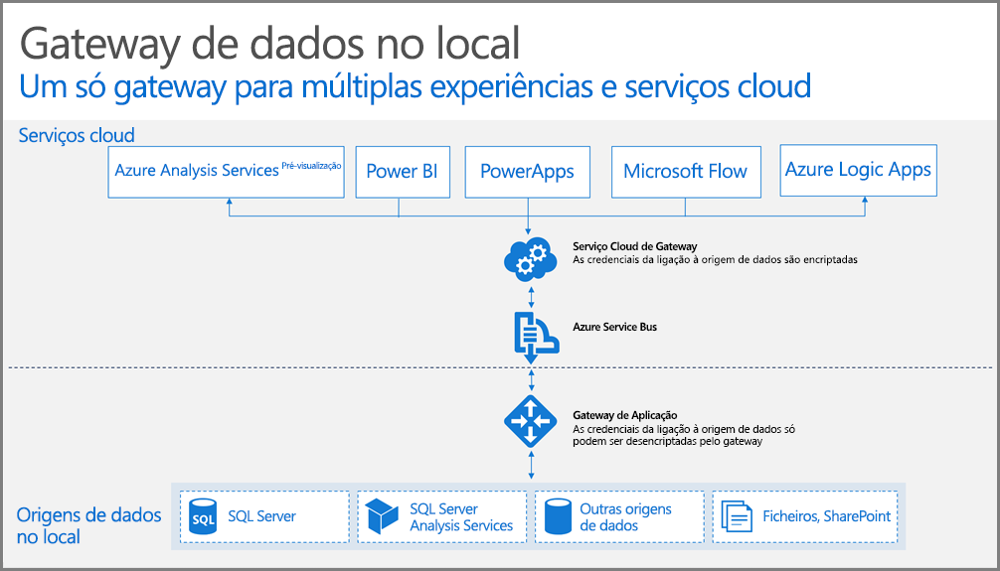

## Como funciona o gateway

Vamos primeiro ver o que acontece quando um utilizador interage com um relatório ligado a uma origem de dados local. 

> [!NOTE]
> Para o Power BI, tem de configurar uma origem de dados para o gateway.
> 
> 

1. O serviço cloud cria uma consulta juntamente com as credenciais encriptadas para a origem de dados, e é enviada para a fila para o gateway processar.
2. O serviço de cloud do gateway vai analisar a consultar e envia por push o pedido para o [Azure Service Bus](https://azure.microsoft.com/documentation/services/service-bus/).
3. O gateway de dados no local consulta o [Azure Service Bus](https://azure.microsoft.com/documentation/services/service-bus/) quanto a pedidos pendentes.
4. O gateway obtém a consulta, desencripta as credenciais e liga à ou às origens de dados com essas credenciais.
5. O gateway envia a consulta para a origem de dados para execução.
6. Os resultados são enviados da origem de dados de volta para o gateway e, em seguida, para o serviço cloud. O serviço utiliza então os resultados.

