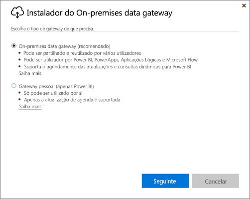
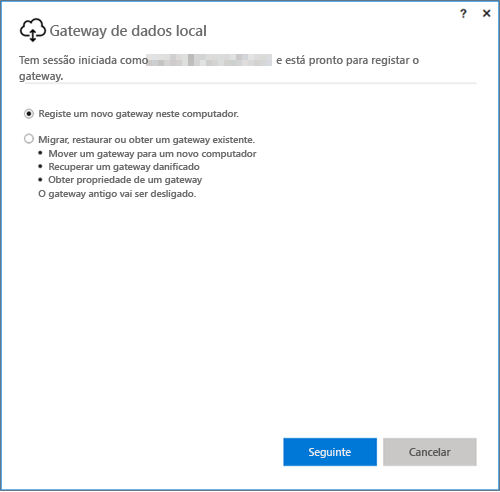
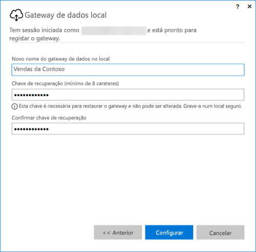

## Instalar o gateway de dados no local
O gateway de dados é instalado e executado no seu computador. O melhor é instalar o gateway num computador que possa ficar permanentemente em funcionamento.

> [!NOTE]
> O gateway é suportado apenas em sistemas operativos de 64 bits do Windows.
> 
> 

Para o Power BI, a primeira escolha a fazer é o modo do gateway.

* **Gateway de dados no local:** Múltiplos utilizadores podem partilhar e reutilizar um gateway neste modo. Este gateway pode ser utilizado pelo Power BI, PowerApps, Flow ou Logic Apps. No Power BI, isto inclui suporte para atualizações agendadas e DirectQuery
* **Pessoal:** Destina-se apenas ao Power BI e pode ser utilizado como um indivíduo sem qualquer configuração de administrador. Só pode ser utilizado em atualizações a pedido e atualizações agendadas. Esta seleção inicia a instalação do gateway pessoal.

Existem alguns fatores a ter em conta relativamente à instalação de qualquer um dos modos do gateway:

* ambos os gateways necessitam de sistemas operativos de 64 bits do Windows
* os gateways não podem ser instalados num controlador de domínio
* pode instalar, no máximo, dois gateways de dados no local no mesmo computador, um em execução em cada modo (pessoal e padrão). 
* não pode ter mais de um gateway em execução da mesma maneira no mesmo computador.
* pode instalar vários gateways de dados no local em computadores diferentes e geri-los a todos a partir da mesma interface de gestão do gateway do Power BI (excluindo a pessoal, consulte a seguinte marca)
* Só pode ter um gateway de modo pessoal em execução para cada utilizador do Power BI. Se instalou outro gateway de modo Pessoal para o mesmo utilizador, mesmo num computador diferente, a instalação mais recente substitui a instalação anterior.

Eis alguns fatores a ter em conta antes de instalar o gateway.

* Se estiver a instalar num portátil e o seu portátil estiver desligado, sem ligação à Internet ou inativo, o gateway não irá funcionar e os dados no serviço da cloud não serão sincronizados com os seus dados no local.
* Se o seu computador estiver ligado a uma rede sem fios, o gateway poderá ter um desempenho mais lento, o que fará com que demore mais tempo a sincronizar os dados no serviço da cloud com os seus dados no local.

Após o gateway ser instalado, terá de iniciar sessão com a sua conta escolar ou profissional.

Após iniciar sessão, terá a opção de configurar um novo gateway ou de migrar, restaurar ou assumir um gateway existente.

## Configurar um novo gateway
1. Introduza um **nome** para o gateway
2. Introduza uma **chave de recuperação**. Tem de ter, no mínimo 8 carateres.
3. Selecione **Configurar**.

> [!NOTE]
> Será necessária a chave de recuperação se precisar de migrar, restaurar ou assumir um gateway. Guarde esta chave num local seguro.
> 
> 

### Migrar, restaurar ou assumir um gateway existente
Terá de selecionar o gateway que pretender recuperar e fornecer a chave de recuperação originalmente utilizada para criar o gateway.

### Gateway de dados no local ligado
Após um gateway ser configurado, poderá utilizá-lo para ligar-se às origens de dados no local.

Se o gateway for para o Power BI, terá de adicionar as suas origens de dados ao gateway no serviço Power BI. Deve fazê-lo na área **Gerir gateway**. Pode consultar os artigos sobre gestão de origens de dados para obter mais informações.

No PowerApps, terá de selecionar um gateway para uma ligação definida para origens de dados suportadas. No Flow e Logic Apps, este gateway está pronto a ser utilizado com as suas ligações no local.

