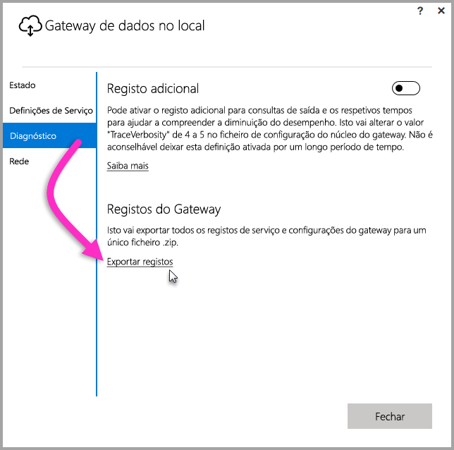
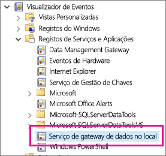

## Ferramentas para resolução de problemas
<a name="logs" />

### Recolher registos do configurador do gateway
Há vários registos que pode recolher do gateway, e deve sempre começar pelos registos. A forma mais simples de recolher registos após instalar o gateway é através da interface de utilizador. Na interface de utilizador **Gateway de dados no local**, selecione **Diagnóstico** e, em seguida, selecione a ligação **Exportar registos** perto da parte inferior da página, conforme demonstrado na imagem que se segue.

**Registos do instalador**

    %localappdata%\Temp\On-premises_data_gateway_*.log

**Registos de configuração**

    %localappdata%\Microsoft\On-premises Data Gateway\GatewayConfigurator*.log

**Registos do serviço de gateway de dados no local**

    C:\Users\PBIEgwService\AppData\Local\Microsoft\On-premises Data Gateway\Gateway*.log

### Registos de Eventos
Os registos de eventos do **Serviço de gateway de dados no local** estão presentes em **Registos de Serviços e Aplicações**.

<a name="fiddler" />

### Rastreio do Fiddler
O [Fiddler](http://www.telerik.com/fiddler) é uma ferramenta gratuita da Telerik que monitoriza o tráfego HTTP.  Pode ver as comunicações com o serviço Power BI a partir do computador de cliente. Isto pode mostrar erros e outras informações relacionadas.

