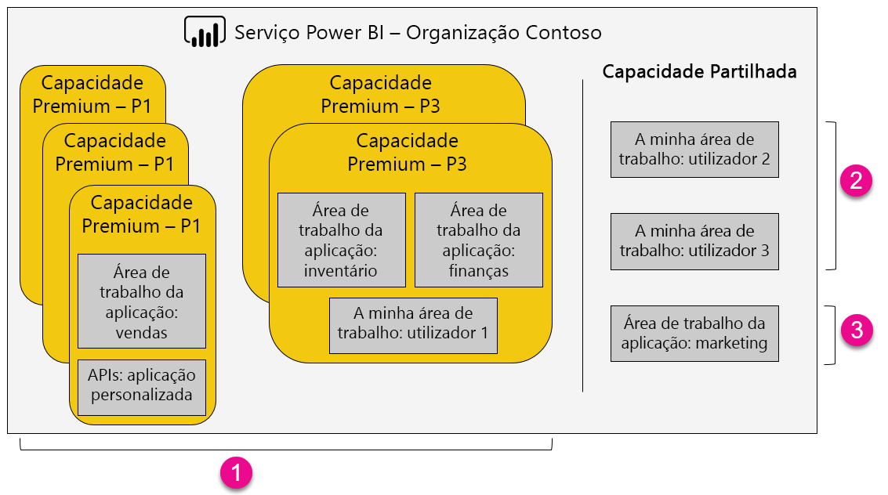

1. Itens numa capacidade Premium
   
   * Aceder às áreas de trabalho das aplicações (como membros ou administradores) e publicar aplicações requer uma licença do Power BI Pro.

   * É necessária uma licença do Power BI Pro para partilhar uma aplicação, mas não para a utilizar.

   * Todos os destinatários do dashboard podem definir alertas de dados, independentemente da licença que têm atribuída.

   * As APIs REST para incorporação utilizam uma conta de serviço com uma licença do Power BI Pro, em vez de uma conta de utilizador.

2. A minha área de trabalho na capacidade Partilhada
   
   * É necessária uma licença do Power BI Pro tanto para partilhar como para utilizar uma aplicação.

3. Áreas de trabalho de aplicação na capacidade Partilhada
   
   * É necessária uma licença do Power BI Pro para utilizar uma aplicação.

