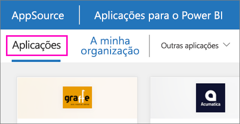

1. Selecione **Aplicações** no painel de navegação e selecione **Obter aplicações** no canto superior direito.
   
     
2. No AppSource, selecione o separador **Aplicações** e procure o serviço que pretende.
   
    

