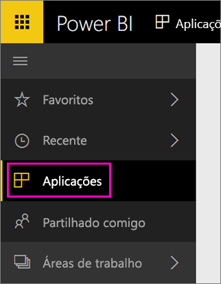

Quando a importação estiver concluída, a nova aplicação aparecerá na página Aplicações.

1. Selecione **Aplicações** no painel de navegação à esquerda > selecione a aplicação.
   
     
2. Pode fazer uma pergunta ao escrever na caixa de perguntas e respostas ou clicar num mosaico para abrir o relatório subjacente. 

