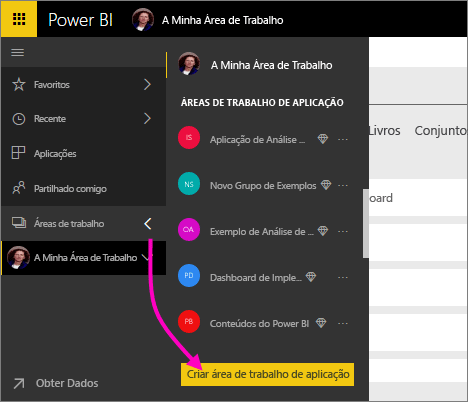

1. Comece por criar a área de trabalho. Selecione **Áreas de Trabalho** > **Criar área de trabalho de aplicação**. 
   
     
   
    Aqui pode colocar os conteúdos em que colabora com os seus colegas.

2. Na faixa **Está a criar uma área de trabalho atualizada**, clique em **Reverter para clássica**. 

    

3. Atribua um nome à área de trabalho. Se o **ID da área de trabalho** correspondente não estiver disponível, edite-o para obter um ID exclusivo.
   
     A aplicação terá o mesmo nome.
   
     

3. Tem algumas opções a definir. Se optar por **Pública**, qualquer pessoa na sua organização pode ver o que está na área de trabalho. **Privada** significa que apenas os membros da área de trabalho podem ver os seus conteúdos.
   
     
   
    Não é possível alterar a definição de pública/privada depois de criar o grupo.

4. Também pode escolher se os membros podem **editar** ou têm acesso **só de visualização**.
   
     
   
     Adicione pessoas à área de trabalho para que possam editar o conteúdo. Se só virem o conteúdo, nãos as adicione à área de trabalho. Pode incluí-las quando publicar a aplicação.

5. Adicione os endereços de e-mail das pessoas que pretende que tenham acesso à área de trabalho e selecione **Adicionar**. Não é possível adicionar aliases de grupo, apenas indivíduos.

6. Decida se cada pessoa é um membro ou um administrador.
   
     
   
    Os administradores podem editar a área de trabalho, incluindo adicionar outros membros. Os membros podem editar o conteúdo da área de trabalho, a menos que tenham acesso só de visualização. Tanto os administradores como os membros podem publicar a aplicação.

7. Selecione **Guardar**.

O Power BI cria a área de trabalho e abre-a. É apresentada na lista de áreas de trabalho das quais é membro. Visto que é um administrador, pode selecionar as reticências (…) para voltar atrás e fazer alterações, adicionar novos membros ou alterar as respetivas permissões.

