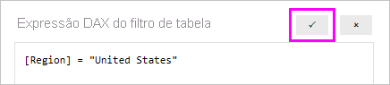

## <a name="define-roles-and-rules-in-power-bi-desktop"></a>Definir funções e regras no Power BI Desktop
Pode definir funções e regras no Power BI Desktop. Quando publicar no Power BI, este também publicará as definições de funções.

Siga estes passos para definir funções de segurança.

1. Importar dados para o seu relatório do Power BI Desktop ou configurar uma ligação do DirectQuery.
   
   > [!NOTE]
   > Não pode definir funções no Power BI Desktop para ligações em direto do Analysis Services. Terá de o fazer no modelo do Analysis Services.
   > 
   > 
2. No separador **Modelação**, selecione **Gerir Funções**.
   
   
3. A partir da janela **Gerir funções**, selecione **Criar**.
   
   
4. Em **Funções**, indique um nome para a função. 
5. Em **Tabelas**, selecione a tabela à qual pretende aplicar uma regra DAX.
6. Na caixa **Expressão DAX do filtro de tabela**, introduza as expressões DAX. Esta expressão devolve um valor de verdadeiro ou falso. Por exemplo: ```[Entity ID] = “Value”```.
      
   

   > [!NOTE]
   > Pode utilizar *username()* nesta expressão. Tenha em conta que *username()* tem o formato *DOMAIN\username* no Power BI Desktop. No serviço Power BI e no Power BI Report Server, estará no formato do Nome Principal de Utilizador (UPN). Em alternativa, pode utilizar *userprincipalname()* , que vai sempre devolver o utilizador no formato do respetivo nome principal de utilizador, *nomedeutilizador\@contoso.com*.
   > 
   > 

7. Após criar a expressão DAX, selecione a marca de verificação acima da caixa de expressão para validar a expressão.
      
   
   
   > [!NOTE]
   > Nesta caixa de expressão, deve utilizar vírgulas para separar argumentos da função DAX mesmo se estiver a utilizar uma região que normalmente utiliza separadores de ponto e vírgula (por exemplo, francês ou alemão). 
   >
   >
   
8. Selecione **Guardar**.

Não pode atribuir utilizadores a uma função no Power BI Desktop. Pode atribuí-los no serviço Power BI. Pode ativar a segurança dinâmica no Power BI Desktop ao utilizar as funções DAX *username()* ou *userprincipalname()* e ter as devidas relações configuradas. 

