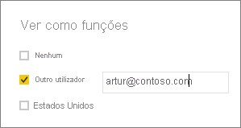

## Validar as funções no Power BI Desktop
Depois de criar as suas funções, teste os resultados das mesmas no Power BI Desktop.

1. Selecione **Ver Como Funções**. 

    

    Em **Ver como funções**, pode ver as funções que criou.

    

3. Selecione uma função que criou e selecione **OK** para a aplicar. O relatório compõe os dados relevantes para essa função. 

4. Também pode selecionar **Outro utilizador** e fornecer um determinado utilizador. Recomendamos que forneça o Nome Principal de Utilizador (UPN), uma vez que é utilizado pelo serviço Power BI e pelo Power BI Report Server.

    

1. Selecione **OK** e o relatório será composto com base no que esse utilizador pode ver. 

No Power BI Desktop, a opção **Outro utilizador** só apresentará resultados diferentes se estiver a utilizar a segurança dinâmica com base nas suas expressões DAX. 

