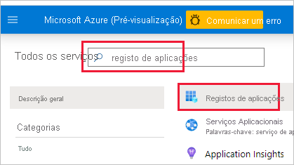
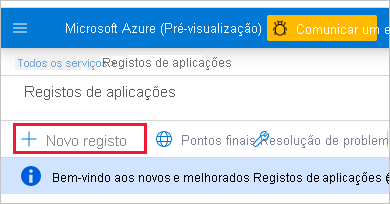

1. Inicie sessão no [Microsoft Azure](https://ms.portal.azure.com/#allservices).

2. Procure **Registos de aplicações** e clique na ligação **Registos de aplicações** .

    

3. Clique em **Novo registo** .

    

4. Preencha as informações necessárias:
    * **Nome** – introduza um nome para a aplicação
    * **Tipos de conta suportados** – selecione os tipos de conta suportados
    * (Opcional) **URI de Redirecionamento** – introduza um URI, se necessário

5. Clique em **Registar** .

6. Após o registo, o *ID da Aplicação* está disponível no separador **Descrição geral** . Copie e guarde o *ID da Aplicação* para utilizar mais tarde.

    