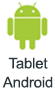
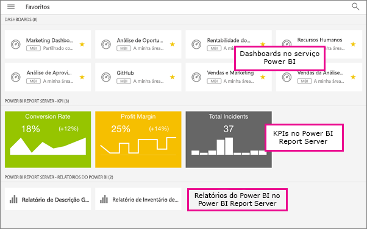

# Marque como favoritos relatórios no local, aplicações e dashboards nas aplicações móveis do Power BI
Aplica-se a:

|  |  |  |  |  |
|:--- |:--- |:--- |:--- |:--- |
| iPhones |iPads |Telemóveis Android |Tablets Android |Dispositivos Windows 10 |

Na página Favoritos nas suas aplicações móveis, vê os seus dashboards e aplicações favoritos do Power BI, juntamente com KPIs e relatórios móveis do Power BI Report Server e do Reporting Services favoritos no local. Quando tornar um dashboard ou uma aplicação *favorito* nas aplicações móveis do Power BI, irá vê-los na sua página Favoritos no serviço Power BI ([https://powerbi.com](https://powerbi.com)) e em todos os seus dispositivos móveis. 

Também pode [tornar dashboards e aplicações do Power BI favoritos no serviço Power BI](service-dashboard-favorite.md). Depois, pode vê-los na página Favoritos na aplicação móvel.

Pode marcar KPIs e relatórios como favoritos num portal Web do Power BI Report Server ou Reporting Services e, em seguida, vê-los numa pasta conveniente no seu dispositivo móvel, juntamente com os seus dashboards favoritos do Power BI.

## Ver os seus dashboards e aplicações favoritos do Power BI e relatórios e KPIs no local
* Toque no menu de navegação superior  e, em seguida, toque em **Favoritos**.
  
  
  
  Pode ver todos os seus favoritos juntos nesta página:
  
  

## Tornar uma aplicação favorita
1. Na lista de aplicações na aplicação móvel, toque nas reticências (...) junto à aplicação > **Favorito**.
   
    
   
    Agora, esta ficará na lista dos seus dashboards e aplicações.
   
    

## Tornar um dashboard favorito nas aplicações móveis para iOS e Windows 10
Pode tornar um dashboard do Power BI ou uma aplicação favoritos na lista de dashboard ou no próprio dashboard.

* Na lista de dashboards na aplicação móvel, toque na estrela vazia junto ao nome do dashboard . A estrela fica amarela .
  
    
* No dashboard, toque na estrela vazia no friso na parte superior . A estrela fica amarela .
  
    

## Tornar um dashboard favorito nas aplicações móveis para Android
Pode tornar um dashboard favorito na lista de dashboards ou no próprio dashboard.

* Na lista de dashboards na aplicação móvel, toque nas reticências verticais (...) junto ao nome do dashboard e, em seguida, toque em **Favorito**. Irá ver uma estrela amarela junto ao nome .
  
    
* No dashboard, toque na estrela vazia no friso na parte superior . A janela fica a cinzento escuro .
  
    

## Tornar KPIs e relatórios do Power BI Report Server e Reporting Services favoritos
Pode ver os seus KPIs e relatórios favoritos do Power BI Report Server e Reporting Services nas aplicações móveis do Power BI, mas não os pode tornar favoritos nas aplicações móveis. Pode [marcá-los como favoritos no portal Web](report-server/getting-around.md#tag-your-favorite-reports-and-kpis). 

## Próximos passos
* [Tornar dashboards favoritos no serviço Power BI](service-dashboard-favorite.md) 
* Perguntas? [Experimente perguntar à Comunidade do Power BI](http://community.powerbi.com/)

