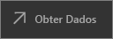
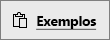

# Início Rápido: explorar dashboards e relatórios nas aplicações móveis do Power BI
Neste manual de início rápido, pode explorar um dashboard e um relatório de exemplo na aplicação móvel do Power BI num telemóvel Android. Também pode acompanhar o processo noutras aplicações móveis. 

Aplica-se a:

|  |  |  |  |
|:--- |:--- |:--- |:--- |
| iPhone | iPad | Android | Windows 10 |

Os dashboards são um portal para o ciclo de vida e processos de sua empresa. Um dashboard é uma descrição geral, um único lugar para monitorizar o estado atual do negócio. Os relatórios são uma vista interativa dos seus dados, com visuais que representam diferentes descobertas e informações obtidas por meio desses dados. 

## Pré-requisitos

### Inscrever-se no Power BI
Se não estiver inscrito no Power BI, [inscreva-se para uma avaliação gratuita](https://app.powerbi.com/signupredirect?pbi_source=web) antes de começar.

### Instalar a aplicação Power BI para Android
[Transfira a aplicação do Power BI para Android](http://go.microsoft.com/fwlink/?LinkID=544867) no Google Play.

O Power BI funciona em dispositivos Android com o sistema operativo Android 5.0 ou posterior. Para verificar o seu dispositivo, aceda a **Definições** > **Acerca do dispositivo** > **Versão do Android**.

### Transferir o exemplo de Análise de Revenda
O primeiro passo deste manual de início rápido é transferir o exemplo de Análise de Retalho no serviço do Power BI.

1. Abra o serviço Power BI no seu browser (app.powerbi.com) e inicie sessão.

1. Selecione o ícone de navegação global para abrir o painel de navegação à esquerda.

    

2. No painel de navegação à esquerda, selecione **Áreas de Trabalho** > **A Minha Área de Trabalho**.

    

3. No canto inferior esquerdo, selecione **Obter Dados**.
   
    

3. Na página Obter Dados, selecione o ícone **Exemplos**.
   
   

4. Selecione o **exemplo de Análise de Revenda**.
 
    
 
8. Selecione **Ligar**.  
  
   
   
5. O Power BI importa o exemplo e adiciona um novo dashboard, relatório e conjunto de dados a A Minha Área de Trabalho do utilizador.
   
   

OK, está pronto para ver o exemplo no seu dispositivo Android.

## Visualizar um dashboard no seu dispositivo Android
1. No seu dispositivo Android, abra a aplicação Power BI e inicie sessão com as credenciais da sua conta do Power BI, as mesmas que utilizou no serviço Power BI no browser.

1.  Toque no botão de navegação global .

2.  Toque em **Áreas de Trabalho** > **A Minha Área de Trabalho**

    

3. Toque no dashboard do Exemplo de Análise de Revenda para o abrir.
 
    
   
    Uma notação abaixo do nome do dashboard (neste caso, a letra "C") mostra como os dados são classificados em cada dashboard. Leia mais sobre a [classificação de dados no Power BI](service-data-classification.md).

    Os dashboards do Power BI parecem um pouco diferentes no seu telemóvel Android. Todos os mosaicos são apresentados com a mesma largura e são dispostos um após o outro, de cima para baixo.

4. Toque no ícone de estrela  na barra de título para adicionar este dashboard aos favoritos.

    Ao adicionar um favorito na aplicação móvel, este torna-se um favorito no serviço Power BI e vice-versa.

4. Desloque para baixo e toque no gráfico de linhas preenchido “Vendas deste Ano, Vendas do Ano Passado”.

    

    Abre-se no modo de detalhe.

7. No modo de detalhe, toque em Abr no gráfico. São apresentados os valores de Abril na parte superior do gráfico.

    

8. Toque no ícone Relatório  no canto superior direito. O relatório relacionado com este mosaico abre-se no modo horizontal.

    

9. Toque na bolha amarela “040 – Juniors” no gráfico de bolhas. Consegue ver como realça os valores relacionados nos outros gráficos? 

    

10. Percorra para cima para ver a barra de ferramentas na parte inferior e toque no ícone de lápis.

    

11. Toque no ícone da cara sorridente na barra de ferramentas Anotar e adicione algumas caras sorridentes à sua página de relatório.
 
    

12. Toque em **Partilhar** no canto superior direito.

1. Preencha os endereços de e-mail deles e adicione uma mensagem, se quiser.  

    

    Pode partilhar este instantâneo com qualquer pessoa, dentro ou fora da sua organização. Se essa pessoa estiver na sua organização e tiver a sua própria conta do Power BI, também vai conseguir abrir o relatório de exemplo de Análise de Revenda.

## Limpar recursos

Depois de concluir este manual de início rápido, se desejar, pode eliminar o dashboard, o relatório e o conjunto de dados de exemplo da Análise de Revenda.

1. Abra o serviço Power BI (app.powerbi.com) e inicie sessão.

2. No painel de navegação à esquerda, selecione **Áreas de Trabalho** > **A Minha Área de Trabalho**.

    Reparou na estrela amarela a indicar que é um favorito?

3. No separador **Dashboards**, selecione o ícone **Eliminar** de caixote do lixo junto ao dashboard Análise de Revenda.

    

4. Selecione o separador **Relatórios** e faça o mesmo para o relatório de Análise de Revenda.

5. Selecione o separador **Conjuntos de Dados** e faça o mesmo para o conjunto de dados (Análise de Revenda).

## Próximos passos

Neste manual de início rápido, o utilizador explorou um dashboard e um relatório de exemplo no seu dispositivo Android. Leia mais sobre como trabalhar no serviço Power BI. 

> [!div class="nextstepaction"]
> [Início Rápido: introdução ao serviço Power BI](service-the-new-power-bi-experience.md)

