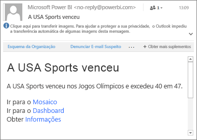

# Definir alertas de dados nas aplicações móveis do Power BI
Aplica-se a:

|  |  |  |  |  |
|:--- |:--- |:--- |:--- |:--- |
| iPhones |iPads |Telemóveis Android |Tablets Android |Dispositivos Windows 10 |

Pode definir alertas nos dashboards nas aplicações móveis do Power BI e no serviço Power BI. Os alertas notificam-no quando os dados num mosaico forem alterados para além dos limites que definiu. Os alertas são compatíveis com mosaicos com um único número, como cartões e medidores, mas não com a transmissão de dados. Pode definir alertas de dados no seu dispositivo móvel e vê-los no serviço Power BI e vice-versa. Só pode ver os alertas de dados que definir, mesmo que partilhe um dashboard ou instantâneo de um mosaico.

Pode definir alertas em mosaicos se tiver uma licença do Power BI Pro ou se tiver uma licença do Power BI gratuita e se o dashboard partilhado estiver dentro da capacidade de Premium. 

> [!WARNING]
> As notificações de alertas com base em dados dão-lhe informações sobre os seus dados. Se o seu dispositivo for roubado, recomendamos que aceda ao serviço Power BI para desativar todas as regras de alertas baseados em dados. 
> 
> Saiba mais sobre [gerir os alertas de dados no serviço Power BI](service-set-data-alerts.md).
> 
> 

## Alertas de dados num iPhone ou iPad
### Definir um alerta num iPhone ou iPad
1. Toque num número ou mosaico de medidor no dashboard para o abrir no modo de detalhe.  
   
   
2. Toque no ícone de sino  para adicionar um alerta.  
3. Toque em **Adicionar regra de alerta**.
   
   
4. Opte por receber alertas acima ou abaixo de um determinado valor e, em seguida, defina o valor.
   
   
5. Decida se pretende receber alertas horários ou diários e se também pretende receber um e-mail ao receber o alerta.
   
   > [!NOTE]
   > Não receberá alertas todas as horas ou dias, a menos que os dados tenham efetivamente sido atualizados nesse período.
   > 
   > 
6. Também pode alterar o título do alerta.
7. Toque em **Guardar**.
8. Um único mosaico pode ter alertas para valores acima e abaixo dos limiares. Em **Gerir alertas**, toque em **Adicionar regra de alerta**.
   
   

### Gerir alertas no seu iPhone ou iPad
Pode gerir alertas individuais no seu dispositivo móvel ou [gerir todos os seus alertas no serviço Power BI](service-set-data-alerts.md).

1. Num dashboard, toque num número ou mosaico de medidor que tenha um alerta.  
   
   
2. Toque no ícone do sino .  
3. Toque no nome do alerta para editá-lo, toque no controlo de deslize para desativar os alertas de e-mails ou toque na lata do lixo para eliminar o alerta.
   
    

## Alertas de dados num dispositivo Android
### Definir um alerta num dispositivo Android
1. Num dashboard do Power BI, toque num número ou mosaico de medidor para abri-lo.  
2. Toque no ícone de sino  para adicionar um alerta.  
   
   
3. Toque no ícone de adição (+).
   
   
4. Opte por receber alertas acima ou abaixo de um determinado valor e escreva o valor.
   
   
5. Toque em **Concluído**.
6. Decida se pretende receber alertas horários ou diários e se também pretende receber um e-mail ao receber o alerta.
   
   > [!NOTE]
   > Não receberá alertas todas as horas ou dias, a menos que os dados tenham efetivamente sido atualizados nesse período.
   > 
   > 
7. Também pode alterar o título do alerta.
8. Toque em **Guardar**.

### Gerir alertas num dispositivo Android
Pode gerir alertas individuais na aplicação móvel do Power BI ou [gerir todos os seus alertas no serviço Power BI](service-set-data-alerts.md).

1. Num dashboard, toque num cartão ou mosaico de medidor que tenha um alerta.  
2. Toque no ícone de sino sólido .  
3. Toque no alerta para alterar um valor ou desativá-lo.
   
    
4. Toque no ícone de adição (+) para adicionar outro alerta ao mesmo mosaico.
5. Para eliminar o alerta, toque no ícone da lata de lixo .

## Alertas de dados num dispositivo Windows
### Definir alertas de dados num dispositivo Windows
1. Toque num número ou mosaico de medidor no dashboard para o abrir.  
2. Toque no ícone de sino  para adicionar um alerta.  
   
   
3. Toque no ícone de adição (+).
   
   
4. Opte por receber alertas acima ou abaixo de um determinado valor e escreva o valor.
   
   
5. Decida se pretende receber alertas horários ou diários e se também pretende receber um e-mail ao receber o alerta.
   
   > [!NOTE]
   > Não receberá alertas todas as horas ou dias, a menos que os dados tenham efetivamente sido atualizados nesse período.
   > 
   > 
6. Também pode alterar o título do alerta.
7. Toque na marca de verificação.
8. Um único mosaico pode ter alertas para valores acima e abaixo dos limiares. Em **Gerir alertas**, toque no sinal de adição (+).
   
   

### Gerir alertas num dispositivo Windows
Pode gerir alertas individuais na aplicação móvel do Power BI ou [gerir todos os seus alertas no serviço Power BI](service-set-data-alerts.md).

1. Num dashboard, toque num cartão ou mosaico de medidor que tenha um alerta.  
2. Toque no ícone do sino .  
   
   
3. Toque no alerta para alterar um valor ou desativá-lo.
   
    
4. Para eliminar um alerta, clique com o botão direito do rato ou toque e mantenha premido > **Eliminar**.

## Receber alertas
Os alertas são recebidos no [Centro de Notificações](mobile-apps-notification-center.md) do Power BI no seu dispositivo móvel ou no serviço Power BI, juntamente com notificações de novos dashboards que alguém partilhou consigo.

Normalmente, as origens de dados são definidas para serem atualizadas diariamente, apesar de algumas serem atualizadas mais vezes. Quando os dados no dashboard são atualizados, se os dados monitorizados atingirem um dos limiares que selecionou, acontecerão várias coisas.

1. O Power BI verifica se passou mais de uma hora ou mais de 24 horas (consoante a opção selecionada) desde o último alerta enviado.
   
   Desde que os dados tenham passado o limiar, receberá um alerta uma vez por hora ou por cada 24 horas.
2. Se tiver definido o alerta para lhe enviar uma mensagem de e-mail, irá encontrar algo deste género na sua Caixa de entrada.
   
   
3. O Power BI adiciona uma mensagem ao seu **Centro de notificações** e adiciona o ícone de novo alerta ao mosaico aplicável .
4. Toque no botão de navegação global  para [abrir o seu **Centro de notificações**](mobile-apps-notification-center.md) e ver os detalhes do alerta.
   
      

> [!NOTE]
> Os alertas só funcionam em dados que são atualizados. Quando os dados forem atualizados, o Power BI procura alertas definidos para esses dados. Se os dados tiverem atingido um limiar de alerta, será acionado um alerta.
> 
> 

## Sugestões e resolução de problemas
* Atualmente, os alertas não são suportados para mosaicos do Bing ou mosaicos de cartões com medidas de data/hora.
* Os alertas só funcionam com dados numéricos.
* Os alertas só funcionam em dados que são atualizados. Não funcionam com dados estáticos.
* Os alertas não funcionam com mosaicos que contenham dados de transmissão.

## Passos seguintes
* [Gerir os seus alertas no serviço Power BI](service-set-data-alerts.md)
* [Centro de Notificações Móveis do Power BI](mobile-apps-notification-center.md)
* Perguntas? [Experimente perguntar à Comunidade do Power BI](http://community.powerbi.com/)

