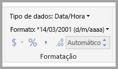
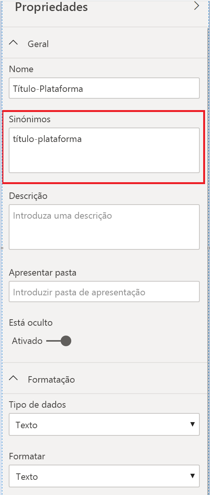

# Melhores práticas para otimizar as Perguntas e Respostas no Power BI
Utilizar linguagem natural e expressões comuns para fazer perguntas sobre os seus dados é algo extremamente útil. Torna-se ainda mais eficaz quando os seus dados respondem a essas perguntas e é isso que as Perguntas e Respostas no Power BI fazem.

Para que a funcionalidade Perguntas e Respostas interprete com êxito a abrangente quantidade de perguntas às quais consegue responder, esta tem de fazer suposições sobre o modelo. Se a estrutura do seu modelo não corresponder a uma ou mais destas suposições, tem de ajustar o seu modelo. Esses ajustes às Perguntas e Respostas são as mesmas otimizações recomendadas para qualquer modelo no Power BI, independentemente se utiliza as Perguntas e Respostas.

Nas secções seguintes, descrevemos como ajustar o seu modelo para que funcione bem com as Perguntas e Respostas no Power BI.

## Ajustes automáticos feitos pelas Perguntas e Respostas

### Tabelas de medida

Nas versões anteriores das Perguntas e Respostas, as tabelas de medida confundem as Perguntas e Respostas porque a tabela subjacente foi desativada. Agora, as Perguntas e Respostas funcionam sem problemas com tabelas de medida.

### Os nomes de tabelas entram em conflito com os nomes de colunas

Nas versões anteriores das Perguntas e Respostas, se uma tabela e uma coluna tivessem o mesmo nome, a tabela teria preferência. Este problema foi resolvido, pelo que já não tem de corrigi-lo nos seus modelos.

## Passos manuais para melhorar as Perguntas e Respostas

### Utilizar as novas ferramentas das Perguntas e Respostas para corrigir as suas perguntas

Com as ferramentas das Perguntas e Respostas, pode ensinar os principais termos comerciais às Perguntas e Respostas e corrigir perguntas feitas pelos utilizadores finais. Por vezes, algumas perguntas continuam a não ser respondidas porque os dados estão formatados incorretamente ou estão em falta. Nesse caso, leia as outras secções abaixo para ajudá-lo a otimizar. Leia mais sobre as [ferramentas das Perguntas e Respostas](q-and-a-tooling-intro.md).

## Adicionar relações em falta

Se o seu modelo tiver relações entre tabelas em falta, os relatórios do Power BI e as Perguntas e Respostas não conseguirão interpretar a forma como devem associar essas tabelas. As relações são o alicerce de um bom modelo. Por exemplo, não pode pedir as "vendas totais dos clientes do Porto" se a relação entre as tabelas *encomendas* e *clientes* estiver em falta. As seguintes imagens mostram um modelo que precisa de ser modificado e um modelo que está pronto para as Perguntas e Respostas. 

**Precisa de ser modificado**

Na primeira imagem, não existem relações entre as tabelas Clientes, Vendas e Produtos.

**Está pronto para as Perguntas e Respostas**

Na primeira imagem, as relações estão definidas entre as tabelas.

## Mudar o nome de tabelas e colunas

A escolha das tabelas e colunas é importante para as Perguntas e Respostas. Por exemplo, digamos que tenha uma tabela com o nome *ResumoDeClientes*, que contém uma lista dos seus clientes. Teria de fazer perguntas como “Listar os resumos de clientes em Chicago”, em vez de “Listar os clientes em Chicago”. 

Embora consigam fazer deteção de plurais e quebras de palavras básicas, as Perguntas e Respostas presumem que os nomes de tabelas e colunas refletem os conteúdos de forma precisa.

Considere outro exemplo. Imagine que tem uma tabela com o nome *ContagemDeFuncionários*, que contém os nomes próprios, apelidos e os números dos funcionários. Tem outra tabela com o nome *Funcionários*, que contém os números dos funcionários, os números das tarefas e as datas de início. As pessoas familiarizadas com o modelo podem compreender esta estrutura. Outra pessoa que peça a “contagem dos funcionários” irá obter uma contagem das linhas da tabela “Funcionários”. Este resultado não é provavelmente o que tinha em mente, porque é uma contagem de todas as tarefas que cada funcionário teve. Seria melhor mudar o nome dessas tabelas para refletirem corretamente os conteúdos.

**Precisa de ser modificado**

Nomes de tabelas como *StoreInfo* e *Lista de Produtos* precisam de ser modificados.

**Está pronto para as Perguntas e Respostas**

Tabelas denominadas *Loja* e *Produtos* funcionam melhor.

## Corrigir tipos de dados incorretos

Os dados importados podem ter tipos de dados incorretos. Em particular, as colunas *data* e *número*, que são importadas como *cadeias de caracteres*, não são interpretadas pelas Perguntas e Respostas como datas e números. Certifique-se de que seleciona o tipo de dados correto no seu modelo do Power BI.

## Marcar as colunas de ano e identificador como Não Resumir

O Power BI agrega agressivamente as colunas numéricas por predefinição, por isso perguntas como "vendas totais por ano" podem resultar num total geral de vendas juntamente como um total geral de anos. Se tiver colunas específicas em que não pretende que o Power BI apresente este comportamento, defina a propriedade **Resumo Predefinido** na coluna para **Não Resumir**. Tenha cuidado com as colunas **ano**, **mês**, **dia** e **ID**, pois costumam causar problemas mais frequentemente. Para outras colunas que não são sensíveis a somas, como *idade*, também pode ser benéfico definir a opção **Resumo Predefinido** para **Não Resumir** ou para **Média**. Irá encontrar esta definição no separador **Modelação**.

## Selecionar uma Categoria de Dados para cada coluna de data e geografia

A **Categoria de Dados** fornece conhecimento semântico adicional sobre os conteúdos de uma coluna, para além do tipo de dados. Por exemplo, pode marcar uma coluna de número inteiro como um código postal, uma coluna de cadeia como uma Cidade, País/Região e assim por diante. As Perguntas e Respostas utilizam estas informações de duas formas importantes: Para seleção da visualização e para tendências da linguagem.

Em primeiro lugar, as Perguntas e Respostas utilizam as informações em **Categorias de Dados** para ajudar a tomar decisões sobre o tipo de apresentação visual a utilizar. Por exemplo, reconhece que colunas com **Categorias de Dados** de data ou hora são normalmente uma boa opção para o eixo horizontal de um gráfico de linhas ou o eixo de reprodução de um gráfico de bolhas. Presume que os resultados que contêm colunas com **Categorias de Dados** geográficos podem ter um bom aspeto num mapa.

Em segundo lugar, as Perguntas e Respostas fazem suposições fundamentadas sobre como os utilizadores irão falar sobre as colunas de geografia e data, para ajudar a compreender determinados tipos de perguntas. Por exemplo, a palavra "quando" em "Quando é que o Guilherme Sarmento foi contratado?" irá mapear a uma coluna de data e é mais provável que a palavra "Aveiro" em "Contagem de clientes em Aveiro" seja referente a uma cidade e não a um nome próprio.

## Escolher uma opção Ordenar Por Coluna para colunas relevantes

A propriedade **Ordenar Por Coluna** permite que uma coluna seja ordenada automaticamente de acordo com uma coluna diferente. Por exemplo, quando pede para "ordenar clientes pelo tamanho da t-shirt", provavelmente quer que a coluna Tamanho da T-shirt seja ordenada pelo tamanho subjacente (XS, S, M, L, XL) e não alfabeticamente (L, M, S, XL, XS).

## Normalizar o seu modelo

Tenha em atenção que não estamos a dizer que precisa de reformatar o seu modelo inteiro. No entanto, determinadas estruturas são tão difíceis que as Perguntas e Respostas não as processam corretamente. Se fizer uma normalização básica da estrutura do seu modelo, a usabilidade dos relatórios do Power BI aumenta significativamente, bem como a precisão dos resultados das Perguntas e Respostas.

Siga esta regra geral: cada “conteúdo” exclusivo sobre o qual o utilizador fala deve ser representado exatamente por um objeto de modelo (tabela ou coluna). Se os seus utilizadores falarem sobre clientes, deverá existir um objeto *cliente*. Se os seus utilizadores falarem sobre vendas, deverá existir um objeto *vendas*. Parece simples, não é? Pode ser simples dependendo da formatação dos dados que tem. Existem funcionalidades avançadas de formatação de dados disponíveis no **Editor de Consultas** se for necessário, no entanto, as transformações mais simples podem ocorrer ao utilizar cálculos no modelo do Power BI.

As secções seguintes contêm algumas transformações comuns que poderá ter de realizar.

### Criar novas tabelas para entidades de múltiplas colunas

Se tiver múltiplas colunas que atuam como uma única unidade distinta numa tabela maior, essas colunas devem ser divididas numa tabela própria. Por exemplo, digamos que tem uma coluna Nome do Contacto, Cargo do Contacto e Telefone do Contacto na tabela *Empresas*. Uma estrutura melhor seria ter uma tabela *Contactos* separada para conter o Nome, Cargo e Telefone e uma ligação para a tabela *Empresas*. Isto torna mais fácil fazer perguntas sobre os contactos, independentemente das perguntas sobre as empresas a que os contactos pertencem, e melhora a flexibilidade da apresentação.

**Precisa de ser modificado**

**Está pronto para as Perguntas e Respostas**

### Dinamizar para eliminar matrizes de propriedades

Se tiver *matrizes de propriedades* no seu modelo, estas devem ser reestruturadas para ter uma única coluna por propriedade. As matrizes de propriedades, embora sejam convenientes para gerir grandes quantidades de propriedades, têm várias limitações inerentes que os relatórios do Power BI e as Perguntas e Respostas não conseguem ultrapassar.

Por exemplo, considere uma tabela *DadosDemográficosDosClientes* com as colunas IDDoCliente, Propriedade e Valor, em que cada linha representa uma propriedade diferente do cliente (por exemplo, idade, estado civil, cidade e assim por diante). Ao sobrecarregar o significado da coluna Valor com base nos conteúdos da coluna Propriedade, torna-se impossível às Perguntas e Respostas interpretarem a maioria das consultas que fazem referência à mesma. Uma pergunta tão simples como "mostrar a idade de cada cliente" poderá funcionar, uma vez que pode ser interpretada como "mostrar os clientes e os dados demográficos dos clientes em que a propriedade é idade". No entanto, a estrutura do modelo não suporta perguntas ligeiramente mais complexas, como "idade média dos clientes em Lisboa". Embora os utilizadores que criam diretamente relatórios do Power BI possam por vezes encontrar formas mais inteligentes de obter os dados que procuram, as Perguntas e Respostas só funcionam quando cada coluna tem apenas um único significado.

**Precisa de ser modificado**

**Está pronto para as Perguntas e Respostas**

### União para eliminar a criação de partições

Se tiver criado partições dos seus dados em múltiplas tabelas ou tiver valores articulados em múltiplas colunas, é difícil ou mesmo impossível aos seus utilizadores realizarem algumas operações comuns. Em primeiro lugar, considere a criação de partições de uma tabela típica: uma tabela *Vendas2000-2010* e uma tabela *Vendas2011-2020*. Se todos os seus relatórios importantes estiverem restritos a uma década específica, provavelmente deverá mantê-los desta forma para os relatórios do Power BI. No entanto, a flexibilidade das Perguntas e Respostas leva os seus utilizadores a esperar respostas a perguntas como "vendas totais por ano". Para esta consulta funcionar, tem de unir os dados numa única tabela de modelo do Power BI.

Da mesma forma, considere uma coluna de valor articulado típica: uma tabela *ApresentaçãoDoLivro* que contém as colunas Autor, Livro, Cidade1, Cidade2 e Cidade3. Com uma estrutura como esta, mesmo as perguntas simples como "contagem de livros por cidade" não podem ser interpretadas corretamente. Para esta consulta funcionar, crie uma tabela *CidadesDaApresentaçãoDoLivro* separada, que faz a união dos valores de cidade numa única coluna.

**Precisa de ser modificado**

**Está pronto para as Perguntas e Respostas**

### Dividir colunas formatadas

Se a origem a partir da qual está a importar os seus dados contiver colunas formatadas, os relatórios do Power BI (e Perguntas e Respostas) não acedem à coluna para analisar os conteúdos. Por isso, se tiver, por exemplo, uma coluna **Endereço Completo** que contém o endereço, a cidade e o país, também deve dividi-la nas colunas Endereço, Cidade e País para que os seus utilizadores possam consultá-las individualmente.

**Precisa de ser modificado**

**Está pronto para as Perguntas e Respostas**

Da mesma forma, se tiver colunas de nome completo para uma pessoa, adicione as colunas **Nome Próprio** e **Apelido**, no caso de alguém querer fazer perguntas com nomes parciais. 

### Criar novas tabelas para colunas de múltiplos valores

Além disso, se a origem a partir da qual está a importar os seus dados contiver colunas de múltiplos valores, os relatórios do Power BI (e as Perguntas e Respostas) não acedem à coluna para analisar os conteúdos. Por isso, se tiver, por exemplo, uma coluna Compositor que contém os nomes de múltiplos compositores de uma canção, deve dividi-la em múltiplas linhas numa tabela *Compositores* separada.

**Precisa de ser modificado**

**Está pronto para as Perguntas e Respostas**

### Desnormalizar para eliminar relações inativas

A única exceção à regra "a normalização é melhor" ocorre quando existe mais do que um caminho para ir de uma tabela para outra. Por exemplo, digamos que tem uma tabela *Voos* com as colunas IDDaCidadeDeOrigem e IDDaCidadeDeDestino, em que cada uma está relacionada com a tabela *Cidades*. Uma dessas relações tem de ser marcada como inativa. Como as Perguntas e Respostas só podem utilizar relações ativas, não pode fazer perguntas sobre a origem ou o destino, dependendo do que escolher. Se desnormalizar as colunas de nome de cidade para a tabela *Voos*, pode fazer perguntas como: “listar os voos de amanhã com a cidade de origem Lisboa e a cidade de destino Porto”.

**Precisa de ser modificado**

**Está pronto para as Perguntas e Respostas**

### Adicionar sinónimos a tabelas e colunas

Este passo aplica-se especificamente às Perguntas e Respostas (e não aos relatórios do Power BI em geral). Muitas vezes, os utilizadores têm uma variedade de termos que utilizam para fazer referência aos mesmos conteúdos, tal como vendas totais, vendas líquidas, vendas líquidas totais. Pode adicionar estes sinónimos a tabelas e colunas no modelo do Power BI. 

Este passo pode ser importante. Mesmo tendo nomes de coluna e tabela simples, os utilizadores das Perguntas e Respostas fazem perguntas com o vocabulário de que se lembram. Não escolhem a partir de uma lista de colunas predefinida. Quantos mais sinónimos pertinentes adicionar, melhor é a experiência dos seus utilizadores com o seu relatório. Para adicionar sinónimos no Power BI Desktop, aceda à Vista do modelo, selecione o separador Modelação e selecione um campo ou tabela. O painel Propriedades mostra a caixa **Sinónimos**, onde pode adicionar sinónimos.

 Tenha cuidado ao adicionar sinónimos. Adicionar o mesmo sinónimo a mais de uma coluna ou tabela apresenta ambiguidade. As Perguntas e Respostas utilizam o contexto sempre que possível para optar entre sinónimos ambíguos, mas nem todas as perguntas têm contexto suficiente. Por exemplo, quando o utilizador pede a “contagem de clientes”, se tiver três itens com o sinónimo “cliente” no modelo, os utilizadores poderão não obter a resposta que procuram. Nestes casos, certifique-se de que o sinónimo principal é exclusivo, uma vez que é utilizado na reformulação. Pode alertar o utilizador acerca da ambiguidade (por exemplo, com a reformulação "mostrar o número de registos de cliente arquivados"), para sugerir que pode perguntar de forma diferente.
