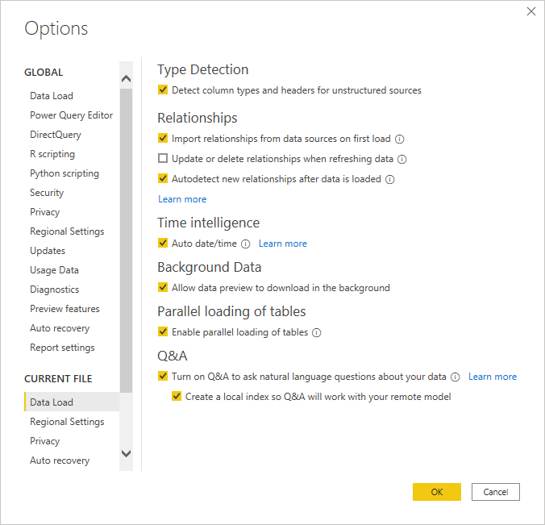

# Utilizar linguagem natural com a importação, a ligação em direto e a consulta direta

A funcionalidade Perguntas e Respostas no Power BI permite-lhe obter rapidamente respostas a partir dos dados com linguagem natural para fazer perguntas sobre esses dados. Este artigo descreve como a indexação e a colocação em cache são utilizadas para melhorar o desempenho de cada configuração suportada.

## Que origens de dados são suportadas nas Perguntas e Respostas?

As Perguntas e Respostas são suportadas nas seguintes configurações:

- Modo de importação
- Modo de ligação em direto – com o SQL Server Analysis Services, o Azure Analysis Services ou os conjuntos de dados do Power BI no local
- Consulta Direta – Azure Synapse, Azure SQL e SQL Server 2019. Embora outras origens possam funcionar no modo de consulta direta, oficialmente, não suportamos a essas origens.

Por predefinição, as Perguntas e Respostas estarão ativadas num relatório se utilizar o elemento visual Perguntas e Respostas. Se estiver a utilizar a Consulta Direta ou a Ligação em direto, será apresentada uma mensagem. Pode ativar/desativar explicitamente as funções de linguagem natural de um relatório ao aceder às opções.

Para obter mais informações, veja [Limitações das Perguntas e Respostas do Power BI](q-and-a-limitations.md).

## Como funciona a indexação com as Perguntas e Respostas?

Quando ativa as Perguntas e Respostas, é criado um índice para disponibilizar rapidamente feedback em tempo real ao utilizador e para ajudar a interpretar as perguntas do utilizador. A criação do índice pode demorar algum tempo e terá os seguintes elementos e limitações.

- Todos os nomes de colunas e tabelas são inseridos no índice, a menos que tenham sido explicitamente desativados nas ferramentas de Perguntas e Respostas.
- Todos os valores de texto com menos de 100 carateres serão indexados. Os valores de texto com mais de 100 carateres não serão indexados. 
- As Perguntas e Respostas armazenam um máximo de 5 milhões valores exclusivos no índice. Se exceder este limiar, o índice não incluirá todos os potenciais valores, o que poderá diminuir a precisão dos resultados recebidos das Perguntas e Respostas.
- Se ocorrer um erro durante a indexação, o índice permanecerá num estado parcial e será recriado na próxima atualização, conforme descrito na próxima secção.

## Com que frequência o índice é atualizado e colocado em cache?

No Power BI Desktop, o índice é criado quando utiliza as Perguntas e Respostas. É apresentado um pequeno ícone a informar que o índice está a ser criado. Durante esse tempo, o carregamento do elemento visual Perguntas e Respostas, incluindo as sugestões, pode demorar algum tempo.

No serviço Power BI, o índice é recriado aquando da publicação/republicação e atualização. O índice das Perguntas e Respostas nem sempre é criado automaticamente e, por vezes, será criado a pedido para otimizar as atualizações do conjunto de dados. Para a Consulta Direta, vamos indexar os dados, no máximo, uma vez por dia para reduzir o impacto na origem da mesma.

## Próximos passos

Pode integrar uma linguagem natural nos seus relatórios de diversas formas. Para obter mais informações, veja estes artigos:

* [Q&A visual](../visuals/power-bi-visualization-q-and-a.md) (Elemento visual Perguntas e Respostas)
* [Q&A best practices](q-and-a-best-practices.md) (Melhores práticas das Perguntas e Respostas)
