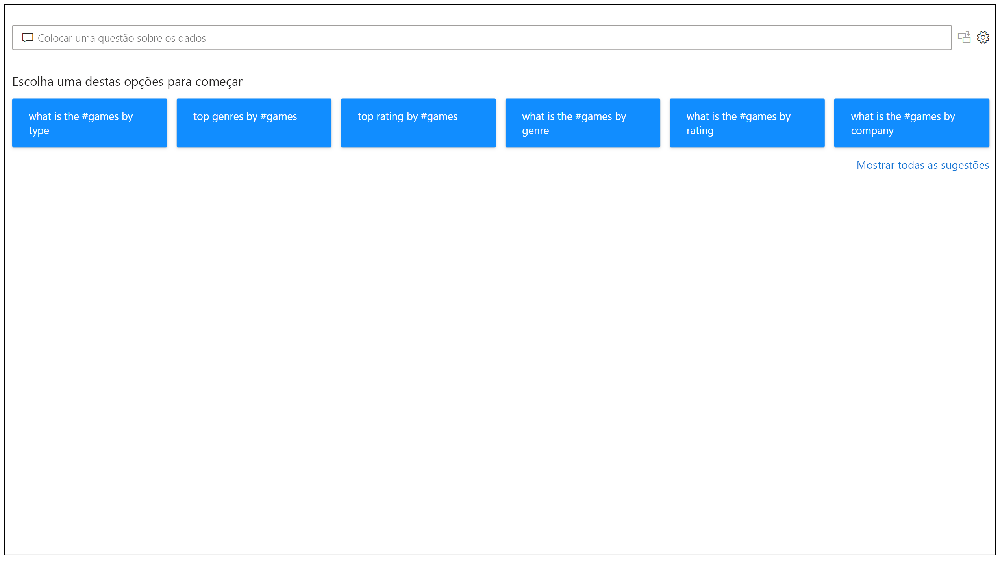
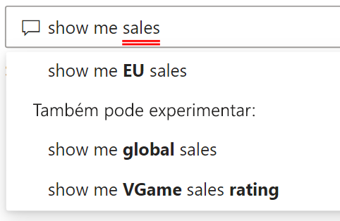
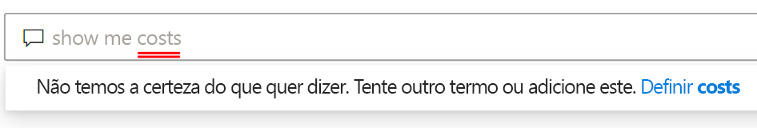
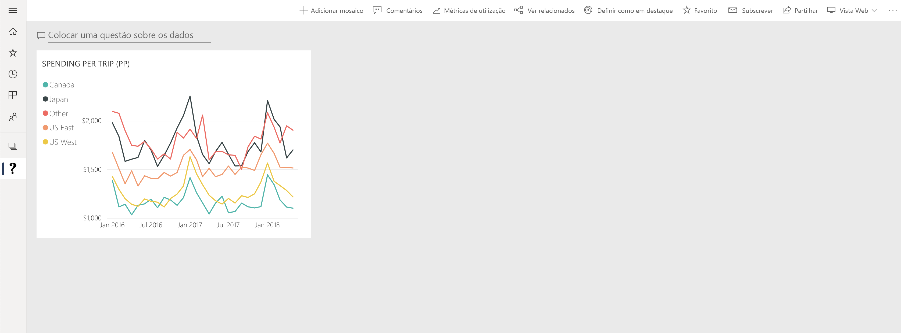

# Introdução às Perguntas e Respostas do Power BI

Por vezes, a forma mais rápida de obter uma resposta dos seus dados é pesquisá-los através de uma linguagem natural. A funcionalidade Perguntas e Respostas no Power BI permite-lhe explorar os seus dados com as suas próprias palavras através de uma linguagem natural. As Perguntas e Respostas são interativas e até divertidas. Muitas vezes, uma pergunta leva a outras, uma vez que as visualizações revelam caminhos interessantes a seguir. A pergunta é apenas o início. Viaje pelos seus dados ao refinar ou ampliar a sua pergunta, descobrir novas informações, concentrar-se em detalhes ou reduzir uma vista para a expandir. A experiência é interativa e rápida, baseada num armazenamento na memória. 

A funcionalidade Perguntas e Respostas do Power BI é gratuita e está disponível para todos os utilizadores. No Power BI Desktop, os estruturadores de relatórios podem utilizar as Perguntas e Respostas para explorar dados e criar visualizações. No serviço Power BI, todos podem explorar os respetivos dados com as Perguntas e Respostas. Se tiver permissão para editar um dashboard ou um relatório, também poderá afixar os seus resultados das Perguntas e Respostas.

## Como utilizar as Perguntas e Respostas

Mesmo antes de começar a escrever, as Perguntas e Respostas apresentam um ecrã novo com sugestões para o ajudar a formular a sua pergunta. Comece com uma das perguntas sugeridas ou escreva as suas próprias perguntas. A funcionalidade Perguntas e Respostas suporta uma ampla variedade de perguntas, incluindo, entre outras:

- **Faça perguntas naturais:** Que vendas têm a receita mais alta?
- **Utilize a filtragem de data relativa:** Mostrar-me as vendas no último ano
- **Obtenha apenas os N principais:** 10 principais produtos por vendas
- **Forneça um filtro:** Mostrar-me as vendas nos EUA
- **Forneça condições complexas:** Mostrar-me as vendas em que a categoria de produto é a Categoria 1 ou a Categoria 2
- **Obtenha um elemento visual específico:** Mostrar-me as vendas por produto como um gráfico circular
- **Utilize agregações complexas:** Mostrar-me as vendas medianas por produto
- **Ordene resultados:** Mostrar-me os 10 principais países/regiões por vendas ordenadas por código de país/região
- **Compare dados:** Mostrar-me a data por total de vendas vs. custo total
- **Visualize tendências:** Mostrar-me as vendas ao longo do tempo

### Preenchimento Automático

Ao escrever a sua pergunta, a funcionalidade Perguntas e Respostas do Power BI apresenta sugestões relevantes e contextuais para o ajudar a ser produtivo rapidamente com uma linguagem natural. Ao escrever, obtém feedback e resultados imediatos. A experiência é semelhante a escrever num motor de busca.

### Sublinhados a vermelho/azul

A funcionalidade Perguntas e Respostas apresenta as palavras com sublinhados para ajudar a ver que palavras o sistema compreendeu ou não reconheceu. Um sublinhado azul sólido indica que o sistema fez corresponder com êxito a palavra a um campo ou valor no modelo de dados. O exemplo abaixo mostra que a funcionalidade Perguntas e Respostas reconheceu as palavras *eu sales* (vendas da UE).

Muitas vezes, ao escrever uma palavra nas Perguntas e Respostas, a mesma é marcada com um sublinhado a vermelho. Um sublinhado a vermelho pode indicar um de dois possíveis problemas. O primeiro tipo de problema é categorizado como *confiança baixa*. Se escrever uma palavra vaga ou ambígua, o campo será sublinhado a vermelho. Um exemplo poderá ser a palavra "sales" (vendas). Múltiplos campos podem conter a palavra "vendas", pelo que o sistema utiliza um sublinhado a vermelho para pedir que escolha o campo pretendido. Outro exemplo de baixa confiança poderá ser se escrever a palavra "área", mas a coluna correspondente for "região". A funcionalidade Perguntas e Respostas do Power BI reconhece palavras que significam a mesma coisa, graças à integração com o Bing e o Office. A funcionalidade Perguntas e Respostas sublinha a palavra a vermelho para que saiba que não é uma correspondência direta.

O segundo tipo de problema é quando a funcionalidade Perguntas e Respostas não reconhece a palavra. Poderá deparar-se com este problema ao utilizar um termo específico de domínio que não é mencionado nos dados ou se os campos de dados tiverem um nome atribuído incorretamente. Um exemplo poderá ser utilizar a palavra "costs" (custos), embora a mesma não exista nos dados. A palavra existe no dicionário, mas a funcionalidade Perguntas e Respostas marca este termo com um sublinhado a vermelho.

> [!NOTE]
> Pode personalizar as cores de sublinhado a azul/vermelho no painel **Formatação visual** das Perguntas e Respostas. Além disso, o artigo sobre [ferramentas das Perguntas e Respostas](q-and-a-tooling-teach-q-and-a.md) explica a funcionalidade *Ensinar Perguntas e Respostas*, que pode utilizar para definir os termos que a funcionalidade Perguntas e Respostas não reconheceu.

### Resultados da visualização

Ao escrever a sua pergunta, a funcionalidade Perguntas e Respostas tenta interpretar e visualizar instantaneamente a resposta. Como parte das atualizações mais recentes, a funcionalidade Perguntas e Respostas tenta agora interpretar a pergunta e representar graficamente os campos de forma automática no eixo correto. Por exemplo, se escrever "Vendas por ano", a funcionalidade Perguntas e Respostas irá detetar que esse ano é um campo de data e dará sempre prioridade à colocação desse campo no eixo X. Se quiser alterar o tipo de visualização, escreva "como *tipo de gráfico*" após a pergunta. A funcionalidade Perguntas e Respostas suporta atualmente os seguintes tipos de visualizações:

- Gráfico de linhas
- Gráfico de barras
- Matriz
- Tabela
- Cartão
- Área
- Gráfico circular
- Gráfico de Dispersão/Bolhas
 

## Adicionar Perguntas e Respostas a um relatório

Pode adicionar Perguntas e Respostas a um relatório no Power BI Desktop ou no serviço Power BI de duas formas diferentes:

- Adicione um elemento visual das Perguntas e Respostas.
- Adicione um botão Perguntas e Respostas.

Para adicionar o elemento visual das Perguntas e Respostas a um relatório, selecione o novo ícone **Q&A** (Perguntas e Respostas) e o novo elemento visual das Perguntas e Respostas no painel Visualization (Visualização). Como alternativa, faça duplo clique em qualquer local na tela do relatório para inserir o elemento visual das Perguntas e Respostas.

Para adicionar um botão, no friso **Home Page**, selecione **Botões** > **Perguntas e Respostas**. Pode personalizar completamente a imagem do botão Perguntas e Respostas.

> [!NOTE]
> Ao iniciar as Perguntas e Respostas através do botão, ainda é utilizada a funcionalidade Perguntas e Respostas antiga. As versões subsequentes do Power BI irão mudar esta situação.

## Utilizar as Perguntas e Respostas para dashboards

Por predefinição, a funcionalidade Perguntas e Respostas está disponível na parte superior dos dashboards. Para utilizar as Perguntas e Respostas, escreva na caixa **Ask a question on your data** (Faça uma pergunta sobre os seus dados).

## Próximos passos

Pode integrar uma linguagem natural nos seus relatórios de diversas formas. Para obter mais informações, veja estes artigos:

* [Q&A visual](../visuals/power-bi-visualization-q-and-a.md) (Elemento visual Perguntas e Respostas)
* [Q&A best practices](q-and-a-best-practices.md) (Melhores práticas das Perguntas e Respostas)
