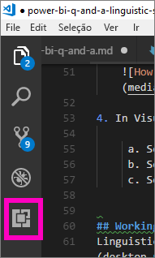

# <a name="edit-qa-linguistic-schema-and-add-phrasings-in-power-bi-desktop"></a>Editar o esquema linguístico e adicionar expressões nas Perguntas e Respostas no Power BI Desktop 
Utilizar linguagem natural e expressões comuns para fazer perguntas sobre os seus dados é algo extremamente útil. Ainda mais útil quando os seus dados respondem. Quando coloca uma questão nas Perguntas e Respostas do Power BI, estas fazem todos os possíveis para responder corretamente. Porém, pode otimizar as respostas para obter interações das Perguntas e Respostas ainda melhores. Uma forma de o fazer é editar o esquema linguístico. 

Tudo começa com os dados da sua empresa.  Quanto melhor for o modelo de dados, mais fácil será para os utilizadores obter respostas de qualidade. Uma forma de melhorar o modelo é adicionar um esquema linguístico que defina e categorize a terminologia e as relações entre os nomes de tabelas e colunas no conjunto de dados. O Power BI Desktop é onde gere os seus esquemas linguísticos. 

Existem dois lados nas Perguntas e Respostas.  O primeiro é a preparação ou *modelação*.  O segundo é colocar questões e explorar os dados ou *consumir*. Em algumas empresas, os colaboradores conhecidos como *modeladores de dados* ou Administradores de TI podem ser aqueles que montam os conjuntos de dados, criam os modelos de dados e publicam os conjuntos de dados no Power BI.  Um outro conjunto de colaboradores seria constituído por aqueles que "consomem" os dados online.  Noutras empresas, estas funções podem estar combinadas. 

Este artigo destina-se a modeladores de dados, as pessoas que otimizam conjuntos de dados para conseguir os melhores resultados possíveis das Perguntas e Respostas. 

## <a name="what-is-a-linguistic-schema"></a>O que é um esquema linguístico?
Um esquema linguístico descreve os termos e as expressões que as Perguntas e Respostas devem compreender para objetos num conjunto de dados, incluindo partes do discurso, sinónimos e expressões relacionados com esse conjunto de dados. Quando importa ou liga a um conjunto de dados, o Power BI cria um esquema linguístico com base na estrutura do conjunto de dados. Quando coloca uma questão nas Perguntas e Respostas, são procuradas correspondências e relações nos dados para descobrir a intenção da sua pergunta. Por exemplo, são procurados substantivos, verbos, adjetivos, expressões e outros elementos. São também procuradas relações, como as colunas que são objetos de um verbo. 

É provável que já conheça as categorias gramaticais (caso contrário, veja abaixo), mas o termo *expressões* pode ser novo para si.  Uma expressão é a forma como fala sobre as relações entre as coisas (ou como as *expressa*). Por exemplo, para descrever a relação entre clientes e produtos, pode dizer "os clientes compram produtos". Para descrever a relação entre clientes e idades, pode dizer "as idades indicam há quanto tempo são clientes". Para descrever a relação entre clientes e números de telefone, pode simplesmente dizer "os clientes têm números de telefone".

Estas expressões têm várias formas e tamanhos. Algumas correspondem diretamente a relações no modelo de dados. Algumas estabelecem relações entre as colunas e as respetivas tabelas. Outras estão relacionadas com múltiplas tabelas e colunas em relações complexas. Em todos os casos, descrevem como as coisas estão relacionadas com termos de uso corrente.

Os esquemas linguísticos são guardados no formato .yaml. Este formato está relacionado com o formato JSON popular, mas fornece uma sintaxe mais flexível e fácil de ler. Os esquemas linguísticos podem ser editados, exportados e importados para o Power BI Desktop.

## <a name="prerequisites"></a>Pré-requisitos

- Se ainda não tiver lido o artigo sobre como [melhorar o seu modelo de dados para as Perguntas e Respostas](q-and-a-best-practices.md), poderá ser útil lê-lo primeiro. Inclui várias sugestões para estruturar e melhorar o seu modelo de dados e uma secção importante sobre como adicionar sinónimos.  
- Transfira [ficheiros .yaml e .pbix](https://go.microsoft.com/fwlink/?linkid=871858) de exemplo.   
- Instale um editor de ficheiros .yaml. Recomendamos o [Visual Studio Code](https://code.visualstudio.com/).

### <a name="set-up-an-editor-for-yaml-files"></a>Configurar um editor de ficheiros .yaml
Recomendamos que utilize o Visual Studio Code para editar os ficheiros .yaml de esquema linguístico. O Visual Studio Code inclui suporte integrado para ficheiros .yaml e pode ser expandido para validar especificamente o formato do esquema linguístico do Power BI.
1. Instale o [Visual Studio Code](https://code.visualstudio.com/).    

2. Selecione o esquema linguístico de exemplo que guardou anteriormente: [ficheiro .yaml](https://go.microsoft.com/fwlink/?linkid=871858) (SummerOlympics.lsdl.yaml).    
4. Selecione **Visual Studio Code** e **Utilizar sempre esta aplicação para abrir ficheiros .yaml**.

    

4. No Visual Studio Code, instale a extensão YAML Support by Red Hat.    
    a. Selecione o separador **Extensões** (o último à esquerda) ou Ctrl+Shift+X.    
        
    b. Procure "yaml" e selecione **YAML Support by Red Hat** na lista.    
    c. Selecione **Instalar > Recarregar**.


## <a name="working-with-linguistic-schemas"></a>Trabalhar com esquemas linguísticos

Existem duas formas de trabalhar com esquemas linguísticos. Uma forma é editar, importar e exportar o .yaml do friso no Power BI Desktop. Esta forma é abordada no artigo [Experiência da Ferramenta das Perguntas e Respostas](q-and-a-tooling-intro.md) do Power BI. Não tem de abrir o ficheiro .yaml para melhorar as Perguntas e Respostas. 

A outra forma de editar um esquema linguístico é ao exportar e editar diretamente o ficheiro .yaml.  Quando edita um ficheiro .yaml de esquema linguístico, atribui etiquetas a colunas na tabela ao categorizar os elementos gramaticais diferentes e define as palavras que podem ser utilizadas por um colega ao formular uma pergunta. Por exemplo, indica as colunas que são o sujeito e o objeto do verbo. Adiciona palavras alternativas que podem ser utilizadas por colegas para fazer referência a tabelas, colunas e medidas no seu modelo. 


Antes de poder editar um esquema linguístico, tem de o abrir (exportar) a partir do Power BI Desktop. Quando guarda o ficheiro .yaml na mesma localização, isto é considerado importação.  No entanto, também pode importar outros ficheiros .yaml.  Por exemplo, se tiver um conjunto de dados semelhante e já tiver tido muito trabalho a adicionar categorias gramaticais, identificar relações, criar expressões e criar sinónimos, pode utilizar esse ficheiro .yaml num ficheiro diferente do Power BI Desktop. 

As Perguntas e Respostas utilizam todas estas informações juntamente com as melhorias feitas para fornecer melhores respostas, preenchimento automático e resumo das perguntas.

## <a name="edit-a-linguistic-schema"></a>Editar um esquema linguístico
Quando exporta primeiro o esquema linguístico a partir do Power BI Desktop, a maior parte ou todos os conteúdos no ficheiro serão gerados automaticamente pelo motor das Perguntas e Respostas. Estas entidades, palavras (sinónimos), relações e expressões geradas são designadas com uma etiqueta **Estado: Gerado**. Estão incluídas no ficheiro principalmente para fins informativos, mas podem ser um ponto de partida útil para as suas próprias alterações. 

> [!NOTE]
> O ficheiro .yaml de exemplo incluído neste tutorial não contém as etiquetas **Estado: Gerado** ou **Estado: Eliminado**, uma vez que foi especificamente preparado para este tutorial. Para ver estas etiquetas, abra um ficheiro .pbix não editado na vista Relações e exporte o esquema linguístico.


Quando importar o ficheiro do esquema linguístico de volta para o Power BI Desktop, o que está marcado como **Estado: Gerado** é ignorado e depois novamente gerado. Por isso, se quiser alterar conteúdos gerados, remova o **Estado: Gerado** correspondente. Da mesma forma, se quiser remover conteúdos gerados, altere a etiqueta **Estado: Gerado** para **Estado: Eliminado** para que não seja gerada novamente quando importar o ficheiro de esquema linguístico.

### <a name="export-then-import-a-yaml-file"></a>Exportar e depois importar um ficheiro .yaml

1. Abra o conjunto de dados na vista de Modelo no Power BI Desktop. 
2. No separador **Modelação**, selecione **Esquema Linguístico** > **Exportar esquema linguístico**.
3. Guarde-o. O nome do ficheiro termina com .lsdl.yaml.
4. Abra-o no Visual Studio Code ou noutro editor.
4. Na vista de Modelo no Power BI Desktop, no separador **Modelação**, selecione **Esquema Linguístico** > **Importar esquema linguístico**. 
6. Navegue para a localização onde guardou o ficheiro .yaml editado e selecione-o. Uma mensagem de êxito indica que o ficheiro .yaml de esquema linguístico foi importado com êxito.

    

## <a name="phrasings-in-the-linguistic-schema"></a>Expressões no esquema linguístico
Novamente, uma expressão é a forma como fala sobre as relações entre as coisas. Por exemplo, para descrever a relação entre clientes e produtos, pode dizer "os clientes compram produtos".

## <a name="where-do-phrasings-come-from"></a>Qual a origem das expressões?
O Power BI adiciona automaticamente muitas expressões simples ao esquema linguístico, com base na estrutura do modelo e em alguns palpites baseados nos nomes de coluna. Por exemplo:
- A maioria das colunas tem a ver com a respetiva tabela através de uma expressão simples, como "produtos com descrições".
- As relações do modelo resultam em expressões predefinidas para ambas as direções da relação, como "encomendas com produtos" e "produtos com encomendas".
- Algumas relações do modelo podem, com base nos respetivos nomes de coluna, obter uma expressão predefinida mais complexa, como "as encomendas são enviadas para cidades".

No entanto, existem inúmeras formas de os utilizadores falarem sobre temas que as Perguntas e Respostas não podem adivinhar. Por conseguinte, pode adicionar as suas próprias expressões manualmente.

## <a name="why-add-phrasings"></a>Porquê adicionar expressões?
O primeiro motivo para adicionar uma expressão é definir um novo termo. Por exemplo, se quiser perguntar "listar os clientes mais antigos", tem primeiro de ensinar às Perguntas e Respostas o que significa "antigo". Deverá fazê-lo ao adicionar uma expressão como "as idades indicam há quanto tempo são clientes".

O segundo motivo para adicionar uma expressão é resolver a ambiguidade. Uma pesquisa por palavra-chave básica só resulta quando as palavras têm mais do que um significado. Por exemplo, "voos para Chicago" não é o mesmo que "voos de Chicago". No entanto, as Perguntas e Respostas não sabem a qual se refere, exceto se adicionar as expressões "voos de cidades de partida" e "voos para cidades de chegada". Da mesma forma, as Perguntas e Respostas só compreenderão a distinção entre "carros que o João vendeu à Mariana" e "carros que o João comprou à Mariana" depois de adicionar as expressões "os clientes compram carros de colaboradores" e "os colaboradores vendem carros a clientes".

O último motivo para adicionar uma expressão é melhorar as reformulações. Em vez de as Perguntas e Respostas devolverem "Mostrar os clientes e os seus produtos", seria mais claro indicar "Mostrar os clientes e os produtos que compraram" ou "Mostrar os clientes e os produtos que reviram", consoante a interpretação da pergunta. A adição de expressões personalizadas permite que as reformulações sejam mais explícitas e inequívocas.


## <a name="kinds-of-phrasings"></a>Tipos de expressões
Para compreender os diferentes tipos de expressões, primeiro terá de se lembrar de alguns termos gramaticais básicos:
- Um *substantivo* é uma pessoa, local ou coisa. 
    Exemplos: carro, adolescente, Mateus, condensador de fluxos
- Um *verbo* é uma ação ou o estado de ser. 
    Exemplos: chocar, explodir, devorar, ejetar
- Um *adjetivo* é uma palavra descritiva que modifica um substantivo. 
    Exemplos: poderoso, mágico, dourado, roubado
- Uma *preposição* é uma palavra utilizada antes de um substantivo para o relacionar com um substantivo, verbo ou adjetivo anterior. Exemplos: de, para, por, desde
-  Um *atributo* é uma qualidade ou funcionalidade de algo.
-  Um *nome* é uma palavra ou conjunto de palavras pelas quais uma pessoa, animal, local ou coisa é conhecida ou referida.   


### <a name="attribute-phrasings"></a>Expressões de atributo
As expressões de atributo são a base das Perguntas e Respostas, utilizadas quando uma coisa está a agir como atributo de outra coisa. São simples, diretas e fazem a maior parte do trabalho pesado quando ainda não foi definida uma expressão mais subtil e detalhada. As expressões de atributo são descritas através da utilização do verbo "ter" ("os produtos têm categorias" e "os países anfitriões têm cidades anfitriãs"). Também permitem automaticamente a formulação de perguntas com as preposições "de" e "para" ("categorias de produtos", "encomendas para produtos") e possessivos ("as encomendas do João"). As expressões de atributo são utilizadas nos seguintes tipos de perguntas:

- Que clientes têm encomendas?
- Listar as cidades anfitriãs por país por ordem ascendente
- Mostrar as encomendas que têm chai
- Listar os clientes com encomendas
- Qual é a categoria de cada produto?
- Contar as encomendas de Samuel Costa    

O Power BI gera a esmagadora maioria de expressões de atributo necessárias no seu modelo, com base na contenção de tabelas/colunas e nas relações do modelo. Normalmente, não terá de criá-las.
Eis um exemplo do aspeto de uma expressão de atributo dentro do esquema linguístico:

```json
product_has_category:
  Binding: {Table: Products}
  Phrasings:
  - Attribute: {Subject: product, Object: product.category}
```
 
### <a name="name-phrasings"></a>Expressões de Nome
As expressões de nome são úteis se o modelo de dados tiver uma tabela com objetos nomeados, como nomes de atletas e de clientes. Por exemplo, uma expressão "os nomes de produtos são nomes de produtos" é essencial para poder utilizar nomes de produtos em perguntas. As expressões de nome também permitem utilizar a expressão "com o nome" (por exemplo, "Listar clientes com o nome João Silva"). No entanto, é mais importante quando utilizada em conjunto com outras expressões, para permitir que um valor de nome seja utilizado para fazer referência a uma linha de tabela específica. Por exemplo, em "Clientes que compraram chai", as Perguntas e Respostas podem dizer que o valor "chai" faz referência a toda a linha da tabela de produtos, em vez de somente um valor na coluna de nomes de produto. As expressões de nome são utilizadas nos seguintes tipos de perguntas:    
- Colaboradores com o nome Samuel Costa
- Pessoas com o nome Tiago Ribeiro
- Desporto de Fernand De Montigny
- Número de atletas com o nome Mariana
- O que comprou Samuel Costa?

Partindo do princípio que utilizou uma convenção de nomenclatura pertinente para colunas de nomes no seu modelo (por exemplo, "Name" ou "ProductName" em vez de "PrdNm"), a maioria das expressões de nome necessárias no seu modelo será gerada automaticamente pelo Power BI, pelo que normalmente não tem de as criar.

Eis um exemplo do aspeto de uma expressão de nome dentro do esquema linguístico:

```json
employee_has_name:
  Binding: {Table: Employees}
  Phrasings:
  - Name:
      Subject: employee
      Name: employee.name
```

 
### <a name="adjective-phrasings"></a>Expressões de adjetivos
As expressões de adjetivo definem novos adjetivos utilizados para descrever coisas no seu modelo. Por exemplo, a expressão "clientes satisfeitos são clientes em que a classificação > 6" é necessária para fazer perguntas como "listar clientes satisfeitos em Des Moines". Existem várias formas de expressões de adjetivo, para utilização em diversas situações.

As *expressões de adjetivo simples* definem um novo adjetivo com base numa condição, como "produtos descontinuados são produtos em que o estado = D". As expressões de adjetivo simples são utilizadas nos seguintes tipos de perguntas:
- Que produtos foram descontinuados?
- Listar os produtos descontinuados
- Listar os medalhistas de ouro
- Produtos que estão pendentes

Eis um exemplo do aspeto de uma expressão de adjetivo simples dentro do esquema linguístico:

product_is_discontinued:

```json
Binding: {Table: Products}
  Conditions:
  - Target: product.discontinued
    Operator: Equals
    Value: true
  Phrasings:
  - Adjective:
      Subject: product
      Adjectives: [discontinued]
```

As *expressões de adjetivo de medição* definem um novo adjetivo com base num valor numérico que indica a extensão a que o adjetivo se aplica, como "os comprimentos indicam o comprimento dos rios" e "as pequenas regiões têm áreas terrestres pequenas". As expressões de adjetivo de medida são utilizadas nos seguintes tipos de perguntas:
- Listar os rios longos
- Quais os rios mais longos?
- Listar as regiões mais pequenas que ganharam o ouro em basquetebol
- Qual é o comprimento do Rio Grande?

Eis um exemplo do aspeto de uma expressão de adjetivo de medição dentro do esquema linguístico:

river_has_length:

 ```json
Binding: {Table: Rivers}
  Phrasings:
  - Adjective:
      Subject: river
      Adjectives: [long]
      Antonyms: [short]
      Measurement: river.length
```

As *expressões de adjetivo dinâmicas* definem um conjunto de novos adjetivos com base nos valores numa coluna no modelo, como "as cores descrevem os produtos" e "os eventos têm géneros". As expressões de adjetivo dinâmicas são utilizadas nos seguintes tipos de perguntas:
- Listar os produtos vermelhos
- Que produtos são verdes?
- Mostrar eventos de skate para mulheres
- Número de problemas ativos

Eis um exemplo do aspeto de uma expressão de adjetivo dinâmico dentro do esquema linguístico:

product_has_color:
```json
Binding: {Table: Products}
  Phrasings:
  - DynamicAdjective:
      Subject: product
      Adjective: product.color
```

 
### <a name="noun-phrasings"></a>Expressões de substantivo
As expressões de substantivo definem novos substantivos que descrevem subconjuntos de coisas no seu modelo. Incluem muitas vezes algum tipo de medição ou condição específica do modelo. Por exemplo, para o nosso modelo de Jogos Olímpicos, podemos adicionar expressões que distinguem os campeões dos medalhistas, os desportos com bola dos desportos aquáticos, as equipas dos individuais, categorias de idade de atletas (juvenis, adultos, séniores), etc. Para a nossa base de dados de filmes, podemos adicionar expressões de substantivo para "os falhanços são filmes em que o lucro líquido < 0" para podermos fazer perguntas como "número de falhanços por ano". Existem duas formas de expressões de substantivo, para utilização em diversas situações.

As *expressões de substantivo simples* definem um novo substantivo com base numa condição, como "os contratantes são colaboradores em que o tempo inteiro = false" e "o campeão é um atleta em que o número de medalhas > 5". As expressões de substantivo simples são utilizadas nos seguintes tipos de perguntas:

- Que colaboradores são contratantes?
- Número de contratantes em Portland
- Quantos campeões em 2016

Eis um exemplo do aspeto de uma expressão de nome simples dentro do esquema linguístico:

employee_is_contractor:

```json
Binding: {Table: Employees}
  Conditions:
  - Target: employee.full_time
    Operator: Equals
    Value: false
  Phrasings:
  - Noun:
      Subject: employee
      Nouns: [contractor]
```

As *expressões de substantivo dinâmicas* definem um conjunto de novos substantivos com base nos valores numa coluna no modelo, como "os trabalhos definem os subconjuntos de colaboradores". As expressões de substantivo dinâmicas são utilizadas nos seguintes tipos de perguntas:

- Listar os caixas em Chicago
- Que colaboradores são baristas?
- Listar os árbitros em 1992

Eis um exemplo do aspeto de uma expressão de substantivo dinâmica dentro do esquema linguístico: employee_has_job:

 ```json
Binding: {Table: Employees}
  Phrasings:
  - DynamicNoun:
      Subject: employee
      Noun: employee.job
```

### <a name="preposition-phrasings"></a>Expressões de preposição
As expressões de preposição são utilizadas para descrever como as coisas no seu modelo estão relacionadas através de preposições. Por exemplo, uma expressão "as cidades estão em países" melhora a compreensão de perguntas como "número de cidades em Washington". Algumas expressões de preposição são criadas automaticamente quando uma coluna é reconhecida como uma entidade geográfica. As expressões de preposição são utilizadas nos seguintes tipos de perguntas:

- Número de clientes em Nova Iorque
- Listar os livros sobre linguística
- Em que cidade está Robert King?
- Quantos livros existem de Stephen Pinker?
 
Eis um exemplo do aspeto de uma expressão de preposição dentro do esquema linguístico: customers_are_in_cities:

 ```json
Binding: {Table: Customers}
  Phrasings:
  - Preposition:
      Subject: customer
      Prepositions: [in]
      Object: customer.city
```

 
### <a name="verb-phrasings"></a>Expressões de verbo
As expressões de verbo são utilizadas para descrever como as relações entre os itens no seu modelo são feitas através de verbos. Por exemplo, uma expressão "os clientes compram produtos" melhora a compreensão de perguntas como "quem comprou queijo?" e "o que comprou o João?". As expressões de verbo são as mais flexíveis de todos os tipos de expressões, muitas vezes relacionadas com mais de duas coisas, como em "os colaboradores vendem produtos a clientes". As expressões de verbo são utilizadas nos seguintes tipos de perguntas:

- Quem vendeu o quê a quem?
- Que colaborador vendeu chai ao João?
- A Mariana vendeu chai a quantos clientes?
- Listar os produtos que a Mariana vendeu ao João.
- Que produtos descontinuados foram vendidos aos clientes de Chicago pelos colaboradores de Boston?

As expressões de verbo também podem conter expressões preposicionais, adicionadas à respetiva flexibilidade, como "os atletas ganham medalhas em competições" ou "os clientes recebem reembolsos de produtos". As expressões de verbo com expressões preposicionais são utilizadas nos seguintes tipos de perguntas:

- Quantos atletas ganharam uma medalha de ouro no Campeonato Visa?
- A que clientes foi atribuído um reembolso referente a queijo?
- Em que competição Danell Leyva ganhou uma medalha de bronze?

Algumas expressões de verbo são criadas automaticamente quando uma coluna é reconhecida como tendo um verbo e uma preposição.

Eis um exemplo do aspeto de uma expressão de verbo dentro do esquema linguístico: customers_buy_products_from_salespeople:

```json
Binding: {Table: Orders}
  Phrasings:
  - Verb:
      Subject: customer
      Verbs: [buy, purchase]
      Object: product
      PrepositionalPhrases:
      - Prepositions: [from]
        Object: salesperson
```

### <a name="relationships-with-multiple-phrasings"></a>Relações com múltiplas expressões
Muitas vezes, uma só relação pode ser descrita de diversas formas. Neste caso, uma só relação pode ter mais do que uma expressão. É bastante comum uma relação entre uma entidade de tabela e uma entidade de coluna ter uma expressão de atributo e outra expressão. Por exemplo, na relação entre cliente e nome do cliente, é aconselhável ter uma expressão de atributo (por exemplo, "os clientes têm nomes") e uma expressão de nome (por exemplo, "os nomes de cliente são os nomes dos clientes"), pelo que pode fazer os dois tipos de perguntas.

Eis um exemplo do aspeto de uma relação com duas expressões dentro do esquema linguístico: customer_has_name:

  ```json
Binding: {Table: Customers}
  Phrasings:
    - Attribute: {Subject: customer, Object: customer.name}
    - Name:
        Subject: customer
        Object: customer.name
```

Outro exemplo seria adicionar a expressão alternativa "os colaboradores vendem produtos a clientes" à relação "os clientes compram produtos a colaboradores". Tenha em atenção que não tem de adicionar variações como "os colaboradores vendem produtos *a clientes*" ou "os produtos são vendidos a clientes *por colaboradores*", uma vez que as variações "por" e "a" do sujeito e do objeto indireto são inferidas automaticamente pelas Perguntas e Respostas.

## <a name="considerations-and-troubleshooting"></a>Considerações e resolução de problemas
Se fizer uma alteração a um ficheiro .lsdl.yaml que não esteja em conformidade com o formato de esquema linguístico, verá agora traços de validação para indicar problemas: 


Mais perguntas? [Pergunte à Comunidade do Power BI](http://community.powerbi.com/)
