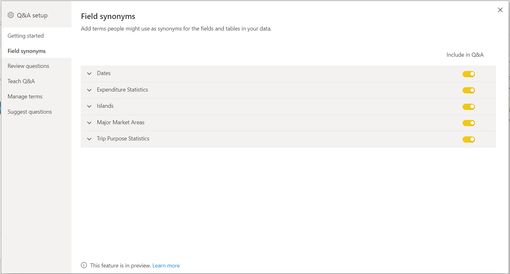

# Introdução às ferramentas das Perguntas e Respostas para preparar as Perguntas e Respostas do Power BI (pré-visualização)

Com as *ferramentas* das Perguntas e Respostas do Power BI, pode melhorar a experiência de linguagem natural dos seus utilizadores. Como designer ou administrador, interage com o motor de linguagem natural e faz melhorias em três áreas: 

- Rever perguntas que os utilizadores colocaram.
- Ensinar as Perguntas e Respostas a entender as perguntas.
- Gerir os termos que ensinou às Perguntas e Respostas.

Além destas capacidades dedicadas de ferramentas, o separador **Modelação** no Power BI Desktop oferece mais opções:  

- Sinónimos
- Etiquetas de linha
- Ocultar das Perguntas e Respostas
- Configuração do esquema linguístico (avançado)

## Introdução às ferramentas das Perguntas e Respostas

As ferramentas das Perguntas e Respostas só estão disponíveis no Power BI Desktop e, atualmente, apenas suportam o modo de importação.

1. Abra o Power BI Desktop e utilize as Perguntas e Respostas para criar um elemento visual. 
2. No canto do elemento visual, selecione o ícone de engrenagem. 

    

    É aberta a página de Introdução.  

    

### Sinónimos de Campos

Selecione **Sinónimos de Campos** para ver todas as tabelas e colunas pertencentes ao modelo. Esta vista permite-lhe adicionar nomes alternativos para corresponder as colunas, de forma a ajudar os utilizadores. Pode também escolher se uma coluna ou tabela deve ser ocultada das Perguntas e Respostas.

Clique numa das tabelas para expandir e verá uma caixa de diálogo semelhante à apresentada abaixo.

A caixa de diálogo vai apresentar todas as colunas e tabelas, bem como os respetivos termos/sinónimos que os utilizadores podem usar ao fazer perguntas ao conjunto de dados. Pode ver rapidamente todos os termos num só local e adicionar ou remover termos de múltiplas colunas. 

- Adicionar termos: se tiver um campo chamado Vendas, pode decidir adicionar um termo chamado Receita, para que um utilizador possa utilizar esta palavra em vez de ter de utilizar a palavra Vendas. Clique no sinal de adição para adicionar rapidamente um novo termo

- Incluir nas Perguntas e Respostas: esta opção permite que uma coluna ou tabela seja omitida das Perguntas e Respostas, o que significa que não será apresentada nem pode ser apresentado um resultado com esta coluna. Uma circunstância em que pode decidir não incluir uma coluna é quando lida com datas. Se houver diversos campos de data, ou chaves externas, pode decidir remover todos menos um dos campos de data, para que a coluna de data correta seja escolhida quando um utilizador fizer uma pergunta relacionada com datas.

- Termos Sugeridos: as Perguntas e Respostas também recomendarão termos sugeridos obtidos do nosso motor de sugestões para ajudar a adicionar rapidamente termos/sinónimos. Se não forem adicionadas sugestões, ainda funcionarão, mas darão ao utilizador uma linha pontilhada laranja, que indica que as Perguntas e Respostas acreditam ter uma resposta mas não têm a certeza. Se o sinónimo sugerido estiver correto, clique no ícone + para que possa ser utilizado com sinónimo. Se a sugestão estiver incorreta, clique no X, o que irá remover o termo e garantir que não será utilizado como termo/sinónimo e não funcionará nas Perguntas e Respostas. As sugestões recorrem a tecnologias de Dicionário do Office e também provêm de mudanças de nome dentro de um relatório

### Rever as perguntas

Selecione **Rever perguntas** para ver uma lista de conjuntos de dados que estão a ser utilizados no serviço Power BI para o seu inquilino. A página **Rever perguntas** mostra também o proprietário do conjunto de dados, a área de trabalho e a data da última atualização. A partir daí, pode selecionar um conjunto de dados e ver que perguntas os utilizadores têm feito. Os dados também mostram palavras que não foram reconhecidas. Todos os dados mostrados aqui dizem respeito aos últimos 28 dias.

### Ensinar Perguntas e Respostas

A secção **Ensinar Perguntas e Respostas** permite-lhe preparar as Perguntas e Respostas para reconhecer palavras. Para começar, escreva uma pergunta que contenha uma ou mais palavras que as Perguntas e Respostas não reconhecem. As Perguntas e Respostas pedem-lhe a definição desse termo. Introduza um filtro ou um nome de campo que corresponda ao significado dessa palavra. Depois, as Perguntas e Respostas reinterpretam a pergunta original. Se estiver satisfeito com os resultados, pode guardar o texto introduzido. Para saber mais, veja [Ensinar Perguntas e Respostas](q-and-a-tooling-teach-q-and-a.md)

### Gerir termos

Tudo o que tiver guardado da secção Ensinar Perguntas e Respostas aparece aqui, pelo que pode rever ou eliminar os termos que definiu. Atualmente, não pode editar uma definição existente, por isso, para redefinir um termo, tem de o eliminar e voltar a criar.

### Sugerir perguntas

> [!NOTE]
> As perguntas sugeridas aparecerão para todas as instâncias do elemento visual de Perguntas e Respostas. Não é possível criar um conjunto de sugestões separado para cada elemento visual de Perguntas e Respostas.
> 
> 

O elemento visual de Perguntas e Respostas sugere várias perguntas para começar, sem ser necessária configuração. Estas perguntas são geradas automaticamente com base no seu modelo de dados. Em **Sugerir perguntas**, pode substituir as perguntas geradas automaticamente pelas suas perguntas.

Para começar, escreva a pergunta que pretende adicionar na caixa de texto. Na secção de pré-visualização, verá o resultado no elemento visual de Perguntas e Respostas. 

:::image type="content" source="media/q-and-a-tooling-intro/power-bi-qna-suggest-questions.png" alt-text="Sugerir perguntas para as Perguntas e Respostas":::
 
Selecione o botão **Adicionar** para adicionar esta pergunta a **As suas perguntas sugeridas**. Todas as perguntas adicionais serão adicionadas ao final desta lista. As perguntas serão apresentadas no elemento visual de Perguntas e Respostas pela mesma ordem que nesta lista. 

:::image type="content" source="media/q-and-a-tooling-intro/power-bi-qna-save-suggest-questions.png" alt-text="Guardar perguntas sugeridas":::
 
Certifique-se de que seleciona **Guardar** para mostrar a sua lista de perguntas sugeridas no elemento visual de Perguntas e Respostas. 

## Outras definições das Perguntas e Respostas

### Definir uma etiqueta de linha

Uma etiqueta de linha permite-lhe definir qual a coluna (ou o *campo*) que melhor identifica uma linha única numa tabela. Por exemplo, numa tabela chamada "Cliente", a etiqueta de linha costuma ser "Nome a Apresentar". Fornecer estes metadados adicionais permite às Perguntas e Respostas desenhar um elemento visual mais útil, quando os utilizadores escrevem "Mostrar-me as vendas por cliente". Em vez de tratar "cliente" como uma tabela, pode utilizar "Nome a Apresentar" e apresentar um gráfico de barras que mostra as vendas para cada cliente. Só pode definir a Vista de modelação da etiqueta de linha. 

1. No Power BI Desktop, selecione a Vista de modelação.

2. Selecione uma tabela para mostrar o painel **Propriedades**.

3. Na caixa **Etiqueta de linha**, selecione um campo.

## Configurar o esquema linguístico (avançado)

No Power BI, pode preparar totalmente e melhorar o motor de linguagem natural dentro das Perguntas e Respostas, incluindo mudar a pontuação e a ponderação dos resultados em linguagem natural subjacentes. Para saber como, veja [Editar o esquema linguístico e adicionar expressões nas Perguntas e Respostas](q-and-a-tooling-advanced.md).

## Passos seguintes

Existem diversas melhores práticas para melhorar o motor de linguagem natural. Para obter mais informações, veja [Melhores práticas das Perguntas e Respostas](q-and-a-best-practices.md).
