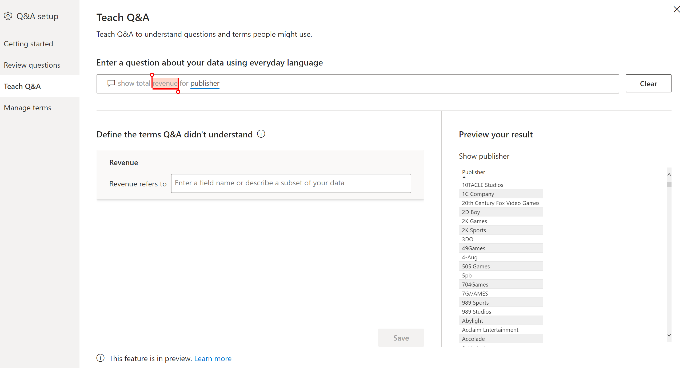

# Ensinar Perguntas e Respostas para compreender as perguntas e os termos nas Perguntas e Respostas do Power BI

Na secção **Ensinar Perguntas e Respostas** da configuração das Perguntas e Respostas, irá preparar Perguntas e Respostas para compreender as perguntas e os termos de linguagem natural que não são reconhecidos. Para começar, submeta uma pergunta que contenha uma ou mais palavras que as Perguntas e Respostas não reconhecem. Em seguida, as Perguntas e Respostas pedem-lhe para definir esse termo. Introduza um filtro ou um nome de campo que corresponda ao significado dessa palavra. Depois, as Perguntas e Respostas reinterpretam a pergunta original. Se estiver satisfeito com os resultados, guarde-os.

> [!NOTE]
> A funcionalidade Ensinar Perguntas e Respostas apenas suporta o modo de importação. Também ainda não suporta a ligação a uma origem de dados no local ou do Azure Analysis Services. Esta limitação deverá ser removida nas versões subsequentes do Power BI.

## Começar a ensinar Perguntas e Respostas

1. No Power BI Desktop, no friso **Modelação**, selecione **Configuração das Perguntas e Respostas** > **Ensinar Perguntas e Respostas**.

    

2. Escreva uma frase com um termo que as Perguntas e Respostas não reconhecem e selecione **Submeter**.

3. Selecione a palavra sublinhada a vermelho. 

    As Perguntas e Respostas fornecem sugestões e pedem-lhe para indicar a definição correta do termo. 
    
3. Em **Definir os termos que as Perguntas e Respostas não compreenderam**, forneça uma definição.

    

4. Selecione **Guardar** para pré-visualizar o elemento visual atualizado.

5. Introduza a pergunta seguinte ou selecione o **X** para fechar.

Os consumidores do seu relatório só verão esta alteração quando publicar o relatório novamente no serviço.

## Definir substantivos e adjetivos

Pode ensinar dois tipos de termos às Perguntas e Respostas:

- Substantivos
- Adjetivos

### Definir um sinónimo de substantivo

Quando trabalha com dados, geralmente tem nomes de campos que podem ser referidos com nomes alternativos. Um exemplo poderia ser "Vendas". Várias palavras ou frases podem referir-se a vendas, como "receita". Se uma coluna for denominada "Vendas" e os consumidores do relatório escreverem "receita", as Perguntas e Respostas podem não escolher a coluna correta para responder à pergunta adequadamente. Nesse caso, quer informar as Perguntas e Respostas que "Vendas" e "Receita" se referem à mesma coisa.

As Perguntas e Respostas detetam automaticamente quando uma palavra não reconhecida é um substantivo através do conhecimento do Microsoft Office. Se as Perguntas e Respostas detetarem um substantivo, ser-lhe-á pedido da seguinte forma:

- <your term> **refere-se a** 

Preenche a caixa com o termo dos seus dados.

Se fornecer algo diferente de um campo do modelo de dados, poderá obter resultados indesejáveis.

### Definir uma condição de filtro de adjetivo

Por vezes, poderá querer definir termos que atuem como uma condição nos dados subjacentes. Um exemplo poderia ser "Publicadores Fantásticos". "Fantástico" pode ser uma condição que seleciona apenas publicadores que publicaram um determinado número de produtos. As Perguntas e Respostas tentam detetar os adjetivos e mostram um pedido diferente:

- <field name> **que tem**  

Preenche a caixa com a condição.

Algumas condições de exemplo que pode definir são:

- País, que é EUA
- País, que não é EUA
- Produtos > 100
- Produtos é maior do que 100
- Produtos = 100
- Produtos é 100
- Produtos < 100
- Produtos é menos do que 100

Nestes exemplos, "Produtos" pode ser um nome de coluna ou uma medida. 

Também pode especificar uma agregação na própria expressão de Perguntas e Respostas. Por exemplo, se "produtos populares" forem produtos com pelo menos 100 unidades vendidas, pode definir produtos com "soma de unidades vendidas > 100" como populares.  

:::image type="content" source="media/q-and-a-tooling-teach-q-and-a/power-bi-qna-popular-products.png" alt-text="Definir "produtos populares"":::

Só pode definir uma condição nas ferramentas. Para definir condições mais complexas, utilize o DAX para criar uma coluna ou medida calculada e, em seguida, a secção de ferramentas para criar uma única condição para essa coluna ou medida.

## Gerir termos

Depois de fornecer as definições, pode ver todas as correções feitas e editá-las ou eliminá-las. 

1. Em **Configuração das Perguntas e Respostas**, vá para a secção **Gerir termos**.

2. Elimine os termos que já não quer. Atualmente, não pode editar os termos. Para redefinir um termo, elimine-o e defina-o.

    

## Próximos passos

Existem diversas melhores práticas para melhorar o motor de linguagem natural. Para obter mais informações, veja [Melhores práticas das Perguntas e Respostas](q-and-a-best-practices.md).
